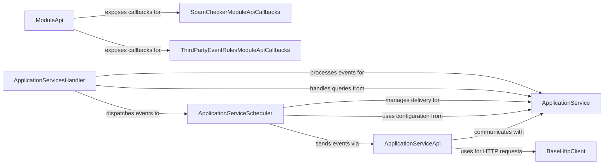

## Component Details

The `Application Services & Extensibility` subsystem in Synapse provides a robust framework for external applications and internal modules to extend the homeserver's functionality. This is achieved by allowing Application Services (ASes) to interact with the Matrix server for querying users/aliases, sending, and receiving events, and by providing a general module API for custom server-side logic.

The chosen components are fundamental because they collectively manage the entire lifecycle of Application Service interactions—from configuration and interest matching (`ApplicationService`), to handling incoming data and dispatching (`ApplicationServicesHandler`), to reliably sending outgoing events (`ApplicationServiceScheduler`, `ApplicationServiceApi`, `BaseHttpClient`). Furthermore, the `ModuleApi` and its specific callback implementations (`SpamCheckerModuleApiCallbacks`, `ThirdPartyEventRulesModuleApiCallbacks`) are crucial for Synapse's internal extensibility, allowing developers to inject custom logic at various points in the server's operation.

### ApplicationService
Represents a single Application Service configured with Synapse. It defines the AS's capabilities, including which user IDs, room aliases, and room IDs it is interested in, based on defined namespaces and regular expressions. It provides methods to check if the AS is interested in specific users, rooms, or events.

**Related Classes/Methods**:

- `ApplicationService` (1:1000)

### ApplicationServiceApi
This component acts as the client-side interface for Synapse to communicate with Application Services. It handles outgoing HTTP requests to ASes for various queries (user existence, alias resolution, 3PE lookups, key claims) and event pushes. It serializes events and manages HTTP client interactions.

**Related Classes/Methods**:

- `ApplicationServiceApi` (1:1000)

### ApplicationServiceScheduler
This component is responsible for scheduling and sending events to Application Services. It manages a queue of transactions and ensures reliable delivery, including retry mechanisms for failed attempts. It orchestrates the background processes for sending events.

**Related Classes/Methods**:

- `ApplicationServiceScheduler` (1:1000)

### ApplicationServicesHandler
This handler is responsible for processing incoming events and ephemeral data (like typing notifications, receipts, presence) and notifying the relevant Application Services. It determines which ASes are interested in a given piece of data and dispatches it. It also handles queries from ASes regarding user existence and 3PE protocols.

**Related Classes/Methods**:

- `ApplicationServicesHandler` (1:1000)

### ModuleApi
This is a general-purpose API that Synapse modules (including Application Services, though ASes primarily use their own API) can use to interact with the homeserver's internal functionalities. It provides methods for user management, room state manipulation, event creation, presence updates, and more. It serves as the central hub for module extensibility.

**Related Classes/Methods**:

- `ModuleApi` (1:1000)

### SpamCheckerModuleApiCallbacks
This component provides callback interfaces for modules to implement spam checking functionalities. It allows external modules to hook into various points in Synapse's flow (e.g., event creation, registration, login) to determine if an action is spammy.

**Related Classes/Methods**:

- `SpamCheckerModuleApiCallbacks` (1:1000)

### ThirdPartyEventRulesModuleApiCallbacks
This component provides callback interfaces for modules to implement custom rules for third-party events. It allows modules to control whether certain events are allowed, or to react to room creation and other state changes.

**Related Classes/Methods**:

- `ThirdPartyEventRulesModuleApiCallbacks` (1:1000)

### BaseHttpClient
A foundational component for making HTTP requests. It provides methods for GET, POST, and PUT operations, used by other Synapse components to communicate with external services, including Application Services.

**Related Classes/Methods**:

- `BaseHttpClient` (1:1000)

### [FAQ](https://github.com/CodeBoarding/GeneratedOnBoardings/tree/main?tab=readme-ov-file#faq)