```mermaid
graph LR
    synapse_storage_database["synapse.storage.database"]
    synapse_storage_engines["synapse.storage.engines"]
    synapse_storage_databases_main["synapse.storage.databases.main"]
    synapse_storage_databases_state["synapse.storage.databases.state"]
    synapse_storage_controllers["synapse.storage.controllers"]
    synapse_storage_background_updates["synapse.storage.background_updates"]
    synapse_storage_schema["synapse.storage.schema"]
    synapse_storage_util["synapse.storage.util"]
    synapse_storage_database -- "Uses" --> synapse_storage_engines
    synapse_storage_database -- "Utilized by" --> synapse_storage_databases_main
    synapse_storage_engines -- "Provides implementations for" --> synapse_storage_database
    synapse_storage_databases_main -- "Utilizes" --> synapse_storage_database
    synapse_storage_databases_main -- "Interacted with by" --> synapse_storage_controllers
    synapse_storage_databases_state -- "Utilizes" --> synapse_storage_database
    synapse_storage_databases_state -- "Interacted with by" --> synapse_storage_controllers
    synapse_storage_controllers -- "Interacts with" --> synapse_storage_databases_main
    synapse_storage_controllers -- "Interacts with" --> synapse_storage_databases_state
    synapse_storage_background_updates -- "Relies on" --> synapse_storage_database
    synapse_storage_background_updates -- "Applies" --> synapse_storage_schema
    synapse_storage_schema -- "Defines structure for" --> synapse_storage_background_updates
    synapse_storage_schema -- "Is read by" --> synapse_storage_background_updates
    synapse_storage_util -- "Provides utilities to" --> synapse_storage_database
    synapse_storage_util -- "Provides utilities to" --> synapse_storage_databases_main
```

## Component Details

The `Data Management & Persistence` component in Synapse provides a robust abstraction layer for interacting with the underlying database (PostgreSQL or SQLite), ensuring data durability and integrity. It manages schema updates, handles data storage and retrieval for all Synapse components, and includes mechanisms for background data updates and consistency.

### synapse.storage.database
This is the core database interface. It defines the Database class, which serves as the primary abstraction for executing SQL queries, managing transactions, and handling database connections. It provides a unified way for other Synapse components to interact with the database, abstracting away the underlying database engine specifics.

**Related Classes/Methods**:

- <a href="https://github.com/matrix-org/synapse/blob/master/synapse/storage/database.py#L1-L1" target="_blank" rel="noopener noreferrer">`synapse/storage/database.py` (1:1)</a>

### synapse.storage.engines
This package contains the database engine implementations for PostgreSQL (postgres.py) and SQLite (sqlite.py). These modules provide the low-level, database-specific operations, abstracting away the differences between the two supported database systems. The _base.py module defines the common interface that all database engines must adhere to.

**Related Classes/Methods**:

- <a href="https://github.com/matrix-org/synapse/blob/master/synapse/storage/engines/postgres.py#L1-L1" target="_blank" rel="noopener noreferrer">`synapse/storage/engines/postgres.py` (1:1)</a>
- <a href="https://github.com/matrix-org/synapse/blob/master/synapse/storage/engines/sqlite.py#L1-L1" target="_blank" rel="noopener noreferrer">`synapse/storage/engines/sqlite.py` (1:1)</a>
- <a href="https://github.com/matrix-org/synapse/blob/master/synapse/storage/engines/_base.py#L1-L1" target="_blank" rel="noopener noreferrer">`synapse/storage/engines/_base.py` (1:1)</a>

### synapse.storage.databases.main
This package houses the concrete implementations of various data stores for the main Synapse database. Each module within main (e.g., events.py, roommember.py, devices.py) is responsible for managing a specific set of data, inheriting from synapse.storage._base.BaseStore and interacting with the Database object. This is where the actual data models and CRUD operations for most Synapse entities are defined.

**Related Classes/Methods**:

- <a href="https://github.com/matrix-org/synapse/blob/master/synapse/storage/databases/main/__init__.py#L1-L1" target="_blank" rel="noopener noreferrer">`synapse/storage/databases/main/__init__.py` (1:1)</a>

### synapse.storage.databases.state
This package is specifically dedicated to the storage and retrieval of room state information. synapse.storage.databases.state.store manages the complex state groups and their associated events, while synapse.storage.databases.state.bg_updates handles background updates related to state. Given the critical nature of room state in Matrix, this separation highlights its importance.

**Related Classes/Methods**:

- <a href="https://github.com/matrix-org/synapse/blob/master/synapse/storage/databases/state/store.py#L1-L1" target="_blank" rel="noopener noreferrer">`synapse/storage/databases/state/store.py` (1:1)</a>
- <a href="https://github.com/matrix-org/synapse/blob/master/synapse/storage/databases/state/bg_updates.py#L1-L1" target="_blank" rel="noopener noreferrer">`synapse/storage/databases/state/bg_updates.py` (1:1)</a>

### synapse.storage.controllers
This package provides higher-level abstractions and business logic for interacting with the data stores defined in synapse.storage.databases. Instead of directly calling store methods, other Synapse components often interact with these controllers, which encapsulate more complex data operations, ensuring data integrity and enforcing business rules. Examples include persist_events.py and purge_events.py.

**Related Classes/Methods**:

- <a href="https://github.com/matrix-org/synapse/blob/master/synapse/storage/controllers/__init__.py#L1-L1" target="_blank" rel="noopener noreferrer">`synapse/storage/controllers/__init__.py` (1:1)</a>

### synapse.storage.background_updates
This module is crucial for managing and executing schema migrations and background data updates. It ensures database consistency across different Synapse versions by applying necessary changes to the database schema and data in a controlled manner, often in the background to minimize service disruption.

**Related Classes/Methods**:

- <a href="https://github.com/matrix-org/synapse/blob/master/synapse/storage/background_updates.py#L1-L1" target="_blank" rel="noopener noreferrer">`synapse/storage/background_updates.py` (1:1)</a>

### synapse.storage.schema
This directory contains the SQL schema definitions and delta scripts for database migrations. It's critical for defining the database structure and enabling seamless upgrades by providing incremental changes (deltas) that background_updates applies. It separates schema management from application logic.

**Related Classes/Methods**:

- `synapse/storage/schema/main/full_schemas/72/full.sql.postgres` (1:1)
- `synapse/storage/schema/main/delta/72/01add_room_type_to_state_stats.sql` (1:1)

### synapse.storage.util
This package contains utility functions used across the storage layer. Examples include id_generators.py for generating unique identifiers and sequence.py for managing database sequences. These utilities provide common, reusable functionalities that support the various data storage operations.

**Related Classes/Methods**:

- <a href="https://github.com/matrix-org/synapse/blob/master/synapse/storage/util/id_generators.py#L1-L1" target="_blank" rel="noopener noreferrer">`synapse/storage/util/id_generators.py` (1:1)</a>
- <a href="https://github.com/matrix-org/synapse/blob/master/synapse/storage/util/sequence.py#L1-L1" target="_blank" rel="noopener noreferrer">`synapse/storage/util/sequence.py` (1:1)</a>

### [FAQ](https://github.com/CodeBoarding/GeneratedOnBoardings/tree/main?tab=readme-ov-file#faq)