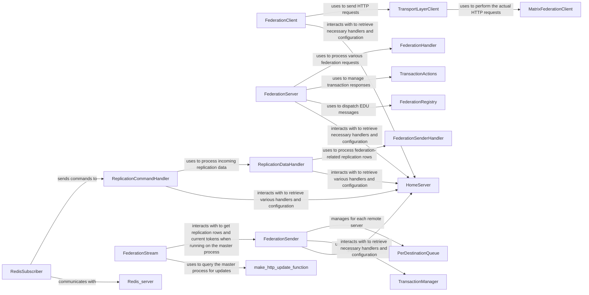

## Component Details

This section provides an overview of the core components within the Distributed & Federation Services subsystem, detailing their purpose, source files, and key interactions. These components are fundamental for enabling both inter-server communication (federation) and internal data consistency/load distribution across Synapse worker processes (replication). These components are fundamental because they collectively manage all aspects of distributed communication within Synapse. FederationClient, FederationServer, FederationSender, and TransportLayerClient are responsible for the external communication with other Matrix homeservers. ReplicationDataHandler, ReplicationCommandHandler, RedisSubscriber, and FederationStream are crucial for internal communication and data synchronization in a scaled-out Synapse deployment. Without these components, Synapse would not be able to participate in the Matrix federation or operate efficiently in a distributed environment.

### FederationClient
Initiates and manages outgoing federation requests to other Matrix homeservers. This includes fetching room state, backfilling events, sending join/leave/invite/knock requests, querying user keys, and downloading media. It handles retries and caching for these requests.

**Related Classes/Methods**:

- <a href="https://github.com/matrix-org/synapse/blob/master/scripts-dev/federation_client.py#L1-L1" target="_blank" rel="noopener noreferrer">`FederationClient` (1:1)</a>

### FederationServer
Handles incoming federation requests from other Matrix homeservers. It processes transactions containing events (PDUs) and ephemeral data (EDUs), manages room state requests, and handles membership events (joins, leaves, invites, knocks). It also manages a staging area for incoming events and processes them in the background.

**Related Classes/Methods**:

- <a href="https://github.com/matrix-org/synapse/blob/master/synapse/federation/federation_server.py#L126-L1329" target="_blank" rel="noopener noreferrer">`FederationServer` (126:1329)</a>

### FederationSender
Acts as the central orchestrator for sending outgoing federation traffic. It manages queues for events and EDUs destined for various remote servers and ensures their reliable transmission, including handling read receipts, presence updates, and device messages. It also manages retries and backoff for destinations.

**Related Classes/Methods**:

- <a href="https://github.com/matrix-org/synapse/blob/master/synapse/app/federation_sender.py#L1-L1" target="_blank" rel="noopener noreferrer">`FederationSender` (1:1)</a>

### TransportLayerClient
A low-level HTTP client specifically designed for federation communication. It constructs and sends HTTP requests to remote homeservers for various federation endpoints (e.g., /send, /state, /join, /invite, /knock, /publicRooms, /user/keys/query, /user/devices, /user/keys/claim, /get_missing_events, /hierarchy, /account_status, /download). It handles different API versions (v1, v2, v3, r0) and includes retry mechanisms.

**Related Classes/Methods**:

- `TransportLayerClient` (1:1)

### ReplicationDataHandler
On worker processes, this handler processes incoming replication data (RDATA) and position updates from the main process or other workers. It dispatches these updates to relevant sub-handlers, including those for federation, typing, push rules, account data, receipts, to-device messages, device lists, and pusher changes. It also notifies the data store about updates.

**Related Classes/Methods**:

- `ReplicationDataHandler` (1:1)

### ReplicationCommandHandler
This component is responsible for handling incoming replication commands (like RDATA and POSITION) from other Synapse processes (master or workers) and dispatching them to the appropriate handlers. It also manages the sending of outgoing replication commands to connected TCP replication clients. It acts as a central point for coordinating data flow and state synchronization between different Synapse processes.

**Related Classes/Methods**:

- `ReplicationCommandHandler` (1:1)

### RedisSubscriber
This class acts as a client for Redis, subscribing to specific channels to receive replication messages. It parses these messages into replication commands and dispatches them to the ReplicationCommandHandler for further processing. It also handles the initial subscription to Redis channels and sends a REPLICATE command upon connection.

**Related Classes/Methods**:

- `RedisSubscriber` (1:1)

### FederationStream
Defines the structure and handling of federation-specific data streams over TCP replication. This ensures that federation events and state changes are correctly transmitted between master and worker processes, especially when federation sending is offloaded to a worker.

**Related Classes/Methods**:

- `FederationStream` (1:1)

### [FAQ](https://github.com/CodeBoarding/GeneratedOnBoardings/tree/main?tab=readme-ov-file#faq)