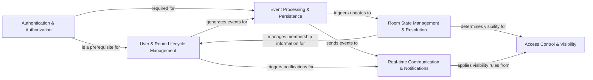

## Component Details

The Matrix Protocol Engine encapsulates the core logic of a Matrix homeserver, managing user interactions, event flow, and room state. It is fundamental because it directly implements the Matrix protocol specifications, enabling secure, decentralized, and real-time communication. Without these components, a Matrix homeserver cannot function.

### Authentication & Authorization
Manages user authentication, session handling, and token generation. It provides methods for validating user credentials and handling various authentication flows (e.g., password, SSO via CAS, SAML, OIDC, and JWT). This component is the gateway for users to interact with the Matrix homeserver securely.

**Related Classes/Methods**:

- <a href="https://github.com/matrix-org/synapse/blob/master/synapse/handlers/auth.py#L0-L0" target="_blank" rel="noopener noreferrer">`synapse/handlers/auth.py` (0:0)</a>
- <a href="https://github.com/matrix-org/synapse/blob/master/synapse/api/auth/base.py#L0-L0" target="_blank" rel="noopener noreferrer">`synapse/api/auth/base.py` (0:0)</a>
- <a href="https://github.com/matrix-org/synapse/blob/master/synapse/handlers/sso.py#L0-L0" target="_blank" rel="noopener noreferrer">`synapse/handlers/sso.py` (0:0)</a>
- <a href="https://github.com/matrix-org/synapse/blob/master/synapse/api/auth/msc3861_delegated.py#L0-L0" target="_blank" rel="noopener noreferrer">`synapse/api/auth/msc3861_delegated.py` (0:0)</a>
- <a href="https://github.com/matrix-org/synapse/blob/master/synapse/handlers/jwt.py#L0-L0" target="_blank" rel="noopener noreferrer">`synapse/handlers/jwt.py` (0:0)</a>
- <a href="https://github.com/matrix-org/synapse/blob/master/synapse/util/macaroons.py#L0-L0" target="_blank" rel="noopener noreferrer">`synapse/util/macaroons.py` (0:0)</a>
- <a href="https://github.com/matrix-org/synapse/blob/master/synapse/handlers/password_policy.py#L0-L0" target="_blank" rel="noopener noreferrer">`synapse/handlers/password_policy.py` (0:0)</a>
- <a href="https://github.com/matrix-org/synapse/blob/master/synapse/handlers/cas.py#L0-L0" target="_blank" rel="noopener noreferrer">`synapse/handlers/cas.py` (0:0)</a>
- <a href="https://github.com/matrix-org/synapse/blob/master/synapse/handlers/saml.py#L0-L0" target="_blank" rel="noopener noreferrer">`synapse/handlers/saml.py` (0:0)</a>
- <a href="https://github.com/matrix-org/synapse/blob/master/synapse/handlers/oidc.py#L0-L0" target="_blank" rel="noopener noreferrer">`synapse/handlers/oidc.py` (0:0)</a>

### Event Processing & Persistence
Responsible for the creation, validation, and initial processing of all Matrix events. It ensures events adhere to the Matrix specification and room-specific authentication rules before they are persisted and propagated. This component also handles the storage of events.

**Related Classes/Methods**:

- <a href="https://github.com/matrix-org/synapse/blob/master/synapse/events/__init__.py#L0-L0" target="_blank" rel="noopener noreferrer">`synapse/events/__init__.py` (0:0)</a>
- <a href="https://github.com/matrix-org/synapse/blob/master/synapse/events/builder.py#L0-L0" target="_blank" rel="noopener noreferrer">`synapse/events/builder.py` (0:0)</a>
- <a href="https://github.com/matrix-org/synapse/blob/master/synapse/events/validator.py#L0-L0" target="_blank" rel="noopener noreferrer">`synapse/events/validator.py` (0:0)</a>
- <a href="https://github.com/matrix-org/synapse/blob/master/synapse/event_auth.py#L0-L0" target="_blank" rel="noopener noreferrer">`synapse/event_auth.py` (0:0)</a>
- <a href="https://github.com/matrix-org/synapse/blob/master/synapse/handlers/message.py#L0-L0" target="_blank" rel="noopener noreferrer">`synapse/handlers/message.py` (0:0)</a>
- <a href="https://github.com/matrix-org/synapse/blob/master/synapse/handlers/events.py#L0-L0" target="_blank" rel="noopener noreferrer">`synapse/handlers/events.py` (0:0)</a>
- `synapse/handlers/event_creation.py` (0:0)
- <a href="https://github.com/matrix-org/synapse/blob/master/synapse/storage/databases/main/events.py#L0-L0" target="_blank" rel="noopener noreferrer">`synapse/storage/databases/main/events.py` (0:0)</a>
- <a href="https://github.com/matrix-org/synapse/blob/master/synapse/storage/controllers/persist_events.py#L0-L0" target="_blank" rel="noopener noreferrer">`synapse/storage/controllers/persist_events.py` (0:0)</a>

### Room State Management & Resolution
Manages the canonical state of Matrix rooms. This includes implementing state resolution algorithms (v1 and v2) to consistently determine the room's state from its event graph, crucial for maintaining a coherent view across distributed homeservers. It also handles the storage and retrieval of room state.

**Related Classes/Methods**:

- <a href="https://github.com/matrix-org/synapse/blob/master/synapse/state/__init__.py#L0-L0" target="_blank" rel="noopener noreferrer">`synapse/state/__init__.py` (0:0)</a>
- <a href="https://github.com/matrix-org/synapse/blob/master/synapse/state/v1.py#L0-L0" target="_blank" rel="noopener noreferrer">`synapse/state/v1.py` (0:0)</a>
- <a href="https://github.com/matrix-org/synapse/blob/master/synapse/state/v2.py#L0-L0" target="_blank" rel="noopener noreferrer">`synapse/state/v2.py` (0:0)</a>
- `synapse/handlers/state.py` (0:0)
- `synapse/handlers/state_resolution.py` (0:0)
- <a href="https://github.com/matrix-org/synapse/blob/master/synapse/storage/databases/main/state.py#L0-L0" target="_blank" rel="noopener noreferrer">`synapse/storage/databases/main/state.py` (0:0)</a>
- <a href="https://github.com/matrix-org/synapse/blob/master/synapse/storage/controllers/state.py#L0-L0" target="_blank" rel="noopener noreferrer">`synapse/storage/controllers/state.py` (0:0)</a>

### User & Room Lifecycle Management
Handles all aspects of user membership within rooms, including joining, leaving, inviting, kicking, and banning. It also manages the creation and overall lifecycle of rooms, as well as their visibility in the public directory. This component also covers user profiles, device registration, and end-to-end encryption key management.

**Related Classes/Methods**:

- <a href="https://github.com/matrix-org/synapse/blob/master/synapse/handlers/room.py#L0-L0" target="_blank" rel="noopener noreferrer">`synapse/handlers/room.py` (0:0)</a>
- <a href="https://github.com/matrix-org/synapse/blob/master/synapse/handlers/room_member.py#L0-L0" target="_blank" rel="noopener noreferrer">`synapse/handlers/room_member.py` (0:0)</a>
- <a href="https://github.com/matrix-org/synapse/blob/master/synapse/handlers/directory.py#L0-L0" target="_blank" rel="noopener noreferrer">`synapse/handlers/directory.py` (0:0)</a>
- <a href="https://github.com/matrix-org/synapse/blob/master/synapse/handlers/room_summary.py#L0-L0" target="_blank" rel="noopener noreferrer">`synapse/handlers/room_summary.py` (0:0)</a>
- `synapse/handlers/room_forgetter.py` (0:0)
- <a href="https://github.com/matrix-org/synapse/blob/master/synapse/handlers/device.py#L0-L0" target="_blank" rel="noopener noreferrer">`synapse/handlers/device.py` (0:0)</a>
- <a href="https://github.com/matrix-org/synapse/blob/master/synapse/handlers/profile.py#L0-L0" target="_blank" rel="noopener noreferrer">`synapse/handlers/profile.py` (0:0)</a>
- <a href="https://github.com/matrix-org/synapse/blob/master/synapse/handlers/e2e_keys.py#L0-L0" target="_blank" rel="noopener noreferrer">`synapse/handlers/e2e_keys.py` (0:0)</a>
- <a href="https://github.com/matrix-org/synapse/blob/master/synapse/handlers/e2e_room_keys.py#L0-L0" target="_blank" rel="noopener noreferrer">`synapse/handlers/e2e_room_keys.py` (0:0)</a>
- <a href="https://github.com/matrix-org/synapse/blob/master/synapse/handlers/admin.py#L0-L0" target="_blank" rel="noopener noreferrer">`synapse/handlers/admin.py` (0:0)</a>
- <a href="https://github.com/matrix-org/synapse/blob/master/synapse/handlers/user_directory.py#L0-L0" target="_blank" rel="noopener noreferrer">`synapse/handlers/user_directory.py` (0:0)</a>
- <a href="https://github.com/matrix-org/synapse/blob/master/synapse/handlers/account_data.py#L0-L0" target="_blank" rel="noopener noreferrer">`synapse/handlers/account_data.py` (0:0)</a>
- <a href="https://github.com/matrix-org/synapse/blob/master/synapse/crypto/keyring.py#L0-L0" target="_blank" rel="noopener noreferrer">`synapse/crypto/keyring.py` (0:0)</a>

### Real-time Communication & Notifications
Facilitates real-time updates to clients, including presence information, typing notifications, and push notifications. It also manages the synchronization of events and state changes to clients, ensuring they receive timely updates.

**Related Classes/Methods**:

- <a href="https://github.com/matrix-org/synapse/blob/master/synapse/notifier.py#L0-L0" target="_blank" rel="noopener noreferrer">`synapse/notifier.py` (0:0)</a>
- <a href="https://github.com/matrix-org/synapse/blob/master/synapse/handlers/presence.py#L0-L0" target="_blank" rel="noopener noreferrer">`synapse/handlers/presence.py` (0:0)</a>
- <a href="https://github.com/matrix-org/synapse/blob/master/synapse/handlers/typing.py#L0-L0" target="_blank" rel="noopener noreferrer">`synapse/handlers/typing.py` (0:0)</a>
- <a href="https://github.com/matrix-org/synapse/blob/master/synapse/push/pusherpool.py#L0-L0" target="_blank" rel="noopener noreferrer">`synapse/push/pusherpool.py` (0:0)</a>
- <a href="https://github.com/matrix-org/synapse/blob/master/synapse/handlers/sync.py#L0-L0" target="_blank" rel="noopener noreferrer">`synapse/handlers/sync.py` (0:0)</a>
- <a href="https://github.com/matrix-org/synapse/blob/master/synapse/streams/events.py#L0-L0" target="_blank" rel="noopener noreferrer">`synapse/streams/events.py` (0:0)</a>
- <a href="https://github.com/matrix-org/synapse/blob/master/synapse/handlers/receipts.py#L0-L0" target="_blank" rel="noopener noreferrer">`synapse/handlers/receipts.py` (0:0)</a>
- <a href="https://github.com/matrix-org/synapse/blob/master/synapse/handlers/read_marker.py#L0-L0" target="_blank" rel="noopener noreferrer">`synapse/handlers/read_marker.py` (0:0)</a>
- <a href="https://github.com/matrix-org/synapse/blob/master/synapse/push/bulk_push_rule_evaluator.py#L0-L0" target="_blank" rel="noopener noreferrer">`synapse/push/bulk_push_rule_evaluator.py` (0:0)</a>
- <a href="https://github.com/matrix-org/synapse/blob/master/synapse/handlers/push_rules.py#L0-L0" target="_blank" rel="noopener noreferrer">`synapse/handlers/push_rules.py` (0:0)</a>

### Access Control & Visibility
Determines which events and room state are visible to a given client or server. It enforces access control rules based on room membership, history visibility settings, and other permissions, ensuring data privacy and security.

**Related Classes/Methods**:

- <a href="https://github.com/matrix-org/synapse/blob/master/synapse/visibility.py#L0-L0" target="_blank" rel="noopener noreferrer">`synapse/visibility.py` (0:0)</a>

### [FAQ](https://github.com/CodeBoarding/GeneratedOnBoardings/tree/main?tab=readme-ov-file#faq)