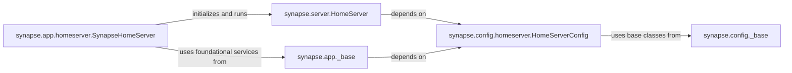

## Component Details

This component acts as the foundational layer of a Synapse instance, responsible for initializing the application, managing its lifecycle, loading configurations, and providing a central registry for various operational components. It ensures the consistent setup and operation of the Synapse homeserver. These components are fundamental because they represent the core bootstrapping and operational control of the Synapse homeserver. `HomeServer` and `SynapseHomeServer` define the application's runtime behavior and expose its functionalities. The `app._base` module provides the essential environment for the application to run, while the `config` modules (`homeserver` and `_base`) are crucial for defining and loading the operational parameters that dictate how the homeserver behaves. Together, they form the backbone of any Synapse deployment.

### synapse.server.HomeServer
This is the central orchestrator and dependency injector of the Synapse instance. It's an abstract base class (`abc.ABCMeta`) that defines the core structure and provides methods for retrieving various handlers, clients, and managers (e.g., `get_federation_client`, `get_auth_handler`). It holds the main `config` object (`HomeServerConfig`) and manages the application's lifecycle, including `setup()` and `start_listening()`. Its numerous `get_...` methods, often decorated with `@cache_in_self`, demonstrate its role in providing singletons of critical components throughout the application.

**Related Classes/Methods**:

- <a href="https://github.com/matrix-org/synapse/blob/master/synapse/server.py#L221-L921" target="_blank" rel="noopener noreferrer">`synapse.server.HomeServer` (221:921)</a>

### synapse.app.homeserver.SynapseHomeServer
This class is the concrete implementation of the `HomeServer` abstract base class, serving as the main application entry point for the Synapse homeserver. It overrides the `DATASTORE_CLASS` and implements the `_listener_http` method to configure and start the HTTP listeners, attaching various resources like client APIs, federation endpoints, and admin interfaces based on the loaded configuration. It bridges the abstract core with the actual operational server.

**Related Classes/Methods**:

- <a href="https://github.com/matrix-org/synapse/blob/master/synapse/app/homeserver.py#L76-L285" target="_blank" rel="noopener noreferrer">`synapse.app.homeserver.SynapseHomeServer` (76:285)</a>

### synapse.app._base
This module provides foundational application services and common setup utilities used across Synapse applications, including homeservers and workers. It handles generic startup tasks such as logging initialization, resource limit adjustments, and reactor management. Functions like `start_reactor` and `register_sighup` ensure consistent and robust application startup and signal handling.

**Related Classes/Methods**:

- <a href="https://github.com/matrix-org/synapse/blob/master/synapse/app/_base.py#L1-L1" target="_blank" rel="noopener noreferrer">`synapse.app._base` (1:1)</a>

### synapse.config.homeserver.HomeServerConfig
This class is the central configuration loader for the Synapse homeserver. It inherits from `RootConfig` and aggregates a multitude of other specific configuration classes (e.g., `ServerConfig`, `DatabaseConfig`, `FederationConfig`). It's responsible for parsing the homeserver configuration file, validating settings, and making them accessible to other components, particularly `HomeServer`.

**Related Classes/Methods**:

- <a href="https://github.com/matrix-org/synapse/blob/master/synapse/config/homeserver.py#L57-L100" target="_blank" rel="noopener noreferrer">`synapse.config.homeserver.HomeServerConfig` (57:100)</a>

### synapse.config._base
This module provides the foundational classes and utilities for all configuration handling within Synapse. `Config` is a base class for individual configuration sections, while `RootConfig` (which `HomeServerConfig` inherits from) provides the mechanism to load and manage multiple configuration sections. It includes utilities for parsing various data types (e.g., `parse_size`) and handling configuration errors.

**Related Classes/Methods**:

- <a href="https://github.com/matrix-org/synapse/blob/master/synapse/config/_base.py#L153-L366" target="_blank" rel="noopener noreferrer">`synapse.config._base.Config` (153:366)</a>
- <a href="https://github.com/matrix-org/synapse/blob/master/synapse/config/_base.py#L372-L860" target="_blank" rel="noopener noreferrer">`synapse.config._base.RootConfig` (372:860)</a>

### [FAQ](https://github.com/CodeBoarding/GeneratedOnBoardings/tree/main?tab=readme-ov-file#faq)