```mermaid
graph LR
    Synapse_Core_Configuration["Synapse Core & Configuration"]
    API_Client_Interaction["API & Client Interaction"]
    Matrix_Protocol_Engine["Matrix Protocol Engine"]
    Data_Management_Persistence["Data Management & Persistence"]
    Distributed_Federation_Services["Distributed & Federation Services"]
    Application_Services_Extensibility["Application Services & Extensibility"]
    Synapse_Core_Configuration -- "Initializes & Manages" --> API_Client_Interaction
    Synapse_Core_Configuration -- "Provides Configuration To" --> Matrix_Protocol_Engine
    API_Client_Interaction -- "Routes Requests To" --> Matrix_Protocol_Engine
    API_Client_Interaction -- "Delivers Responses From" --> Matrix_Protocol_Engine
    Matrix_Protocol_Engine -- "Persists Data To" --> Data_Management_Persistence
    Matrix_Protocol_Engine -- "Exchanges Events With" --> Distributed_Federation_Services
    Data_Management_Persistence -- "Stores Data For" --> Matrix_Protocol_Engine
    Data_Management_Persistence -- "Provides Data To" --> Matrix_Protocol_Engine
    Distributed_Federation_Services -- "Accesses" --> Data_Management_Persistence
    Distributed_Federation_Services -- "Coordinates With" --> Synapse_Core_Configuration
    Application_Services_Extensibility -- "Extends Functionality Of" --> Matrix_Protocol_Engine
    Application_Services_Extensibility -- "Interacts Via" --> API_Client_Interaction
    click Synapse_Core_Configuration href "https://github.com/CodeBoarding/GeneratedOnBoardings/blob/main//synapse/Synapse_Core_Configuration.md" "Details"
    click API_Client_Interaction href "https://github.com/CodeBoarding/GeneratedOnBoardings/blob/main//synapse/API_Client_Interaction.md" "Details"
    click Matrix_Protocol_Engine href "https://github.com/CodeBoarding/GeneratedOnBoardings/blob/main//synapse/Matrix_Protocol_Engine.md" "Details"
    click Data_Management_Persistence href "https://github.com/CodeBoarding/GeneratedOnBoardings/blob/main//synapse/Data_Management_Persistence.md" "Details"
    click Distributed_Federation_Services href "https://github.com/CodeBoarding/GeneratedOnBoardings/blob/main//synapse/Distributed_Federation_Services.md" "Details"
    click Application_Services_Extensibility href "https://github.com/CodeBoarding/GeneratedOnBoardings/blob/main//synapse/Application_Services_Extensibility.md" "Details"
```

## Component Details

The architecture of Synapse, a Matrix Home Server, can be effectively understood through six fundamental components, each with distinct responsibilities and clear interactions. These components are chosen for their critical roles in handling core Matrix protocol operations, managing data, facilitating communication, and enabling extensibility.

### Synapse Core & Configuration
The central orchestrator and dependency injector of the Synapse instance. It is responsible for initializing all other core components, loading configurations, managing the application lifecycle (startup, shutdown), and providing a central registry for accessing various handlers, clients, and managers. It acts as the foundational layer that brings the entire system together.

**Related Classes/Methods**:

- <a href="https://github.com/matrix-org/synapse/blob/master/synapse/server.py#L221-L921" target="_blank" rel="noopener noreferrer">`synapse.server.HomeServer` (221:921)</a>
- <a href="https://github.com/matrix-org/synapse/blob/master/synapse/app/_base.py#L1-L1" target="_blank" rel="noopener noreferrer">`synapse.app._base` (1:1)</a>
- <a href="https://github.com/matrix-org/synapse/blob/master/synapse/app/homeserver.py#L1-L1" target="_blank" rel="noopener noreferrer">`synapse.app.homeserver` (1:1)</a>
- <a href="https://github.com/matrix-org/synapse/blob/master/synapse/config/homeserver.py#L1-L1" target="_blank" rel="noopener noreferrer">`synapse.config.homeserver` (1:1)</a>

### API & Client Interaction
Handles all incoming HTTP requests from Matrix clients and other external entities. It is responsible for routing requests to the appropriate internal handlers, parsing request bodies, managing HTTP responses, enforcing rate limits, and handling API-level errors. It serves as the primary external interface for the Synapse server.

**Related Classes/Methods**:

- `synapse.rest.client` (1:1)
- <a href="https://github.com/matrix-org/synapse/blob/master/synapse/http/server.py#L1-L1" target="_blank" rel="noopener noreferrer">`synapse.http.server` (1:1)</a>
- <a href="https://github.com/matrix-org/synapse/blob/master/synapse/http/servlet.py#L1-L1" target="_blank" rel="noopener noreferrer">`synapse.http.servlet` (1:1)</a>
- <a href="https://github.com/matrix-org/synapse/blob/master/synapse/api/errors.py#L1-L1" target="_blank" rel="noopener noreferrer">`synapse.api.errors` (1:1)</a>
- <a href="https://github.com/matrix-org/synapse/blob/master/synapse/api/ratelimiting.py#L1-L1" target="_blank" rel="noopener noreferrer">`synapse.api.ratelimiting` (1:1)</a>

### Matrix Protocol Engine
Encapsulates the fundamental Matrix protocol logic. This includes user authentication, authorization, and session management; the creation, validation, and state management of Matrix events within rooms; the lifecycle management of users, devices, and rooms; and real-time communication features like presence, typing notifications, and push notifications. It is the heart of Matrix functionality.

**Related Classes/Methods**:

- <a href="https://github.com/matrix-org/synapse/blob/master/synapse/handlers/auth.py#L1-L1" target="_blank" rel="noopener noreferrer">`synapse.handlers.auth` (1:1)</a>
- <a href="https://github.com/matrix-org/synapse/blob/master/synapse/api/auth/base.py#L1-L1" target="_blank" rel="noopener noreferrer">`synapse.api.auth.base` (1:1)</a>
- <a href="https://github.com/matrix-org/synapse/blob/master/synapse/handlers/sso.py#L1-L1" target="_blank" rel="noopener noreferrer">`synapse.handlers.sso` (1:1)</a>
- <a href="https://github.com/matrix-org/synapse/blob/master/synapse/api/auth/msc3861_delegated.py#L1-L1" target="_blank" rel="noopener noreferrer">`synapse.api.auth.msc3861_delegated` (1:1)</a>
- <a href="https://github.com/matrix-org/synapse/blob/master/synapse/handlers/jwt.py#L1-L1" target="_blank" rel="noopener noreferrer">`synapse.handlers.jwt` (1:1)</a>
- `synapse.macaroon_generator` (1:1)
- `synapse.password_auth_provider` (1:1)
- `synapse.password_policy_handler` (1:1)
- `synapse.cas_handler` (1:1)
- `synapse.saml_handler` (1:1)
- `synapse.oidc_handler` (1:1)
- `synapse.events` (1:1)
- <a href="https://github.com/matrix-org/synapse/blob/master/synapse/event_auth.py#L1-L1" target="_blank" rel="noopener noreferrer">`synapse.event_auth` (1:1)</a>
- `synapse.state` (1:1)
- <a href="https://github.com/matrix-org/synapse/blob/master/synapse/handlers/message.py#L1-L1" target="_blank" rel="noopener noreferrer">`synapse.handlers.message` (1:1)</a>
- `synapse.event_builder_factory` (1:1)
- `synapse.handlers.event_creation` (1:1)
- `synapse.handlers.event` (1:1)
- `synapse.handlers.state` (1:1)
- `synapse.handlers.state_resolution` (1:1)
- `synapse.keyring` (1:1)
- <a href="https://github.com/matrix-org/synapse/blob/master/synapse/handlers/device.py#L1-L1" target="_blank" rel="noopener noreferrer">`synapse.handlers.device` (1:1)</a>
- <a href="https://github.com/matrix-org/synapse/blob/master/synapse/handlers/profile.py#L1-L1" target="_blank" rel="noopener noreferrer">`synapse.handlers.profile` (1:1)</a>
- <a href="https://github.com/matrix-org/synapse/blob/master/synapse/handlers/e2e_keys.py#L1-L1" target="_blank" rel="noopener noreferrer">`synapse.handlers.e2e_keys` (1:1)</a>
- <a href="https://github.com/matrix-org/synapse/blob/master/synapse/handlers/e2e_room_keys.py#L1-L1" target="_blank" rel="noopener noreferrer">`synapse.handlers.e2e_room_keys` (1:1)</a>
- <a href="https://github.com/matrix-org/synapse/blob/master/synapse/handlers/room.py#L1-L1" target="_blank" rel="noopener noreferrer">`synapse.handlers.room` (1:1)</a>
- <a href="https://github.com/matrix-org/synapse/blob/master/synapse/handlers/room_member.py#L1-L1" target="_blank" rel="noopener noreferrer">`synapse.handlers.room_member` (1:1)</a>
- <a href="https://github.com/matrix-org/synapse/blob/master/synapse/handlers/directory.py#L1-L1" target="_blank" rel="noopener noreferrer">`synapse.handlers.directory` (1:1)</a>
- <a href="https://github.com/matrix-org/synapse/blob/master/synapse/visibility.py#L1-L1" target="_blank" rel="noopener noreferrer">`synapse.visibility` (1:1)</a>
- <a href="https://github.com/matrix-org/synapse/blob/master/synapse/handlers/admin.py#L1-L1" target="_blank" rel="noopener noreferrer">`synapse.handlers.admin` (1:1)</a>
- <a href="https://github.com/matrix-org/synapse/blob/master/synapse/handlers/user_directory.py#L1-L1" target="_blank" rel="noopener noreferrer">`synapse.handlers.user_directory` (1:1)</a>
- <a href="https://github.com/matrix-org/synapse/blob/master/synapse/handlers/account_data.py#L1-L1" target="_blank" rel="noopener noreferrer">`synapse.handlers.account_data` (1:1)</a>
- <a href="https://github.com/matrix-org/synapse/blob/master/synapse/handlers/room_summary.py#L1-L1" target="_blank" rel="noopener noreferrer">`synapse.handlers.room_summary` (1:1)</a>
- `synapse.handlers.room_forgetter` (1:1)
- <a href="https://github.com/matrix-org/synapse/blob/master/synapse/notifier.py#L1-L1" target="_blank" rel="noopener noreferrer">`synapse.notifier` (1:1)</a>
- <a href="https://github.com/matrix-org/synapse/blob/master/synapse/handlers/presence.py#L1-L1" target="_blank" rel="noopener noreferrer">`synapse.handlers.presence` (1:1)</a>
- <a href="https://github.com/matrix-org/synapse/blob/master/synapse/handlers/typing.py#L1-L1" target="_blank" rel="noopener noreferrer">`synapse.handlers.typing` (1:1)</a>
- <a href="https://github.com/matrix-org/synapse/blob/master/synapse/push/pusherpool.py#L1-L1" target="_blank" rel="noopener noreferrer">`synapse.push.pusherpool` (1:1)</a>
- <a href="https://github.com/matrix-org/synapse/blob/master/synapse/handlers/sync.py#L1-L1" target="_blank" rel="noopener noreferrer">`synapse.handlers.sync` (1:1)</a>
- `synapse.handlers.event_stream` (1:1)
- <a href="https://github.com/matrix-org/synapse/blob/master/synapse/handlers/receipts.py#L1-L1" target="_blank" rel="noopener noreferrer">`synapse.handlers.receipts` (1:1)</a>
- <a href="https://github.com/matrix-org/synapse/blob/master/synapse/handlers/read_marker.py#L1-L1" target="_blank" rel="noopener noreferrer">`synapse.handlers.read_marker` (1:1)</a>
- `synapse.bulk_push_rule_evaluator` (1:1)
- <a href="https://github.com/matrix-org/synapse/blob/master/synapse/handlers/push_rules.py#L1-L1" target="_blank" rel="noopener noreferrer">`synapse.handlers.push_rules` (1:1)</a>

### Data Management & Persistence
Provides a robust abstraction layer for interacting with the underlying database (PostgreSQL or SQLite). It manages schema updates, handles data storage and retrieval for all Synapse components, and includes mechanisms for background data updates and consistency. This component ensures the durability and integrity of all Synapse data.

**Related Classes/Methods**:

- <a href="https://github.com/matrix-org/synapse/blob/master/synapse/storage/database.py#L1-L1" target="_blank" rel="noopener noreferrer">`synapse.storage.database` (1:1)</a>
- `synapse.storage.databases.main` (1:1)
- `synapse.storage.controllers` (1:1)
- `synapse.storage.engines` (1:1)
- `synapse.datastores` (1:1)

### Distributed & Federation Services
Manages all forms of distributed communication within the Synapse ecosystem. This includes federating events and state with other Matrix home servers (inter-server communication), as well as handling internal data consistency, load distribution, and communication between different Synapse worker processes in a scaled-out deployment (inter-worker replication).

**Related Classes/Methods**:

- <a href="https://github.com/matrix-org/synapse/blob/master/synapse/federation/federation_client.py#L1-L1" target="_blank" rel="noopener noreferrer">`synapse.federation.federation_client` (1:1)</a>
- <a href="https://github.com/matrix-org/synapse/blob/master/synapse/federation/federation_server.py#L1-L1" target="_blank" rel="noopener noreferrer">`synapse.federation.federation_server` (1:1)</a>
- `synapse.federation.sender` (1:1)
- <a href="https://github.com/matrix-org/synapse/blob/master/synapse/federation/transport/client.py#L1-L1" target="_blank" rel="noopener noreferrer">`synapse.federation.transport.client` (1:1)</a>
- `synapse.federation.federation_handler` (1:1)
- `synapse.federation.federation_event_handler` (1:1)
- `synapse.federation.federation_registry` (1:1)
- `synapse.federation_ratelimiter` (1:1)
- <a href="https://github.com/matrix-org/synapse/blob/master/synapse/replication/http/_base.py#L1-L1" target="_blank" rel="noopener noreferrer">`synapse.replication.http._base` (1:1)</a>
- <a href="https://github.com/matrix-org/synapse/blob/master/synapse/replication/tcp/handler.py#L1-L1" target="_blank" rel="noopener noreferrer">`synapse.replication.tcp.handler` (1:1)</a>
- <a href="https://github.com/matrix-org/synapse/blob/master/synapse/replication/tcp/client.py#L1-L1" target="_blank" rel="noopener noreferrer">`synapse.replication.tcp.client` (1:1)</a>
- <a href="https://github.com/matrix-org/synapse/blob/master/synapse/replication/tcp/redis.py#L1-L1" target="_blank" rel="noopener noreferrer">`synapse.replication.tcp.redis` (1:1)</a>
- `synapse.replication.streamer` (1:1)
- `synapse.replication.command_handler` (1:1)
- `synapse.replication.data_handler` (1:1)
- `synapse.replication.streams` (1:1)
- `synapse.worker_locks_handler` (1:1)
- `synapse.task_scheduler` (1:1)
- `synapse.outbound_redis_connection` (1:1)

### Application Services & Extensibility
Provides an interface for external application services to interact with the Matrix server, allowing them to extend Synapse's functionality. This includes querying users/aliases, sending events, and receiving events from rooms they are interested in. It also manages internal Synapse modules for custom server-side logic and integrations.

**Related Classes/Methods**:

- `synapse.appservice` (1:1)
- <a href="https://github.com/matrix-org/synapse/blob/master/synapse/appservice/api.py#L1-L1" target="_blank" rel="noopener noreferrer">`synapse.appservice.api` (1:1)</a>
- <a href="https://github.com/matrix-org/synapse/blob/master/synapse/appservice/scheduler.py#L1-L1" target="_blank" rel="noopener noreferrer">`synapse.appservice.scheduler` (1:1)</a>
- <a href="https://github.com/matrix-org/synapse/blob/master/synapse/handlers/appservice.py#L1-L1" target="_blank" rel="noopener noreferrer">`synapse.handlers.appservice` (1:1)</a>
- `synapse.module_api` (1:1)
- `synapse.module_api_callbacks` (1:1)

### [FAQ](https://github.com/CodeBoarding/GeneratedOnBoardings/tree/main?tab=readme-ov-file#faq)