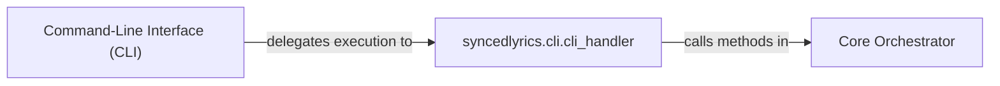

## Details

The `syncedlyrics` project provides a command-line utility for searching and retrieving synchronized lyrics (LRC format) for music tracks. Its core functionality revolves around parsing user input from the command line, orchestrating searches across various lyric providers, and saving the retrieved lyrics to a specified output file. The architecture is centered around a clear separation of concerns, with a dedicated component for handling command-line interactions and a core orchestrator responsible for the lyric search and retrieval logic.

### Command-Line Interface (CLI) [[Expand]](./Command_Line_Interface_CLI_.md)
This component serves as the primary user-facing entry point for the `syncedlyrics` utility. It is responsible for interpreting user commands, parsing arguments, and orchestrating the execution of the library's core functionalities based on these inputs. It acts as a facade, simplifying access to the underlying lyric retrieval mechanisms.

**Related Classes/Methods**:

- <a href="https://github.com/moehmeni/syncedlyrics//blob/syncedlyrics/cli.py#L6-L61" target="_blank" rel="noopener noreferrer">`syncedlyrics.cli.cli_handler`:6-61</a>

### syncedlyrics.cli.cli_handler
This component is the central handler for command-line operations. It defines and parses the command-line arguments using `argparse`, and then, based on these parsed arguments, it orchestrates the call to the `Core Orchestrator` to perform the lyric search and retrieval. It acts as the bridge between the raw command-line input and the core logic of the application.

**Related Classes/Methods**:

- <a href="https://github.com/moehmeni/syncedlyrics//blob/syncedlyrics/cli.py#L6-L61" target="_blank" rel="noopener noreferrer">`syncedlyrics.cli.cli_handler`:6-61</a>

### Core Orchestrator
This component encapsulates the primary business logic for searching and retrieving synchronized lyrics. It takes the search term and various options (like provider preferences, language, and output path) as input from the `cli_handler`. It then coordinates the actual search process, likely interacting with external lyric providers, and returns the synchronized lyrics.

**Related Classes/Methods**:

### [FAQ](https://github.com/CodeBoarding/GeneratedOnBoardings/tree/main?tab=readme-ov-file#faq)