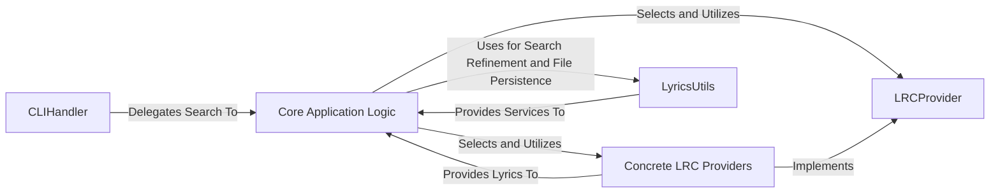

## Details

The `syncedlyrics` architecture revolves around a central `Core Application Logic` that orchestrates lyric retrieval. Users initiate requests through the `CLIHandler`, which then passes control to the `Core Application Logic`. This core component dynamically selects and interacts with various `Concrete LRC Providers`, all adhering to the `LRCProvider` interface, to fetch lyrics from diverse sources. Throughout this process, the `Core Application Logic` leverages `LyricsUtils` for essential data processing and manipulation, ensuring efficient and accurate lyric retrieval and management.

### Core Application Logic [[Expand]](./Core_Application_Logic.md)
This is the central orchestrator and facade of the `syncedlyrics` library. It manages the entire lyric search workflow, including selecting appropriate lyric providers based on availability and user preferences, coordinating the search process, and invoking necessary utility functions for result refinement and persistence. It embodies the Facade and Strategy patterns, providing a simplified entry point to the complex underlying provider logic.

**Related Classes/Methods**:

- <a href="https://github.com/moehmeni/syncedlyrics//blob/syncedlyrics/__init__.py" target="_blank" rel="noopener noreferrer">`syncedlyrics.search`</a>
- <a href="https://github.com/moehmeni/syncedlyrics//blob/syncedlyrics/__init__.py" target="_blank" rel="noopener noreferrer">`syncedlyrics._select_providers`</a>

### LRCProvider
This component defines the abstract interface for all lyric providers. It establishes the contract that concrete provider implementations must adhere to for retrieving lyrics, ensuring extensibility and a consistent API for the `Core Application Logic` to interact with various lyric sources.

**Related Classes/Methods**:

- <a href="https://github.com/moehmeni/syncedlyrics//blob/syncedlyrics/providers/base.py" target="_blank" rel="noopener noreferrer">`syncedlyrics.providers.base.Provider`</a>

### Concrete LRC Providers
These are the specific implementations of the `LRCProvider` abstract base class. Each concrete provider is responsible for interacting with a particular lyric source (e.g., a website or API) to fetch lyrics, parse them, and return them in a standardized format.

**Related Classes/Methods**:

- <a href="https://github.com/moehmeni/syncedlyrics//blob/syncedlyrics/providers/deezer.py#L13-L55" target="_blank" rel="noopener noreferrer">`syncedlyrics.providers.deezer.Deezer`:13-55</a>

### LyricsUtils
This utility component provides common helper functions for tasks supporting the lyric retrieval and processing workflow. This includes functionalities like HTML parsing to extract lyric data, string comparison algorithms for identifying the best match among retrieved lyrics, and functions for saving processed LRC files to disk.

**Related Classes/Methods**:

- <a href="https://github.com/moehmeni/syncedlyrics//blob/syncedlyrics/utils.py" target="_blank" rel="noopener noreferrer">`syncedlyrics.utils`</a>

### CLIHandler
This component is responsible for handling command-line interface interactions. It parses command-line arguments, validates user input, and delegates the lyric search request to the `Core Application Logic`. It acts as the entry point for users interacting with the library via the terminal.

**Related Classes/Methods**:

- <a href="https://github.com/moehmeni/syncedlyrics//blob/syncedlyrics/cli.py" target="_blank" rel="noopener noreferrer">`syncedlyrics.cli`</a>

### [FAQ](https://github.com/CodeBoarding/GeneratedOnBoardings/tree/main?tab=readme-ov-file#faq)