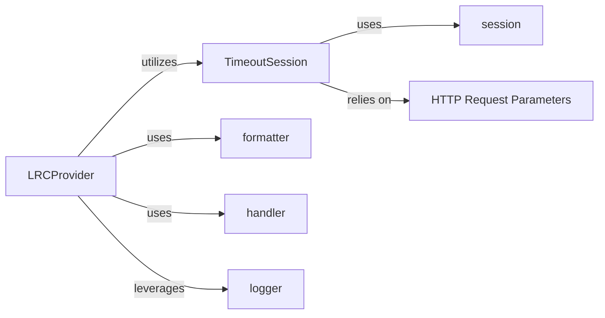

## Details

The Lyric Provider Abstraction subsystem is primarily defined by the syncedlyrics.providers.base module, located at syncedlyrics/providers/base.py. This module encapsulates the common interface and foundational components necessary for interacting with various lyric retrieval services.

### LRCProvider
Serves as the abstract base class or interface for all specific lyric providers. It defines the contract for lyric retrieval operations and manages common resources like the HTTP session and logger.

**Related Classes/Methods**:

- <a href="https://github.com/moehmeni/syncedlyrics//blob/syncedlyrics/providers/base.py#L14-L45" target="_blank" rel="noopener noreferrer">`syncedlyrics.providers.base.LRCProvider`:14-45</a>

### TimeoutSession
Provides a specialized HTTP session capable of handling network requests with configurable timeouts. It ensures reliable and timely communication with external lyric APIs.

**Related Classes/Methods**:

- <a href="https://github.com/moehmeni/syncedlyrics//blob/syncedlyrics/providers/base.py#L8-L11" target="_blank" rel="noopener noreferrer">`syncedlyrics.providers.base.TimeoutSession`:8-11</a>

### formatter
Transforms raw lyric data obtained from external sources into a standardized LRC (Lyrics and Chords) format, ensuring consistent output across different providers.

**Related Classes/Methods**:

- <a href="https://github.com/moehmeni/syncedlyrics//blob/syncedlyrics/providers/base.py" target="_blank" rel="noopener noreferrer">`syncedlyrics.providers.base.formatter`</a>

### handler
Processes and interprets responses received from external lyric APIs, potentially handling specific data structures, parsing content, or managing error conditions.

**Related Classes/Methods**:

- <a href="https://github.com/moehmeni/syncedlyrics//blob/syncedlyrics/providers/base.py" target="_blank" rel="noopener noreferrer">`syncedlyrics.providers.base.handler`</a>

### session
Represents the fundamental HTTP session object (e.g., from a library like `requests`) that performs the actual network communication.

**Related Classes/Methods**:

- <a href="https://github.com/moehmeni/syncedlyrics//blob/syncedlyrics/providers/base.py" target="_blank" rel="noopener noreferrer">`syncedlyrics.providers.base.session`</a>

### HTTP Request Parameters
These represent the fundamental parameters used to construct and execute HTTP requests (e.g., the request object itself, the HTTP method, the target URL, and additional keyword arguments for the request).

**Related Classes/Methods**:

- <a href="https://github.com/moehmeni/syncedlyrics//blob/syncedlyrics/providers/base.py" target="_blank" rel="noopener noreferrer">`syncedlyrics.providers.base.HTTP_Request_Parameters`</a>

### logger
Provides logging capabilities for the subsystem, enabling the recording of operational events, debugging information, and error messages.

**Related Classes/Methods**:

- <a href="https://github.com/moehmeni/syncedlyrics//blob/syncedlyrics/providers/base.py" target="_blank" rel="noopener noreferrer">`syncedlyrics.providers.base.logger`</a>

### [FAQ](https://github.com/CodeBoarding/GeneratedOnBoardings/tree/main?tab=readme-ov-file#faq)