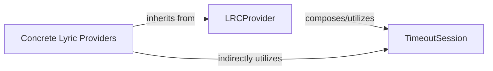

## Details

The Specific Lyric Providers subsystem, defined by the syncedlyrics.providers Python package, contains the abstract base class for lyric providers and all concrete implementations for various online lyric sources. It follows a Strategy Pattern for lyric retrieval.

### LRCProvider
This is the abstract base class (syncedlyrics/syncedlyrics/providers/__init__.py) that defines the common interface (get_lrc, get_lrc_by_id) and foundational functionality for all lyric retrieval providers. It acts as the Strategy interface in a Strategy Pattern, ensuring all concrete providers adhere to a consistent contract for fetching lyrics.

**Related Classes/Methods**:

- <a href="https://github.com/moehmeni/syncedlyrics//blob/syncedlyrics/providers/base.py#L14-L45" target="_blank" rel="noopener noreferrer">`LRCProvider`:14-45</a>

### Concrete Lyric Providers
This collective component represents all concrete classes (e.g., syncedlyrics/syncedlyrics/providers/musixmatch.py, syncedlyrics/syncedlyrics/providers/genius.py, etc.) that extend LRCProvider. Each class is responsible for implementing the specific logic to retrieve lyrics from a particular online source, adhering to the LRCProvider interface.

**Related Classes/Methods**:

- <a href="https://github.com/moehmeni/syncedlyrics//blob/syncedlyrics/providers/musixmatch.py#L15-L140" target="_blank" rel="noopener noreferrer">`Musixmatch`:15-140</a>
- <a href="https://github.com/moehmeni/syncedlyrics//blob/syncedlyrics/providers/genius.py#L8-L35" target="_blank" rel="noopener noreferrer">`Genius`:8-35</a>
- <a href="https://github.com/moehmeni/syncedlyrics//blob/syncedlyrics/providers/deezer.py#L13-L55" target="_blank" rel="noopener noreferrer">`Deezer`:13-55</a>
- <a href="https://github.com/moehmeni/syncedlyrics//blob/syncedlyrics/providers/netease.py#L8-L45" target="_blank" rel="noopener noreferrer">`NetEase`:8-45</a>
- <a href="https://github.com/moehmeni/syncedlyrics//blob/syncedlyrics/providers/lyricsify.py#L12-L37" target="_blank" rel="noopener noreferrer">`Lyricsify`:12-37</a>
- <a href="https://github.com/moehmeni/syncedlyrics//blob/syncedlyrics/providers/megalobiz.py#L9-L41" target="_blank" rel="noopener noreferrer">`Megalobiz`:9-41</a>
- <a href="https://github.com/moehmeni/syncedlyrics//blob/syncedlyrics/providers/spotify.py#L8-L27" target="_blank" rel="noopener noreferrer">`Spotify`:8-27</a>
- <a href="https://github.com/moehmeni/syncedlyrics//blob/syncedlyrics/providers/lrclib.py#L8-L50" target="_blank" rel="noopener noreferrer">`Lrclib`:8-50</a>

### TimeoutSession
A utility class (syncedlyrics/syncedlyrics/providers/__init__.py) providing a robust HTTP session with a configurable timeout. It ensures that network requests made by the lyric providers do not hang indefinitely, contributing to the overall reliability and responsiveness of the lyric retrieval process.

**Related Classes/Methods**:

- <a href="https://github.com/moehmeni/syncedlyrics//blob/syncedlyrics/providers/base.py#L8-L11" target="_blank" rel="noopener noreferrer">`TimeoutSession`:8-11</a>

### [FAQ](https://github.com/CodeBoarding/GeneratedOnBoardings/tree/main?tab=readme-ov-file#faq)