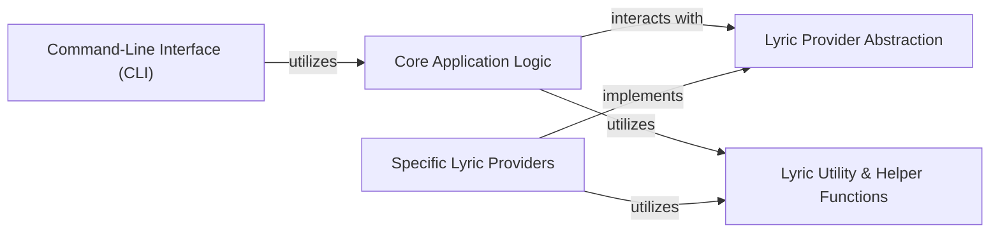

## Details

The `syncedlyrics` architecture is structured as a modular utility library, designed for efficient lyric retrieval. The system's entry point is the `Command-Line Interface (CLI)`, which processes user requests and initiates the core operations. These operations are managed by the `Core Application Logic`, acting as a facade that orchestrates the lyric search. This core component interacts with various `Specific Lyric Providers` through a standardized `Lyric Provider Abstraction`, allowing for seamless integration of new lyric sources. Each specific provider encapsulates the unique logic for fetching lyrics from its respective online platform. Both the `Core Application Logic` and the `Specific Lyric Providers` leverage a shared `Lyric Utility & Helper Functions` component for common tasks such as data manipulation, file handling, and web scraping, promoting code reusability and maintaining a clean separation of concerns within the project.

### Core Application Logic [[Expand]](./Core_Application_Logic.md)
The central orchestrator managing the overall lyric search workflow, selecting providers, and coordinating the process.

**Related Classes/Methods**:

- <a href="https://github.com/moehmeni/syncedlyrics//blob/syncedlyrics/__init__.py" target="_blank" rel="noopener noreferrer">`syncedlyrics`</a>

### Command-Line Interface (CLI) [[Expand]](./Command_Line_Interface_CLI_.md)
Provides the command-line entry point for user interaction, handling argument parsing and triggering core functionality.

**Related Classes/Methods**:

- <a href="https://github.com/moehmeni/syncedlyrics//blob/syncedlyrics/cli.py" target="_blank" rel="noopener noreferrer">`syncedlyrics.cli`</a>

### Lyric Provider Abstraction [[Expand]](./Lyric_Provider_Abstraction.md)
Defines the common interface and base functionality for all specific lyric retrieval services, ensuring extensibility and a consistent API.

**Related Classes/Methods**:

- <a href="https://github.com/moehmeni/syncedlyrics//blob/syncedlyrics/providers/base.py" target="_blank" rel="noopener noreferrer">`syncedlyrics.providers.base`</a>

### Specific Lyric Providers [[Expand]](./Specific_Lyric_Providers.md)
A collection of modules, each implementing the Lyric Provider Abstraction to retrieve lyrics from a particular online source.

**Related Classes/Methods**:

- <a href="https://github.com/moehmeni/syncedlyrics//blob/syncedlyrics/providers/" target="_blank" rel="noopener noreferrer">`syncedlyrics.providers`</a>

### Lyric Utility & Helper Functions
A collection of reusable helper functions for common tasks related to lyric processing, file operations, string manipulation, and web scraping.

**Related Classes/Methods**:

- <a href="https://github.com/moehmeni/syncedlyrics//blob/syncedlyrics/utils.py" target="_blank" rel="noopener noreferrer">`syncedlyrics.utils`</a>

### [FAQ](https://github.com/CodeBoarding/GeneratedOnBoardings/tree/main?tab=readme-ov-file#faq)