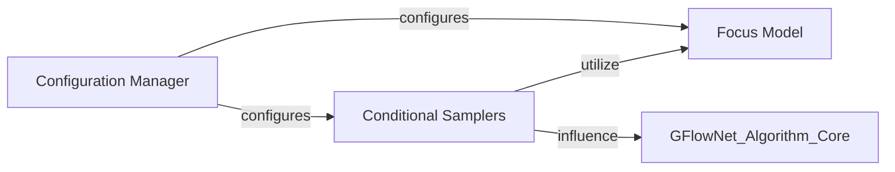

## Details

This subsystem is critical for the `synflownet` project, a research-oriented machine learning application for generative design in chemistry. It embodies the "Configuration-Driven Design" and "Modular Architecture" patterns, ensuring that experiments are reproducible, flexible, and efficiently guided towards desired molecular properties.

### Configuration Manager
This component serves as the central hub for defining, loading, and managing all application-wide settings. It encompasses model hyperparameters, training parameters, and task-specific configurations. By centralizing these parameters, it ensures reproducibility across experiments and provides flexibility for researchers to easily modify settings without altering core code. It leverages the `StrictDataClass` utility for robust, type-checked, and immutable configuration objects.

**Related Classes/Methods**:

- <a href="https://github.com/recursionpharma/synflownet-boltz/blob/trunk/synflownet/config.py" target="_blank" rel="noopener noreferrer">`synflownet.config`</a>
- <a href="https://github.com/recursionpharma/synflownet-boltz/blob/trunk/synflownet/algo/config.py" target="_blank" rel="noopener noreferrer">`synflownet.algo.config`</a>
- <a href="https://github.com/recursionpharma/synflownet-boltz/blob/trunk/synflownet/data/config.py" target="_blank" rel="noopener noreferrer">`synflownet.data.config`</a>
- <a href="https://github.com/recursionpharma/synflownet-boltz/blob/trunk/synflownet/models/config.py" target="_blank" rel="noopener noreferrer">`synflownet.models.config`</a>
- <a href="https://github.com/recursionpharma/synflownet-boltz/blob/trunk/synflownet/tasks/config.py" target="_blank" rel="noopener noreferrer">`synflownet.tasks.config`</a>
- <a href="https://github.com/recursionpharma/synflownet-boltz/blob/trunk/synflownet/utils/config.py" target="_blank" rel="noopener noreferrer">`synflownet.utils.config`</a>
- <a href="https://github.com/recursionpharma/synflownet-boltz/blob/trunk/synflownet/utils/misc.py#L34-L112" target="_blank" rel="noopener noreferrer">`synflownet.utils.misc.StrictDataClass` (34:112)</a>

### Conditional Samplers
These modules are responsible for applying dynamic conditions or biases during the molecule generation process. They guide the GFlowNet towards desired molecular properties by encoding various types of conditional information. Key implementations include `TemperatureConditional` (controlling exploration/exploitation), `MultiObjectiveWeightedPreferences` (for multi-objective optimization), and `FocusRegionConditional` (for guiding generation towards specific chemical spaces). All conditional strategies inherit from a base `Conditional` class, promoting extensibility.

**Related Classes/Methods**:

- <a href="https://github.com/recursionpharma/synflownet-boltz/blob/trunk/synflownet/utils/conditioning.py#L22-L34" target="_blank" rel="noopener noreferrer">`synflownet.utils.conditioning.Conditional` (22:34)</a>
- <a href="https://github.com/recursionpharma/synflownet-boltz/blob/trunk/synflownet/utils/conditioning.py#L37-L93" target="_blank" rel="noopener noreferrer">`synflownet.utils.conditioning.TemperatureConditional` (37:93)</a>
- <a href="https://github.com/recursionpharma/synflownet-boltz/blob/trunk/synflownet/utils/conditioning.py#L96-L133" target="_blank" rel="noopener noreferrer">`synflownet.utils.conditioning.MultiObjectiveWeightedPreferences` (96:133)</a>
- <a href="https://github.com/recursionpharma/synflownet-boltz/blob/trunk/synflownet/utils/conditioning.py#L136-L243" target="_blank" rel="noopener noreferrer">`synflownet.utils.conditioning.FocusRegionConditional` (136:243)</a>
- <a href="https://github.com/recursionpharma/synflownet-boltz/blob/trunk/synflownet/utils/config.py#L75-L80" target="_blank" rel="noopener noreferrer">`synflownet.utils.config.ConditionalsConfig` (75:80)</a>

### Focus Model
This component, primarily implemented by `TabularFocusModel`, is used by the `FocusRegionConditional` within the `Conditional Samplers`. Its purpose is to learn and adaptively update beliefs about promising regions within the vast chemical space. By dynamically identifying and emphasizing these regions, it helps to guide the generative process more efficiently towards areas that are likely to yield molecules with desired properties, often based on feedback from reward functions.

**Related Classes/Methods**:

- <a href="https://github.com/recursionpharma/synflownet-boltz/blob/trunk/synflownet/utils/focus_model.py#L46-L115" target="_blank" rel="noopener noreferrer">`synflownet.utils.focus_model.TabularFocusModel` (46:115)</a>
- <a href="https://github.com/recursionpharma/synflownet-boltz/blob/trunk/synflownet/utils/metrics.py" target="_blank" rel="noopener noreferrer">`synflownet.utils.metrics`</a>

### [FAQ](https://github.com/CodeBoarding/GeneratedOnBoardings/tree/main?tab=readme-ov-file#faq)