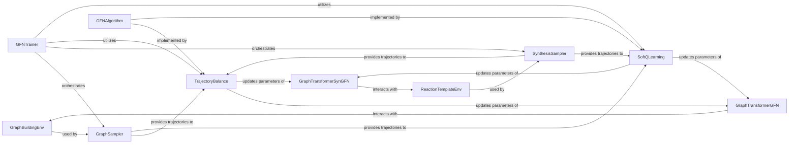

## Details

The `Core GFlowNet Engine` subsystem is the heart of the SynFlowNet project, responsible for implementing the GFlowNet learning and generation loop. It encompasses the neural network models that learn the GFlowNet policy, the environments that define valid actions for molecular or synthesis graph building, and the GFlowNet algorithms that drive model parameter updates and trajectory sampling. This subsystem adheres to the "Research-oriented machine learning application/framework for generative design in chemistry" project type by providing a modular and extensible framework for exploring different GFlowNet algorithms, neural network architectures, and molecular environments. Its design facilitates experimentation and development in generative chemistry.

### GraphBuildingEnv
Defines the environment for step-by-step molecular graph construction. It manages the graph state, valid actions (adding nodes, edges, attributes), and transitions, providing the rules for how molecules are built.

**Related Classes/Methods**:

- <a href="https://github.com/recursionpharma/synflownet-boltz/blob/trunk/synflownet/envs/graph_building_env.py#L165-L428" target="_blank" rel="noopener noreferrer">`synflownet.envs.graph_building_env.GraphBuildingEnv` (165:428)</a>

### ReactionTemplateEnv
A specialized environment for constructing synthesis pathways using predefined reaction templates. It handles the application of reactions to molecules and manages the state of the synthesis tree, enabling the generation of multi-step synthesis routes.

**Related Classes/Methods**:

- <a href="https://github.com/recursionpharma/synflownet-boltz/blob/trunk/synflownet/envs/synthesis_building_env.py#L637-L892" target="_blank" rel="noopener noreferrer">`synflownet.envs.synthesis_building_env.ReactionTemplateEnv` (637:892)</a>

### GraphTransformerGFN
The core Graph Neural Network (GNN) model for general graph generation tasks. It processes graph states from the environment and outputs action logits, representing the GFlowNet policy that guides the graph construction process.

**Related Classes/Methods**:

- <a href="https://github.com/recursionpharma/synflownet-boltz/blob/trunk/synflownet/models/graph_transformer.py#L172-L365" target="_blank" rel="noopener noreferrer">`synflownet.models.graph_transformer.GraphTransformerGFN` (172:365)</a>

### GraphTransformerSynGFN
A specialized GNN model, inheriting from `GraphTransformerGFN`, tailored for synthesis pathway generation. It likely incorporates specific features or architectures to handle the complexities of reaction templates and reactant selection within the synthesis environment.

**Related Classes/Methods**:

- <a href="https://github.com/recursionpharma/synflownet-boltz/blob/trunk/synflownet/models/graph_transformer.py#L368-L449" target="_blank" rel="noopener noreferrer">`synflownet.models.graph_transformer.GraphTransformerSynGFN` (368:449)</a>

### GraphSampler
Orchestrates the forward and backward sampling of molecular graphs using the `GraphBuildingEnv` and the `GraphTransformerGFN` model. It generates trajectories of graph construction, which are essential for training GFlowNet models.

**Related Classes/Methods**:

- <a href="https://github.com/recursionpharma/synflownet-boltz/blob/trunk/synflownet/algo/graph_sampling.py#L101-L369" target="_blank" rel="noopener noreferrer">`synflownet.algo.graph_sampling.GraphSampler` (101:369)</a>

### SynthesisSampler
Similar to `GraphSampler`, but for synthesis pathways. It uses the `ReactionTemplateEnv` and `GraphTransformerSynGFN` to sample forward and backward trajectories of synthesis steps, providing data for training synthesis-focused GFlowNets.

**Related Classes/Methods**:

- <a href="https://github.com/recursionpharma/synflownet-boltz/blob/trunk/synflownet/algo/reaction_sampling.py#L21-L347" target="_blank" rel="noopener noreferrer">`synflownet.algo.reaction_sampling.SynthesisSampler` (21:347)</a>

### TrajectoryBalance
A core GFlowNet training algorithm implementation. It computes the loss function (Trajectory Balance loss) based on sampled trajectories, enabling the model to learn to generate diverse and high-reward molecules/pathways by balancing forward and backward probabilities.

**Related Classes/Methods**:

- <a href="https://github.com/recursionpharma/synflownet-boltz/blob/trunk/synflownet/algo/trajectory_balance.py#L72-L858" target="_blank" rel="noopener noreferrer">`synflownet.algo.trajectory_balance.TrajectoryBalance` (72:858)</a>

### SoftQLearning
Another GFlowNet training algorithm that computes a Q-learning-based loss. It aims to learn a Q-function that estimates the expected reward from a given state, guiding the policy towards high-reward states.

**Related Classes/Methods**:

- <a href="https://github.com/recursionpharma/synflownet-boltz/blob/trunk/synflownet/algo/soft_q_learning.py#L16-L259" target="_blank" rel="noopener noreferrer">`synflownet.algo.soft_q_learning.SoftQLearning` (16:259)</a>

### GFNTrainer
Orchestrates the overall GFlowNet training process. It manages the interaction between the samplers, the GFlowNet algorithms, and the neural network models, handling data flow, loss computation, and model updates.

**Related Classes/Methods**:

- <a href="https://github.com/recursionpharma/synflownet-boltz/blob/trunk/synflownet/trainer.py#L43-L421" target="_blank" rel="noopener noreferrer">`synflownet.trainer.GFNTrainer` (43:421)</a>

### GFNAlgorithm
An abstract base class that defines the common interface and structure for various GFlowNet training algorithms (e.g., Trajectory Balance, Soft Q-Learning). It ensures consistency across different algorithmic implementations.

**Related Classes/Methods**:

- `synflownet.GFNAlgorithm.GFNAlgorithm`

### [FAQ](https://github.com/CodeBoarding/GeneratedOnBoardings/tree/main?tab=readme-ov-file#faq)