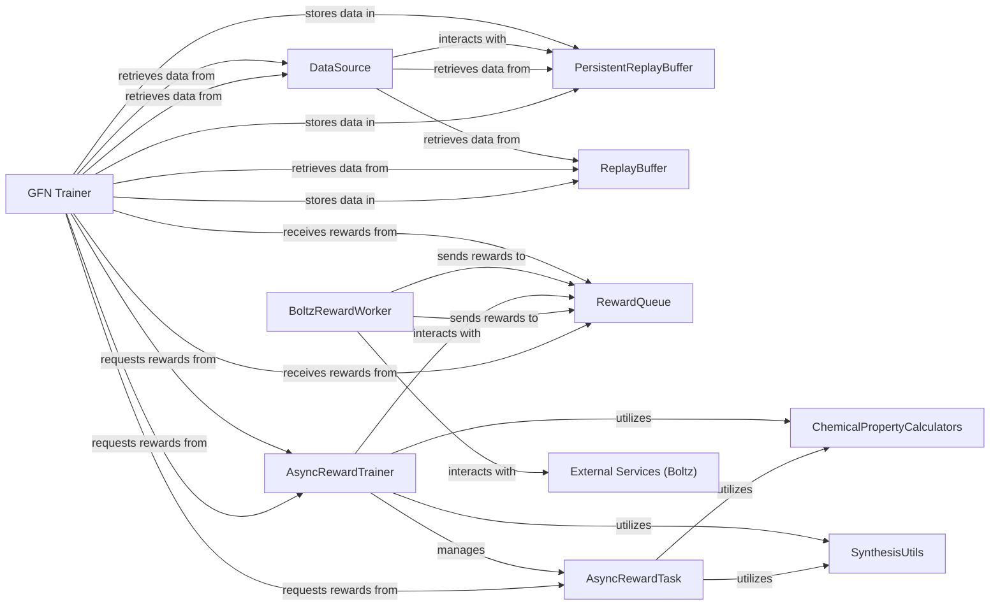

## Details

Handles the entire data lifecycle, from storing and retrieving molecular trajectories and rewards (using persistent storage and replay buffers) to generating training batches. It also orchestrates the asynchronous computation of rewards for generated molecules, integrating with internal chemical property calculators and external services like Boltz.

### PersistentReplayBuffer
Manages the long-term, persistent storage of molecular trajectories, states, actions, and associated data using an SQL database. This ensures data durability and availability across training runs and experiments.

**Related Classes/Methods**:

- <a href="https://github.com/recursionpharma/synflownet-boltz/blob/trunk/synflownet/data/async_sql_databases.py" target="_blank" rel="noopener noreferrer">`synflownet.data.async_sql_databases`</a>

### ReplayBuffer
Provides an in-memory buffer for recently generated trajectories and data. It facilitates efficient sampling of training batches for the GFlowNet, crucial for online learning.

**Related Classes/Methods**:

- <a href="https://github.com/recursionpharma/synflownet-boltz/blob/trunk/synflownet/data/replay_buffer.py" target="_blank" rel="noopener noreferrer">`synflownet.data.replay_buffer`</a>

### DataSource
Acts as an abstraction layer for accessing and managing data from various storage mechanisms, including both persistent and in-memory replay buffers. It provides a unified interface for data retrieval.

**Related Classes/Methods**:

- <a href="https://github.com/recursionpharma/synflownet-boltz/blob/trunk/synflownet/data/data_source.py" target="_blank" rel="noopener noreferrer">`synflownet.data.data_source`</a>

### RewardQueue
A specialized queue for managing and processing rewards, particularly in asynchronous reward computation scenarios. It ensures that computed rewards are efficiently delivered back to the main training process.

**Related Classes/Methods**:

- <a href="https://github.com/recursionpharma/synflownet-boltz/blob/trunk/synflownet/data/async_sql_databases.py" target="_blank" rel="noopener noreferrer">`synflownet.data.async_sql_databases`</a>

### AsyncRewardTask
Defines the structure and logic for generative tasks that involve asynchronous reward computation. It encapsulates the requirements for offloading computationally intensive reward calculations to external workers or services.

**Related Classes/Methods**:

- <a href="https://github.com/recursionpharma/synflownet-boltz/blob/trunk/synflownet/tasks/async_reward_task.py" target="_blank" rel="noopener noreferrer">`synflownet.tasks.async_reward_task`</a>

### AsyncRewardTrainer
Orchestrates the execution and management of asynchronous reward tasks. It is responsible for coordinating with reward worker processes and ensuring that rewards are computed and returned in a timely manner.

**Related Classes/Methods**:

- <a href="https://github.com/recursionpharma/synflownet-boltz/blob/trunk/synflownet/tasks/async_reward_task.py" target="_blank" rel="noopener noreferrer">`synflownet.tasks.async_reward_task`</a>

### BoltzRewardWorker
An external script that acts as a dedicated worker process for communicating with the Boltz service to compute rewards for molecules. It operates asynchronously, offloading the heavy computational burden from the main training loop.

**Related Classes/Methods**:

- <a href="https://github.com/recursionpharma/synflownet-boltz/blob/trunk/synflownet-boltz-launcher/scripts/boltz_reward_worker.py" target="_blank" rel="noopener noreferrer">`synflownet-boltz-launcher.scripts.boltz_reward_worker`</a>

### ChemicalPropertyCalculators
Internal utility modules that implement specific chemical property calculators, such as synthetic accessibility score (sascore) and synthetic complexity score (scscore_numpy). These are often used as intrinsic rewards or constraints.

**Related Classes/Methods**:

- <a href="https://github.com/recursionpharma/synflownet-boltz/blob/trunk/synflownet/utils/sascore.py" target="_blank" rel="noopener noreferrer">`synflownet.utils.sascore`</a>
- <a href="https://github.com/recursionpharma/synflownet-boltz/blob/trunk/synflownet/utils/scscore_numpy.py" target="_blank" rel="noopener noreferrer">`synflownet.utils.scscore_numpy`</a>

### SynthesisUtils
A utility module likely containing functions related to molecular synthesis, which might be used in defining or calculating rewards for reaction-based tasks or for processing molecular structures before reward calculation.

**Related Classes/Methods**:

- <a href="https://github.com/recursionpharma/synflownet-boltz/blob/trunk/synflownet/utils/synthesis_utils.py" target="_blank" rel="noopener noreferrer">`synflownet.utils.synthesis_utils`</a>

### GFN Trainer
Manages the training process of the GFlowNet model, including generating trajectories, interacting with data storage, and requesting/receiving rewards.

**Related Classes/Methods**: _None_

### External Services (Boltz)
Represents external services, specifically Boltz, used for computing rewards for molecules.

**Related Classes/Methods**: _None_

### [FAQ](https://github.com/CodeBoarding/GeneratedOnBoardings/tree/main?tab=readme-ov-file#faq)