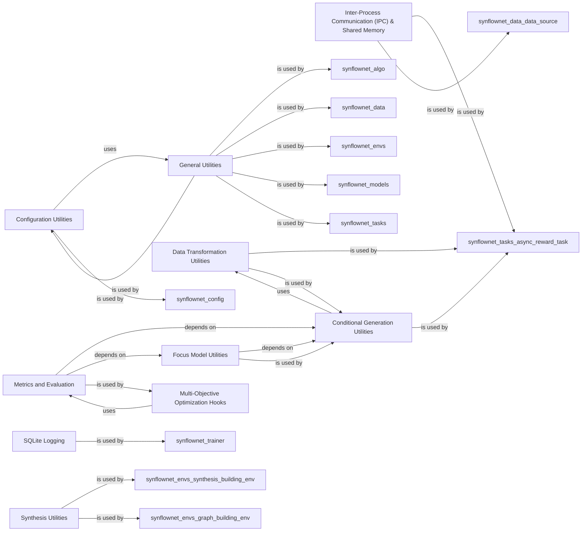

## Details

The `Framework Utilities` component in `synflownet` is a crucial collection of general-purpose utility functions that support various components across the framework. It provides essential functionalities for multiprocessing, inter-process communication, shared memory management, data transformations, device management, RNG seeding, and general data structure manipulation. These components are fundamental because they provide the underlying infrastructure and specialized functionalities required for a research-oriented machine learning application in computational chemistry. They enable efficient data handling, distributed computation, flexible configuration, guided molecule generation, and robust evaluation, all of which are critical for developing and deploying generative models for drug discovery. The modular design of these utilities allows for their reuse across different parts of the framework, promoting maintainability and extensibility.

### Configuration Utilities
This component is responsible for managing configuration settings across the `synflownet` framework, particularly for utility modules. It leverages `StrictDataClass` to ensure strict data validation for configuration objects, promoting robust and reproducible experiments.

**Related Classes/Methods**:

- <a href="https://github.com/recursionpharma/synflownet-boltz/blob/trunk/synflownet/utils/config.py#L1-L1" target="_blank" rel="noopener noreferrer">`synflownet/utils/config.py` (1:1)</a>
- <a href="https://github.com/recursionpharma/synflownet-boltz/blob/trunk/synflownet/utils/misc.py#L1-L1" target="_blank" rel="noopener noreferrer">`synflownet/utils/misc.py` (1:1)</a>

### General Utilities
A versatile module containing a collection of general-purpose utility functions and classes. This includes data structure manipulations (e.g., `flat_dict_to_nested_dict`, `nested_dict_to_flat_dict`), and the `StrictDataClass` which serves as a base for many configuration classes across the project, ensuring strict data validation. It's a foundational component used widely throughout the framework.

**Related Classes/Methods**:

- <a href="https://github.com/recursionpharma/synflownet-boltz/blob/trunk/synflownet/utils/misc.py#L1-L1" target="_blank" rel="noopener noreferrer">`synflownet/utils/misc.py` (1:1)</a>

### Inter-Process Communication (IPC) & Shared Memory
This component provides robust mechanisms for inter-process communication (IPC) and shared memory management. It enables the framework to offload computationally intensive tasks, such as reward calculations, to separate worker processes, crucial for distributed computation and efficient resource utilization.

**Related Classes/Methods**:

- <a href="https://github.com/recursionpharma/synflownet-boltz/blob/trunk/synflownet/utils/multiprocessing_proxy.py#L1-L1" target="_blank" rel="noopener noreferrer">`synflownet/utils/multiprocessing_proxy.py` (1:1)</a>

### Data Transformation Utilities
Handles various data transformations, likely converting data between different formats or representations required by different parts of the framework (e.g., for model input/output or data storage). This ensures data compatibility and consistency across the pipeline.

**Related Classes/Methods**:

- <a href="https://github.com/recursionpharma/synflownet-boltz/blob/trunk/synflownet/utils/transforms.py#L1-L1" target="_blank" rel="noopener noreferrer">`synflownet/utils/transforms.py` (1:1)</a>

### Conditional Generation Utilities
Implements functionalities for conditional generation, allowing the GFlowNet models to generate molecules based on specific criteria or preferences (e.g., `FocusRegionConditional`, `TemperatureConditional`, `MultiObjectiveWeightedPreferences`). This is a core component for guiding the generative process.

**Related Classes/Methods**:

- <a href="https://github.com/recursionpharma/synflownet-boltz/blob/trunk/synflownet/utils/conditioning.py#L1-L1" target="_blank" rel="noopener noreferrer">`synflownet/utils/conditioning.py` (1:1)</a>

### Focus Model Utilities
Contains models or utilities related to defining and utilizing "focus regions" for conditional molecule generation. This component works in conjunction with `Conditional Generation Utilities` to enable targeted molecule generation.

**Related Classes/Methods**:

- <a href="https://github.com/recursionpharma/synflownet-boltz/blob/trunk/synflownet/utils/focus_model.py#L1-L1" target="_blank" rel="noopener noreferrer">`synflownet/utils/focus_model.py` (1:1)</a>

### Metrics and Evaluation
Provides various metrics and evaluation functions used to assess the quality of generated molecules or the performance of the generative models. This includes general metrics as well as specialized ones like Synthetic Accessibility (SA) score and SCScore.

**Related Classes/Methods**:

- <a href="https://github.com/recursionpharma/synflownet-boltz/blob/trunk/synflownet/utils/metrics.py#L1-L1" target="_blank" rel="noopener noreferrer">`synflownet/utils/metrics.py` (1:1)</a>
- <a href="https://github.com/recursionpharma/synflownet-boltz/blob/trunk/synflownet/utils/sascore.py#L1-L1" target="_blank" rel="noopener noreferrer">`synflownet/utils/sascore.py` (1:1)</a>
- <a href="https://github.com/recursionpharma/synflownet-boltz/blob/trunk/synflownet/utils/scscore_numpy.py#L1-L1" target="_blank" rel="noopener noreferrer">`synflownet/utils/scscore_numpy.py` (1:1)</a>

### SQLite Logging
Manages the logging of experimental data, training progress, and other relevant information to an SQLite database, facilitating data persistence and analysis. This is crucial for tracking experiments and debugging.

**Related Classes/Methods**:

- <a href="https://github.com/recursionpharma/synflownet-boltz/blob/trunk/synflownet/utils/sqlite_log.py#L1-L1" target="_blank" rel="noopener noreferrer">`synflownet/utils/sqlite_log.py` (1:1)</a>

### Synthesis Utilities
Contains general utility functions specifically tailored for synthesis-related tasks within the framework, supporting the molecule synthesis pipeline. This includes functions for both synthesis processes and their evaluations.

**Related Classes/Methods**:

- <a href="https://github.com/recursionpharma/synflownet-boltz/blob/trunk/synflownet/utils/synthesis_utils.py#L1-L1" target="_blank" rel="noopener noreferrer">`synflownet/utils/synthesis_utils.py` (1:1)</a>
- <a href="https://github.com/recursionpharma/synflownet-boltz/blob/trunk/synflownet/utils/synthesis_evals.py#L1-L1" target="_blank" rel="noopener noreferrer">`synflownet/utils/synthesis_evals.py` (1:1)</a>

### Multi-Objective Optimization Hooks
Provides hooks and functionalities for integrating multi-objective optimization strategies into the generative process, allowing the framework to optimize for multiple chemical properties simultaneously.

**Related Classes/Methods**:

- <a href="https://github.com/recursionpharma/synflownet-boltz/blob/trunk/synflownet/utils/multiobjective_hooks.py#L1-L1" target="_blank" rel="noopener noreferrer">`synflownet/utils/multiobjective_hooks.py` (1:1)</a>

### [FAQ](https://github.com/CodeBoarding/GeneratedOnBoardings/tree/main?tab=readme-ov-file#faq)