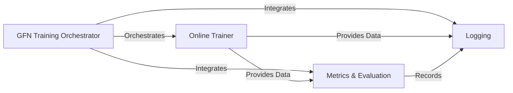

## Details

The `Training & Monitoring Orchestrator` subsystem is a critical part of the `synflownet` project, responsible for managing the entire lifecycle of GFlowNet training, from initialization to performance monitoring and data logging. It embodies the project's modular and pipeline-driven architectural patterns, ensuring a structured and reproducible training process for generative molecular design.

### GFN Training Orchestrator
This is the central control unit for the GFlowNet training process. It orchestrates the overall training lifecycle, including initializing core GFlowNet components, managing training iterations, handling checkpoints, and coordinating with monitoring and logging systems. It acts as the high-level conductor for the generative design pipeline.

**Related Classes/Methods**:

- `GFN Training Orchestrator`

### Online Trainer
A specialized component that focuses on the online learning aspects of the GFlowNet. It is responsible for setting up the GFlowNet model and optimizers, and executing individual training steps, including gradient calculations and model updates based on specific GFN algorithms (e.g., Trajectory Balance, Soft Q-Learning).

**Related Classes/Methods**:

- `Online Trainer`

### Metrics & Evaluation
This component provides a suite of functions and hooks for calculating and reporting various performance metrics, particularly relevant for multi-objective optimization in generative design (e.g., Hypervolume, IGD, Pareto efficiency). The `MultiObjectiveStatsHook` integrates these evaluations into the training pipeline, allowing for real-time performance assessment.

**Related Classes/Methods**:

- `Metrics & Evaluation`
- `MultiObjectiveStatsHook`

### Logging
This component, primarily implemented through `SQLiteLogHook` and `SQLiteLog`, handles the persistent storage of training and evaluation results into an SQLite database. It ensures that experimental data, performance metrics, and sampled molecular data are recorded for later analysis, debugging, and reproducibility.

**Related Classes/Methods**:

- `Logging`
- `SQLiteLogHook`
- `SQLiteLog`

### [FAQ](https://github.com/CodeBoarding/GeneratedOnBoardings/tree/main?tab=readme-ov-file#faq)