```mermaid
graph LR
    Configuration_Guidance_System["Configuration & Guidance System"]
    Core_GFlowNet_Engine["Core GFlowNet Engine"]
    Data_Reward_Management["Data & Reward Management"]
    Training_Monitoring_Orchestrator["Training & Monitoring Orchestrator"]
    Framework_Utilities["Framework Utilities"]
    Configuration_Guidance_System -- "Configures & Guides" --> Core_GFlowNet_Engine
    Configuration_Guidance_System -- "Configures" --> Data_Reward_Management
    Configuration_Guidance_System -- "Configures" --> Training_Monitoring_Orchestrator
    Core_GFlowNet_Engine -- "Generates Trajectories" --> Data_Reward_Management
    Core_GFlowNet_Engine -- "Receives Training Data From" --> Data_Reward_Management
    Core_GFlowNet_Engine -- "Is Orchestrated By" --> Training_Monitoring_Orchestrator
    Core_GFlowNet_Engine -- "Reports Progress To" --> Training_Monitoring_Orchestrator
    Data_Reward_Management -- "Is Managed By" --> Training_Monitoring_Orchestrator
    Data_Reward_Management -- "Provides Metrics To" --> Training_Monitoring_Orchestrator
    Framework_Utilities -- "Provides Support To" --> Configuration_Guidance_System
    Framework_Utilities -- "Provides Support To" --> Core_GFlowNet_Engine
    Framework_Utilities -- "Provides Support To" --> Data_Reward_Management
    Framework_Utilities -- "Provides Support To" --> Training_Monitoring_Orchestrator
    click Configuration_Guidance_System href "https://github.com/CodeBoarding/GeneratedOnBoardings/blob/main/synflownet-boltz/Configuration_Guidance_System.md" "Details"
    click Core_GFlowNet_Engine href "https://github.com/CodeBoarding/GeneratedOnBoardings/blob/main/synflownet-boltz/Core_GFlowNet_Engine.md" "Details"
    click Data_Reward_Management href "https://github.com/CodeBoarding/GeneratedOnBoardings/blob/main/synflownet-boltz/Data_Reward_Management.md" "Details"
    click Training_Monitoring_Orchestrator href "https://github.com/CodeBoarding/GeneratedOnBoardings/blob/main/synflownet-boltz/Training_Monitoring_Orchestrator.md" "Details"
    click Framework_Utilities href "https://github.com/CodeBoarding/GeneratedOnBoardings/blob/main/synflownet-boltz/Framework_Utilities.md" "Details"
```

## Details

The `synflownet-boltz` project, a research-oriented machine learning framework for generative design in chemistry, exhibits a modular and pipeline-driven architecture. The core functionality revolves around a GFlowNet-based generative process, supported by robust data management, reward calculation, and a flexible configuration system.

### Configuration & Guidance System [[Expand]](./Configuration_Guidance_System.md)
Centralizes the management of all application settings, including model hyperparameters, training parameters, and task-specific configurations. It also handles and encodes various types of conditional information (e.g., temperature, multi-objective preferences) that guide the generative process towards desired molecular properties.

**Related Classes/Methods**:

- <a href="https://github.com/recursionpharma/synflownet-boltz/blob/trunk/synflownet/config.py#L1-L1" target="_blank" rel="noopener noreferrer">`synflownet.config` (1:1)</a>
- <a href="https://github.com/recursionpharma/synflownet-boltz/blob/trunk/synflownet/utils/conditioning.py#L1-L1" target="_blank" rel="noopener noreferrer">`synflownet.utils.conditioning` (1:1)</a>
- <a href="https://github.com/recursionpharma/synflownet-boltz/blob/trunk/synflownet/utils/focus_model.py#L1-L1" target="_blank" rel="noopener noreferrer">`synflownet.utils.focus_model` (1:1)</a>
- <a href="https://github.com/recursionpharma/synflownet-boltz/blob/trunk/synflownet/utils/misc.py#L34-L112" target="_blank" rel="noopener noreferrer">`synflownet.utils.misc.StrictDataClass` (34:112)</a>

### Core GFlowNet Engine [[Expand]](./Core_GFlowNet_Engine.md)
Implements the central GFlowNet learning and generation loop. This includes the neural network model (Graph Transformer) that learns the GFlowNet policy, the molecular environments (graph building and synthesis) that define valid actions, and the GFlowNet algorithms (e.g., Soft Q-Learning, Trajectory Balance) that update the model parameters and orchestrate the sampling of molecular trajectories.

**Related Classes/Methods**:

- <a href="https://github.com/recursionpharma/synflownet-boltz/blob/trunk/synflownet/models/graph_transformer.py#L1-L1" target="_blank" rel="noopener noreferrer">`synflownet.models.graph_transformer` (1:1)</a>
- `synflownet.algo` (1:1)
- `synflownet.envs` (1:1)

### Data & Reward Management [[Expand]](./Data_Reward_Management.md)
Handles the entire data lifecycle, from storing and retrieving molecular trajectories and rewards (using persistent storage and replay buffers) to generating training batches. It also orchestrates the asynchronous computation of rewards for generated molecules, integrating with internal chemical property calculators and external services like Boltz.

**Related Classes/Methods**:

- `synflownet.data` (1:1)
- `synflownet.tasks` (1:1)
- <a href="https://github.com/recursionpharma/synflownet-boltz/blob/trunk/synflownet-boltz-launcher/scripts/boltz_reward_worker.py#L1-L1" target="_blank" rel="noopener noreferrer">`synflownet-boltz-launcher.scripts.boltz_reward_worker` (1:1)</a>
- <a href="https://github.com/recursionpharma/synflownet-boltz/blob/trunk/synflownet/utils/sascore.py#L1-L1" target="_blank" rel="noopener noreferrer">`synflownet.utils.sascore` (1:1)</a>
- <a href="https://github.com/recursionpharma/synflownet-boltz/blob/trunk/synflownet/utils/scscore_numpy.py#L1-L1" target="_blank" rel="noopener noreferrer">`synflownet.utils.scscore_numpy` (1:1)</a>
- <a href="https://github.com/recursionpharma/synflownet-boltz/blob/trunk/synflownet/utils/synthesis_utils.py#L1-L1" target="_blank" rel="noopener noreferrer">`synflownet.utils.synthesis_utils` (1:1)</a>

### Training & Monitoring Orchestrator [[Expand]](./Training_Monitoring_Orchestrator.md)
Manages the overall training lifecycle, initializing and coordinating the core GFlowNet components. It runs training iterations, handles checkpoints, and integrates with the monitoring system to log progress, evaluate model performance (metrics like diversity, hypervolume), and track sampled data.

**Related Classes/Methods**:

- <a href="https://github.com/recursionpharma/synflownet-boltz/blob/trunk/synflownet/trainer.py#L1-L1" target="_blank" rel="noopener noreferrer">`synflownet.trainer` (1:1)</a>
- <a href="https://github.com/recursionpharma/synflownet-boltz/blob/trunk/synflownet/online_trainer.py#L1-L1" target="_blank" rel="noopener noreferrer">`synflownet.online_trainer` (1:1)</a>
- <a href="https://github.com/recursionpharma/synflownet-boltz/blob/trunk/synflownet/utils/metrics.py#L1-L1" target="_blank" rel="noopener noreferrer">`synflownet.utils.metrics` (1:1)</a>
- <a href="https://github.com/recursionpharma/synflownet-boltz/blob/trunk/synflownet/utils/multiobjective_hooks.py#L1-L1" target="_blank" rel="noopener noreferrer">`synflownet.utils.multiobjective_hooks` (1:1)</a>
- <a href="https://github.com/recursionpharma/synflownet-boltz/blob/trunk/synflownet/utils/sqlite_log.py#L1-L1" target="_blank" rel="noopener noreferrer">`synflownet.utils.sqlite_log` (1:1)</a>

### Framework Utilities [[Expand]](./Framework_Utilities.md)
Provides a collection of general-purpose utility functions that support various components across the framework. This includes functionalities for multiprocessing, inter-process communication, shared memory management, data transformations, device management, RNG seeding, and general data structure manipulation.

**Related Classes/Methods**:

- <a href="https://github.com/recursionpharma/synflownet-boltz/blob/trunk/synflownet/utils/multiprocessing_proxy.py#L1-L1" target="_blank" rel="noopener noreferrer">`synflownet.utils.multiprocessing_proxy` (1:1)</a>
- <a href="https://github.com/recursionpharma/synflownet-boltz/blob/trunk/synflownet/utils/transforms.py#L1-L1" target="_blank" rel="noopener noreferrer">`synflownet.utils.transforms` (1:1)</a>
- <a href="https://github.com/recursionpharma/synflownet-boltz/blob/trunk/synflownet/utils/misc.py#L1-L1" target="_blank" rel="noopener noreferrer">`synflownet.utils.misc` (1:1)</a>

### [FAQ](https://github.com/CodeBoarding/GeneratedOnBoardings/tree/main?tab=readme-ov-file#faq)