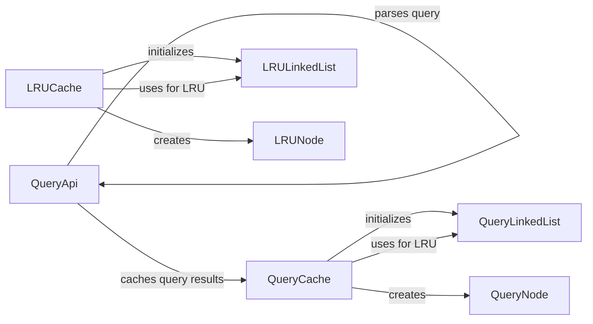

## Component Details

### QueryApi
The QueryApi component defines an interface for handling query requests. It is responsible for receiving a query string, parsing it, and either retrieving the result from the QueryCache or fetching it from the underlying data source. It interacts with the QueryCache to check for cached results before accessing the data source.
- **Related Classes/Methods**: `repos.system-design-primer.solutions.system_design.query_cache.query_cache_snippets.QueryApi`

### QueryCache
The QueryCache component is a specialized cache designed to store query results. It utilizes a LinkedList (QueryLinkedList) for efficient LRU eviction. When a query is received by the QueryApi, the QueryCache is checked first. If the result is found, it's returned immediately; otherwise, the QueryApi fetches the result, stores it in the QueryCache, and then returns it. The QueryCache manages the storage and retrieval of query results, optimizing response times for frequently accessed queries.
- **Related Classes/Methods**: `repos.system-design-primer.solutions.system_design.query_cache.query_cache_snippets.Cache`

### QueryLinkedList
The QueryLinkedList component implements a doubly linked list data structure. It is used by the QueryCache to maintain the order of cache entries based on their usage. The list facilitates LRU eviction by allowing the cache to quickly identify and remove the least recently used entry. It provides methods for adding nodes to the front, removing nodes from the tail, and moving nodes to the front when they are accessed.
- **Related Classes/Methods**: `repos.system-design-primer.solutions.system_design.query_cache.query_cache_snippets.LinkedList`

### QueryNode
The QueryNode component represents a node in the QueryLinkedList. Each node stores a key-value pair, where the key is the query string and the value is the corresponding query result. The nodes are linked together to form the list, enabling efficient traversal and manipulation of cache entries.
- **Related Classes/Methods**: `repos.system-design-primer.solutions.system_design.query_cache.query_cache_snippets.Node`

### LRUCache
The LRUCache component provides a generic implementation of an LRU (Least Recently Used) cache. It stores key-value pairs and evicts the least recently accessed items when the cache reaches its capacity. It uses a LinkedList (LRULinkedList) to keep track of the order of items based on their usage. The LRUCache offers methods for adding, retrieving, and updating items in the cache, ensuring that frequently accessed items remain in the cache while less frequently used items are evicted.
- **Related Classes/Methods**: `repos.system-design-primer.solutions.object_oriented_design.lru_cache.lru_cache.Cache`

### LRULinkedList
The LRULinkedList component implements a doubly linked list data structure. It is used by the LRUCache to maintain the order of cache entries based on their usage. The list facilitates LRU eviction by allowing the cache to quickly identify and remove the least recently used entry. It provides methods for adding nodes to the front, removing nodes from the tail, and moving nodes to the front when they are accessed.
- **Related Classes/Methods**: `repos.system-design-primer.solutions.object_oriented_design.lru_cache.lru_cache.LinkedList`

### LRUNode
The LRUNode component represents a node in the LRULinkedList. Each node stores a key-value pair. The nodes are linked together to form the list, enabling efficient traversal and manipulation of cache entries.
- **Related Classes/Methods**: `repos.system-design-primer.solutions.object_oriented_design.lru_cache.lru_cache.Node`
