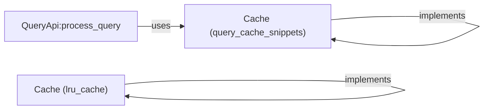

## Component Details

The caching system provides a mechanism to store and retrieve data quickly, improving performance by reducing the need to fetch data from slower sources. It includes a basic cache implementation and an LRU cache, which evicts the least recently used items when the cache is full. The QueryApi utilizes the cache to store and retrieve query results, enhancing the efficiency of query processing.

### QueryApi:process_query
This function processes a query by first checking if the result is present in the cache. If it is, it returns the cached result. Otherwise, it computes the result, stores it in the cache, and returns it. This process optimizes query execution by leveraging cached results for frequently accessed queries.
- **Related Classes/Methods**: `system_design_primer.solutions.system_design.query_cache.query_cache_snippets.QueryApi:process_query`

### Cache (query_cache_snippets)
This class implements a simple cache with `get` and `set` methods. It's used by `QueryApi:process_query` to store and retrieve query results. The cache provides basic storage functionality for query results.
- **Related Classes/Methods**: `system_design_primer.solutions.system_design.query_cache.query_cache_snippets.Cache:__init__`, `system_design_primer.solutions.system_design.query_cache.query_cache_snippets.Cache:get`, `system_design_primer.solutions.system_design.query_cache.query_cache_snippets.Cache:set`

### Cache (lru_cache)
This class implements an LRU (Least Recently Used) cache with `get` and `set` methods. It evicts the least recently used items when the cache is full, optimizing for frequently accessed data. It provides a more sophisticated caching mechanism compared to the simple cache.
- **Related Classes/Methods**: `system_design_primer.solutions.object_oriented_design.lru_cache.lru_cache.Cache:__init__`, `system_design_primer.solutions.object_oriented_design.lru_cache.lru_cache.Cache:get`, `system_design_primer.solutions.object_oriented_design.lru_cache.lru_cache.Cache:set`
