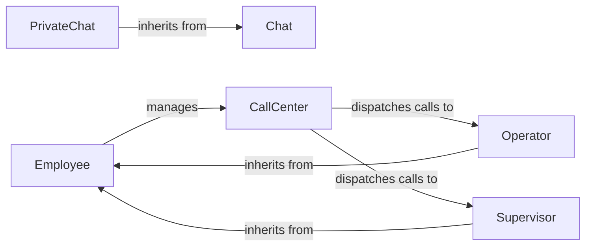

## Component Details

### Chat
Abstract base class for chat functionalities. It manages chat ID, users, and messages, providing a foundation for different types of chats.
- **Related Classes/Methods**: `repos.system-design-primer.solutions.object_oriented_design.online_chat.online_chat.Chat`

### PrivateChat
Represents a private chat between two users, extending the base Chat class. It initializes the chat with the two users involved, inheriting the basic chat functionalities.
- **Related Classes/Methods**: `repos.system-design-primer.solutions.object_oriented_design.online_chat.online_chat.PrivateChat`

### Employee
Abstract base class for call center employees. It manages employee ID, name, rank, current call, and the call center they belong to. It also defines methods for taking and completing calls, as well as escalating calls, serving as a base for different employee roles.
- **Related Classes/Methods**: `repos.system-design-primer.solutions.object_oriented_design.call_center.call_center.Employee`

### Operator
Represents a call center operator, inheriting from the Employee class. It handles incoming calls and can escalate them to supervisors, extending the basic employee functionalities.
- **Related Classes/Methods**: `repos.system-design-primer.solutions.object_oriented_design.call_center.call_center.Operator`

### Supervisor
Represents a call center supervisor, inheriting from the Employee class. It can escalate calls to directors, extending the basic employee functionalities.
- **Related Classes/Methods**: `repos.system-design-primer.solutions.object_oriented_design.call_center.call_center.Supervisor`

### CallCenter
Manages the call center operations, including dispatching calls to available employees (operators, supervisors, directors) and queuing calls when no employee is available. It also handles call escalations and completions, orchestrating the call flow.
- **Related Classes/Methods**: `repos.system-design-primer.solutions.object_oriented_design.call_center.call_center.CallCenter`
