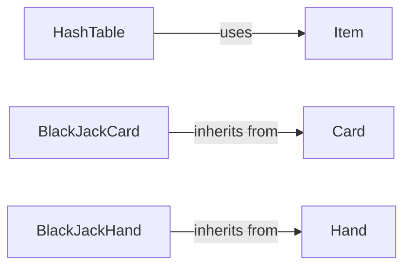

## Component Details

### HashTable
Implements a hash table data structure with set, get, and remove operations. It uses a list of lists to handle collisions, providing a basic key-value storage mechanism.
- **Related Classes/Methods**: `repos.system-design-primer.solutions.object_oriented_design.hash_table.hash_map.HashTable`

### Item
Represents an item (key-value pair) stored in the hash table. It encapsulates the key and value, providing a simple data structure for storing elements in the hash table.
- **Related Classes/Methods**: `repos.system-design-primer.solutions.object_oriented_design.hash_table.hash_map.Item`

### Card
Represents a playing card with a suit and a value. It serves as an abstract base class for more specific card types.
- **Related Classes/Methods**: `repos.system-design-primer.solutions.object_oriented_design.deck_of_cards.deck_of_cards.Card`

### BlackJackCard
Represents a card in the game of Blackjack, inheriting from the Card class and adding Blackjack-specific functionality like determining the card's value. Ace can be 1 or 11. It extends the basic card representation with game-specific rules.
- **Related Classes/Methods**: `repos.system-design-primer.solutions.object_oriented_design.deck_of_cards.deck_of_cards.BlackJackCard`

### Hand
Represents a hand of cards. It can add cards and calculate the total score of the hand. It provides a basic structure for managing a collection of cards.
- **Related Classes/Methods**: `repos.system-design-primer.solutions.object_oriented_design.deck_of_cards.deck_of_cards.Hand`

### BlackJackHand
Represents a hand in the game of Blackjack, inheriting from the Hand class and adding Blackjack-specific functionality like calculating the possible scores of the hand. It extends the basic hand representation with game-specific rules.
- **Related Classes/Methods**: `repos.system-design-primer.solutions.object_oriented_design.deck_of_cards.deck_of_cards.BlackJackHand`
