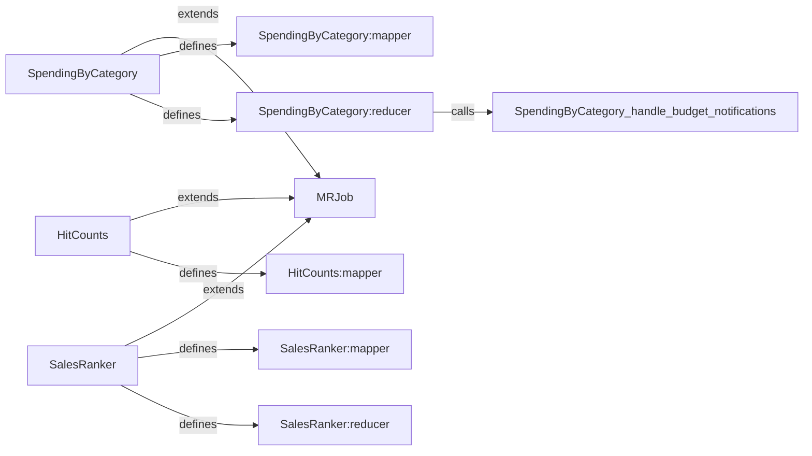

## Component Details

### SpendingByCategory
This component extends MRJob to analyze spending habits by category from Mint data. It extracts year and month from timestamps, handles budget notifications, and defines the mapper and reducer steps for the MapReduce job to aggregate spending by category and time.
- **Related Classes/Methods**: `solutions.system_design.mint.mint_mapreduce.SpendingByCategory`

### HitCounts
This component extends MRJob to track hit counts for Pastebin URLs. It extracts the URL and year-month from log lines, and defines the mapper and reducer steps for the MapReduce job to count hits for each URL over time.
- **Related Classes/Methods**: `solutions.system_design.pastebin.pastebin.HitCounts`

### SalesRanker
This component extends MRJob to rank sales data. It determines if a sale occurred within the past week, and defines the mapper, reducer, mapper_sort, and reducer_identity steps for the MapReduce job to rank products by sales quantity within categories.
- **Related Classes/Methods**: `solutions.system_design.sales_rank.sales_rank_mapreduce.SalesRanker`

### SpendingByCategory:mapper
The mapper function in the SpendingByCategory class. It parses each log line, extracts the timestamp, category, and amount, and emits key-value pairs of the form ((year-month, category), amount). It calls helper functions to extract the year and month from the timestamp.
- **Related Classes/Methods**: `solutions.system_design.mint.mint_mapreduce.SpendingByCategory`

### HitCounts:mapper
The mapper function in the HitCounts class. It parses each log line, extracts the URL and year-month, and emits key-value pairs of the form ((year-month, url), 1). It calls helper functions to extract the URL and year-month from the log line.
- **Related Classes/Methods**: `solutions.system_design.pastebin.pastebin.HitCounts`

### SalesRanker:mapper
The mapper function in the SalesRanker class. It parses each log line, extracts the timestamp, product_id, category, and quantity. If the sale occurred within the past week, it emits key-value pairs of the form ((category, product_id), quantity). It calls a helper function to determine if the sale occurred within the past week.
- **Related Classes/Methods**: `solutions.system_design.sales_rank.sales_rank_mapreduce.SalesRanker`

### SpendingByCategory:reducer
The reducer function in the SpendingByCategory class. It sums the values for each key (year-month, category) and calls the handle_budget_notifications method to trigger notifications based on spending.
- **Related Classes/Methods**: `solutions.system_design.mint.mint_mapreduce.SpendingByCategory`

### SalesRanker:reducer
The reducer function in the SalesRanker class. It sums the values for each key (category, product_id), aggregating the total quantity sold for each product within each category.
- **Related Classes/Methods**: `solutions.system_design.sales_rank.sales_rank_mapreduce.SalesRanker`
