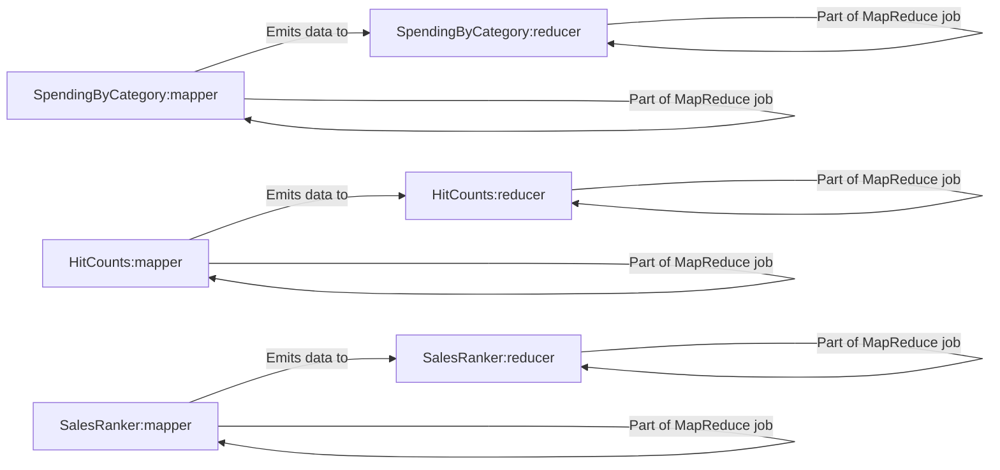

## Component Details

The MapReduce Implementations component provides a set of specific MapReduce jobs tailored for different data processing tasks. It includes implementations for calculating spending by category (Mint), counting hits for Pastebin pastes, and ranking sales. Each implementation consists of mapper and reducer functions that work together to process large datasets in parallel. The mappers extract relevant information from the input data and emit key-value pairs, while the reducers aggregate and process these pairs to produce the final results. This component demonstrates the application of the MapReduce paradigm to solve various data analysis problems.

### SpendingByCategory:mapper
The mapper function for the SpendingByCategory MapReduce job. It processes transaction data, extracts the category and spending amount, and emits key-value pairs where the key is the category and the value is the spending amount. This function prepares the data for aggregation by the reducer.
- **Related Classes/Methods**: `system_design_primer.solutions.system_design.mint.mint_mapreduce.SpendingByCategory:mapper`

### SpendingByCategory:reducer
The reducer function for the SpendingByCategory MapReduce job. It receives key-value pairs from the mapper, where the key is a category and the value is a list of spending amounts. It aggregates these amounts for each category to calculate the total spending per category, providing insights into spending patterns.
- **Related Classes/Methods**: `system_design_primer.solutions.system_design.mint.mint_mapreduce.SpendingByCategory:reducer`

### HitCounts:mapper
The mapper function for the Pastebin hit counter MapReduce job. It processes Pastebin access logs and emits key-value pairs where the key is a Pastebin ID and the value is 1. Each key-value pair represents a single hit for a specific Pastebin paste, allowing the reducer to count the total number of hits.
- **Related Classes/Methods**: `system_design_primer.solutions.system_design.pastebin.pastebin.HitCounts:mapper`

### HitCounts:reducer
The reducer function for the Pastebin hit counter MapReduce job. It receives key-value pairs from the mapper, where the key is a Pastebin ID and the value is a list of 1s (representing hits). It sums the values for each Pastebin ID to calculate the total number of hits for each paste.
- **Related Classes/Methods**: `system_design_primer.solutions.system_design.pastebin.pastebin.HitCounts:reducer`

### SalesRanker:mapper
The mapper function for the sales rank calculation MapReduce job. It processes sales data and emits key-value pairs, where the key is a product ID and the value is the sales figure for that product. This function prepares the sales data for ranking by the reducer.
- **Related Classes/Methods**: `system_design_primer.solutions.system_design.sales_rank.sales_rank_mapreduce.SalesRanker:mapper`

### SalesRanker:reducer
The reducer function for the sales rank calculation MapReduce job. It receives key-value pairs from the mapper, where the key is a product ID and the value is a list of sales figures. It aggregates these figures for each product and calculates the sales rank based on the total sales, providing insights into product popularity.
- **Related Classes/Methods**: `system_design_primer.solutions.system_design.sales_rank.sales_rank_mapreduce.SalesRanker:reducer`
