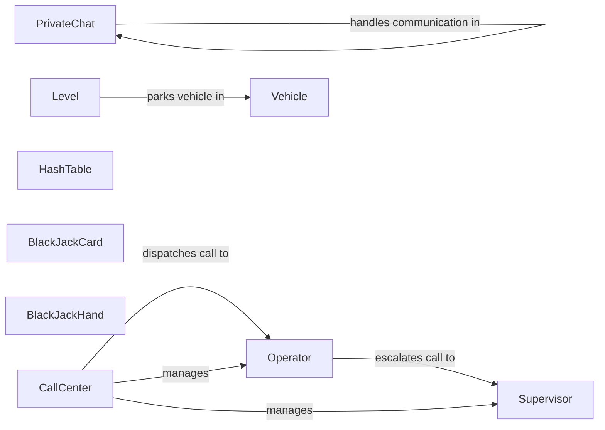

## Component Details

The Object-Oriented Design Examples component provides a collection of practical examples demonstrating object-oriented principles. These examples cover various real-world scenarios, such as online chat systems, call centers, hash tables, deck of cards, and parking lots. Each example illustrates how to model the scenario using classes, objects, and their interactions, showcasing key object-oriented concepts like encapsulation, inheritance, and polymorphism. The examples serve as a learning resource for understanding and applying object-oriented design to solve different types of problems.

### PrivateChat
Represents a private chat session between two users in an online chat system. It encapsulates the communication logic and manages the exchange of messages between the participants.
- **Related Classes/Methods**: `system_design_primer.solutions.object_oriented_design.online_chat.online_chat.PrivateChat`

### CallCenter
Represents the call center system, managing a pool of operators and supervisors. It handles incoming calls, dispatches them to available operators, and escalates calls to supervisors when necessary, ensuring efficient call handling and resolution.
- **Related Classes/Methods**: `system_design_primer.solutions.object_oriented_design.call_center.call_center.CallCenter`

### Operator
Represents a call center operator responsible for handling incoming calls. The operator attempts to resolve the caller's issue and escalates the call to a supervisor if needed.
- **Related Classes/Methods**: `system_design_primer.solutions.object_oriented_design.call_center.call_center.Operator`

### Supervisor
Represents a call center supervisor who handles escalated calls from operators. Supervisors possess higher-level privileges and expertise to resolve complex issues.
- **Related Classes/Methods**: `system_design_primer.solutions.object_oriented_design.call_center.call_center.Supervisor`

### HashTable
Represents a hash table data structure for storing key-value pairs. It provides efficient methods for inserting, retrieving, and deleting elements based on their keys, demonstrating the implementation of a fundamental data structure.
- **Related Classes/Methods**: `system_design_primer.solutions.object_oriented_design.hash_table.hash_map.HashTable`

### BlackJackCard
Represents a card in a Blackjack game, with a suit, rank, and value. It encapsulates the properties of a single playing card within the game context.
- **Related Classes/Methods**: `system_design_primer.solutions.object_oriented_design.deck_of_cards.deck_of_cards.BlackJackCard`

### BlackJackHand
Represents a hand of cards in a Blackjack game. It manages a collection of cards and calculates the hand's score, demonstrating object composition and game logic.
- **Related Classes/Methods**: `system_design_primer.solutions.object_oriented_design.deck_of_cards.deck_of_cards.BlackJackHand`

### Vehicle
Abstracts the concept of a vehicle in the parking lot example. Concrete vehicle types like Car, Bus, and Motorcycle inherit from this class.
- **Related Classes/Methods**: `system_design_primer.solutions.object_oriented_design.parking_lot.parking_lot.Motorcycle`, `system_design_primer.solutions.object_oriented_design.parking_lot.parking_lot.Car`, `system_design_primer.solutions.object_oriented_design.parking_lot.parking_lot.Bus`

### Level
Represents a level within a parking lot, managing parking spots and accommodating vehicles of varying sizes. It encapsulates the logic for parking and unparking vehicles within a specific level.
- **Related Classes/Methods**: `system_design_primer.solutions.object_oriented_design.parking_lot.parking_lot.Level`
