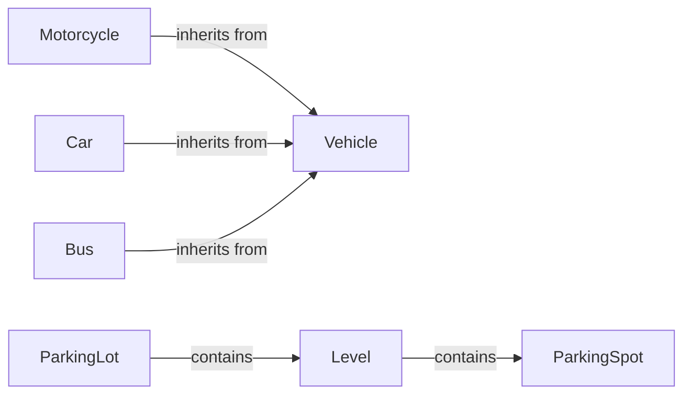

## Component Details

### Vehicle
The Vehicle abstract base class defines the common interface for all types of vehicles that can be parked in the parking lot. It includes attributes like license plate and vehicle type. Concrete vehicle types inherit from this class.
- **Related Classes/Methods**: `repos.system-design-primer.solutions.object_oriented_design.parking_lot.parking_lot.Vehicle`

### Motorcycle
The Motorcycle class represents a motorcycle, a specific type of vehicle. It inherits from the Vehicle class and implements any motorcycle-specific behavior.
- **Related Classes/Methods**: `repos.system-design-primer.solutions.object_oriented_design.parking_lot.parking_lot.Motorcycle`

### Car
The Car class represents a car, a specific type of vehicle. It inherits from the Vehicle class and implements any car-specific behavior.
- **Related Classes/Methods**: `repos.system-design-primer.solutions.object_oriented_design.parking_lot.parking_lot.Car`

### Bus
The Bus class represents a bus, a specific type of vehicle. It inherits from the Vehicle class and implements any bus-specific behavior.
- **Related Classes/Methods**: `repos.system-design-primer.solutions.object_oriented_design.parking_lot.parking_lot.Bus`

### ParkingSpot
The ParkingSpot class represents a single parking spot in the parking lot. It stores information about the spot's size and availability. It is used by the Level class to manage parking spots.
- **Related Classes/Methods**: `repos.system-design-primer.solutions.object_oriented_design.parking_lot.parking_lot.ParkingSpot`

### Level
The Level class represents a level in the parking lot. It manages a collection of parking spots and handles the logic for parking and unparking vehicles on that level. It interacts with the ParkingSpot class to manage individual spots and with the Vehicle classes to park vehicles.
- **Related Classes/Methods**: `repos.system-design-primer.solutions.object_oriented_design.parking_lot.parking_lot.Level`

### ParkingLot
The ParkingLot class represents the entire parking lot. It contains multiple levels and manages the overall parking and unparking process. It interacts with the Level class to manage individual levels and delegate parking requests.
- **Related Classes/Methods**: `repos.system-design-primer.solutions.object_oriented_design.parking_lot.parking_lot.ParkingLot`
