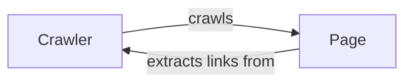

## Component Details

The Web Crawler component is designed to traverse web pages, extract information, and follow links to discover new pages. The crawler starts with an initial URL, fetches the page content, extracts relevant data (like links), and adds the new links to a queue for further crawling. It maintains a record of visited URLs to avoid redundant processing. The core functionality revolves around the `Crawler` class managing the crawling process and the `Page` class representing and processing individual web pages.

### Crawler
The `Crawler` class is the central component responsible for orchestrating the web crawling process. It initializes the crawling process with a starting URL, manages a queue of URLs to be crawled, and keeps track of visited URLs to prevent revisiting. It fetches web pages, uses the `Page` class to extract information and links, and adds new links to the crawling queue. The crawler continues until the queue is empty or a specified limit is reached.
- **Related Classes/Methods**: `system_design_primer.solutions.system_design.web_crawler.web_crawler_snippets.Crawler`

### Page
The `Page` class represents a single web page and is responsible for storing its content and extracting relevant information, such as links to other pages. It receives the raw HTML content of a page and parses it to identify and extract all the URLs. These extracted links are then provided to the `Crawler` to be added to the crawling queue, enabling the discovery of new pages. The `Page` class encapsulates the logic for handling and processing individual web pages.
- **Related Classes/Methods**: `system_design_primer.solutions.system_design.web_crawler.web_crawler_snippets.Page`
