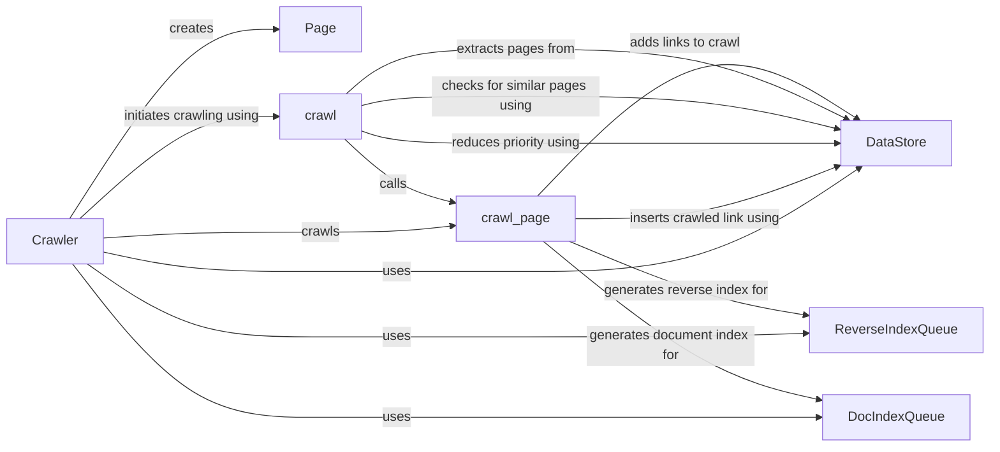

## Component Details

### Page
Represents a web page with its URL and content. It's responsible for storing page information and generating a unique signature for the page content to avoid duplicate crawling. The signature is used to detect duplicate pages and avoid redundant processing.
- **Related Classes/Methods**: `repos.system-design-primer.solutions.system_design.web_crawler.web_crawler_snippets.Page`

### Crawler
The main crawler component responsible for initiating and managing the crawling process. It orchestrates the crawling of web pages, manages the crawling queue (via DataStore), and interacts with other components to fetch and process web pages. It uses ReverseIndexQueue and DocIndexQueue for indexing.
- **Related Classes/Methods**: `repos.system-design-primer.solutions.system_design.web_crawler.web_crawler_snippets.Crawler`

### DataStore
Manages the crawling queue, page priorities, and stores crawled links and their signatures. It provides methods to add links to crawl, extract pages with maximum priority, check for similar crawled pages, reduce page priority, and insert crawled links. It acts as a central repository for managing the crawling process.
- **Related Classes/Methods**: `repos.system-design-primer.solutions.system_design.web_crawler.web_crawler_snippets.Crawler`

### ReverseIndexQueue
Responsible for generating reverse indexes for crawled pages. It receives pages from the crawler and processes them to create reverse indexes, which are used for efficient search and retrieval of web pages based on keywords.
- **Related Classes/Methods**: `repos.system-design-primer.solutions.system_design.web_crawler.web_crawler_snippets.Crawler`

### DocIndexQueue
Responsible for generating document indexes for crawled pages. It receives pages from the crawler and processes them to create document indexes, which are used for efficient search and retrieval of web pages based on document content.
- **Related Classes/Methods**: `repos.system-design-primer.solutions.system_design.web_crawler.web_crawler_snippets.Crawler`

### crawl
Initiates the crawling process. It continuously extracts pages from the DataStore, checks for similar crawled pages, and crawls the page if it's not a duplicate. It uses the DataStore to manage the crawling queue and page priorities.
- **Related Classes/Methods**: `repos.system-design-primer.solutions.system_design.web_crawler.web_crawler_snippets.Crawler.crawl`

### crawl_page
Crawls a single web page, extracts child URLs, and adds them to the crawling queue (via DataStore). It also triggers reverse indexing and document indexing using ReverseIndexQueue and DocIndexQueue respectively. Finally, it updates the DataStore with the crawled link and its signature.
- **Related Classes/Methods**: `repos.system-design-primer.solutions.system_design.web_crawler.web_crawler_snippets.Crawler.crawl_page`
