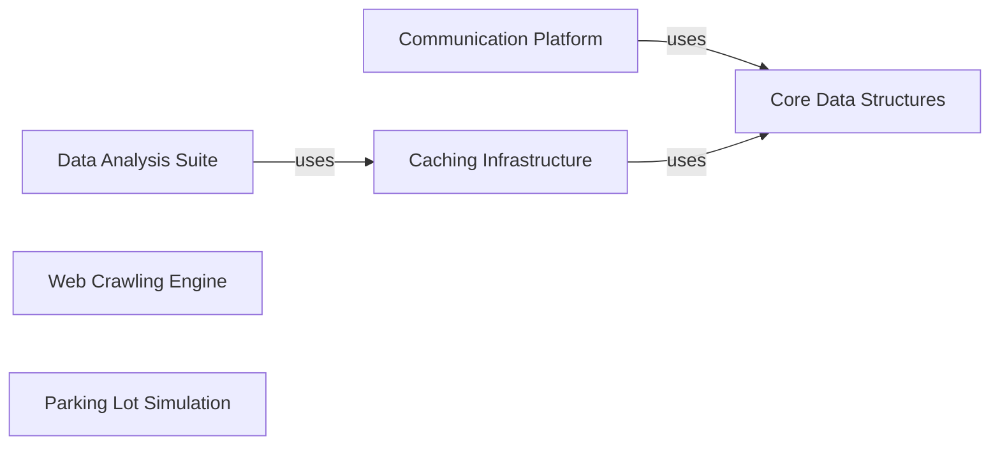

## Component Details

### Data Analysis Suite
This component provides a suite of data analysis tools based on the MapReduce paradigm. It includes functionalities for analyzing spending habits from Mint data, tracking hit counts for Pastebin URLs, and ranking sales data. The component is designed to process large datasets and extract valuable insights for various applications.
- **Related Classes/Methods**: `repos.system-design-primer.solutions.system_design.mint.mint_mapreduce.SpendingByCategory`, `repos.system-design-primer.solutions.system_design.pastebin.pastebin.HitCounts`, `repos.system-design-primer.solutions.system_design.sales_rank.sales_rank_mapreduce.SalesRanker`

### Caching Infrastructure
This component offers caching functionalities to improve application performance. It includes a generic LRU Cache and a Query Cache, both utilizing a LinkedList for efficient eviction of old entries. The LRU Cache evicts the least recently used items, while the Query Cache specifically caches query results to reduce database load and improve response times for frequently accessed queries.
- **Related Classes/Methods**: `repos.system-design-primer.solutions.system_design.query_cache.query_cache_snippets.QueryApi`, `repos.system-design-primer.solutions.system_design.query_cache.query_cache_snippets.Cache`, `repos.system-design-primer.solutions.system_design.query_cache.query_cache_snippets.LinkedList`, `repos.system-design-primer.solutions.system_design.query_cache.query_cache_snippets.Node`, `repos.system-design-primer.solutions.object_oriented_design.lru_cache.lru_cache.Cache`, `repos.system-design-primer.solutions.object_oriented_design.lru_cache.lru_cache.LinkedList`, `repos.system-design-primer.solutions.object_oriented_design.lru_cache.lru_cache.Node`

### Web Crawling Engine
This component implements a web crawler that automatically traverses the web, fetching and processing web pages. It creates signatures for crawled pages to avoid duplicate crawling and efficiently explores the web graph. The crawler is designed to be robust and scalable, capable of handling large numbers of web pages and diverse content types.
- **Related Classes/Methods**: `repos.system-design-primer.solutions.system_design.web_crawler.web_crawler_snippets.Page`, `repos.system-design-primer.solutions.system_design.web_crawler.web_crawler_snippets.Crawler`

### Communication Platform
This component provides the foundation for building communication systems, including online chat applications and call centers. It defines base classes for chats, private chats, call center employees (operators, supervisors), and call dispatching logic. The component is designed to be extensible and customizable, allowing developers to create a wide range of communication applications.
- **Related Classes/Methods**: `repos.system-design-primer.solutions.object_oriented_design.online_chat.online_chat.PrivateChat`, `repos.system-design-primer.solutions.object_oriented_design.online_chat.online_chat.Chat`, `repos.system-design-primer.solutions.object_oriented_design.call_center.call_center.Operator`, `repos.system-design-primer.solutions.object_oriented_design.call_center.call_center.Supervisor`, `repos.system-design-primer.solutions.object_oriented_design.call_center.call_center.CallCenter`, `repos.system-design-primer.solutions.object_oriented_design.call_center.call_center.Employee`

### Core Data Structures
This component implements fundamental data structures that are widely used in software development. It includes a hash table with basic operations like set, get, and remove, as well as a deck of cards with Blackjack game logic. These data structures provide reusable building blocks for various applications and algorithms.
- **Related Classes/Methods**: `repos.system-design-primer.solutions.object_oriented_design.hash_table.hash_map.HashTable`, `repos.system-design-primer.solutions.object_oriented_design.hash_table.hash_map.Item`, `repos.system-design-primer.solutions.object_oriented_design.deck_of_cards.deck_of_cards.BlackJackCard`, `repos.system-design-primer.solutions.object_oriented_design.deck_of_cards.deck_of_cards.BlackJackHand`, `repos.system-design-primer.solutions.object_oriented_design.deck_of_cards.deck_of_cards.Card`, `repos.system-design-primer.solutions.object_oriented_design.deck_of_cards.deck_of_cards.Hand`

### Parking Lot Simulation
This component simulates a parking lot environment, including different vehicle types and parking spot allocation logic. It models vehicles, parking spots, and parking levels, and manages the allocation and deallocation of parking spots. The simulation can be used to test and optimize parking lot management strategies.
- **Related Classes/Methods**: `repos.system-design-primer.solutions.object_oriented_design.parking_lot.parking_lot.Motorcycle`, `repos.system-design-primer.solutions.object_oriented_design.parking_lot.parking_lot.Car`, `repos.system-design-primer.solutions.object_oriented_design.parking_lot.parking_lot.Bus`, `repos.system-design-primer.solutions.object_oriented_design.parking_lot.parking_lot.Vehicle`, `repos.system-design-primer.solutions.object_oriented_design.parking_lot.parking_lot.Level`