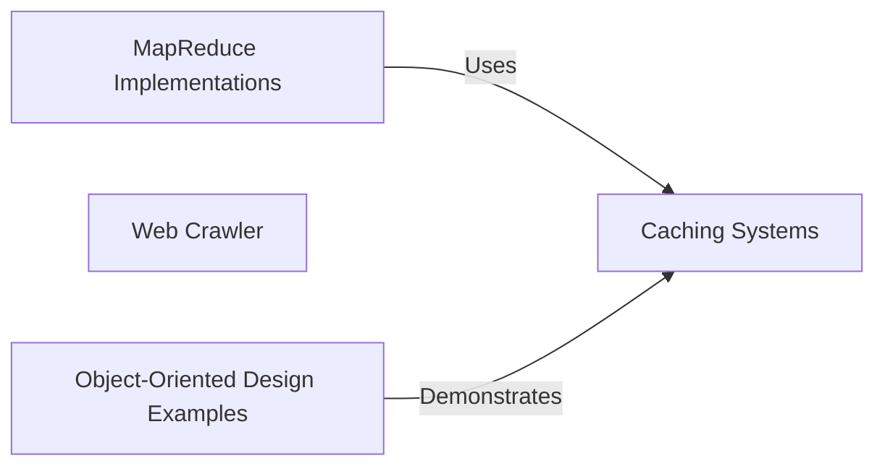

## Component Details

The system design primer project provides solutions and examples for various system design concepts and object-oriented design principles. It includes implementations of caching systems, MapReduce, web crawlers, and object-oriented design patterns. The project aims to illustrate how to apply these concepts in practical scenarios, offering a hands-on approach to learning system design.

### Caching Systems
This component provides implementations for caching data, including a generic cache and an LRU (Least Recently Used) cache. The generic cache offers basic set and get operations, while the LRU cache evicts the least recently used items when the cache is full, optimizing for frequently accessed data. These caches are used to improve performance by storing frequently accessed data in memory, reducing the need to fetch it from slower storage.
- **Related Classes/Methods**: `system_design_primer.solutions.system_design.query_cache.query_cache_snippets.Cache`, `system_design_primer.solutions.object_oriented_design.lru_cache.lru_cache.Cache`

### MapReduce Implementations
This component offers MapReduce implementations for specific tasks, such as calculating spending by category (Mint), counting hits for Pastebin pastes, and ranking sales. It includes mapper and reducer functions tailored to each use case, demonstrating the MapReduce paradigm for parallel data processing. These implementations showcase how to process large datasets efficiently by dividing the work into smaller, independent tasks.
- **Related Classes/Methods**: `system_design_primer.solutions.system_design.mint.mint_mapreduce.SpendingByCategory`, `system_design_primer.solutions.system_design.pastebin.pastebin.HitCounts`, `system_design_primer.solutions.system_design.sales_rank.sales_rank_mapreduce.SalesRanker`

### Web Crawler
This component implements a basic web crawler that can traverse web pages and extract information. It includes classes for representing pages and the crawler itself. The crawler fetches web pages, extracts information, and follows links to discover new pages, demonstrating the core functionality of a web crawler.
- **Related Classes/Methods**: `system_design_primer.solutions.system_design.web_crawler.web_crawler_snippets.Page`, `system_design_primer.solutions.system_design.web_crawler.web_crawler_snippets.Crawler`

### Object-Oriented Design Examples
This component provides various object-oriented design examples, including online chat, call center, hash table, deck of cards, and parking lot. Each example showcases how to model real-world scenarios using classes, objects, and their interactions, illustrating object-oriented design principles. These examples demonstrate how to apply object-oriented concepts to solve different design problems.
- **Related Classes/Methods**: `system_design_primer.solutions.object_oriented_design.online_chat.online_chat.PrivateChat`, `system_design_primer.solutions.object_oriented_design.call_center.call_center.Operator`, `system_design_primer.solutions.object_oriented_design.call_center.call_center.Supervisor`, `system_design_primer.solutions.object_oriented_design.call_center.call_center.CallCenter`, `system_design_primer.solutions.object_oriented_design.hash_table.hash_map.HashTable`, `system_design_primer.solutions.object_oriented_design.deck_of_cards.deck_of_cards.BlackJackCard`, `system_design_primer.solutions.object_oriented_design.deck_of_cards.deck_of_cards.BlackJackHand`, `system_design_primer.solutions.object_oriented_design.parking_lot.parking_lot.Motorcycle`, `system_design_primer.solutions.object_oriented_design.parking_lot.parking_lot.Car`, `system_design_primer.solutions.object_oriented_design.parking_lot.parking_lot.Bus`, `system_design_primer.solutions.object_oriented_design.parking_lot.parking_lot.Level`