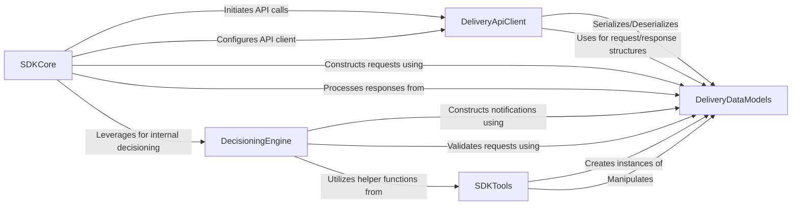

## Component Details

The `target-python-sdk` provides a comprehensive interface for interacting with the Adobe Target Delivery API. It orchestrates the process of constructing and sending delivery requests, handling API responses, and performing client-side decisioning. The SDK leverages dedicated components for managing network communication, defining data structures, and implementing decisioning logic, ensuring efficient and structured interaction with the Adobe Target service.

### DeliveryApiClient
This component is responsible for all network communication with the Adobe Target Delivery API. It manages the underlying HTTP requests, handles API configuration, processes responses, and deals with various API-related exceptions, acting as the primary interface for sending and receiving data from the Target service. It also handles request serialization, response deserialization, and error handling for network communication.

**Related Classes/Methods**:

- <a href="https://github.com/adobe/target-python-sdk/blob/master/delivery_api_client/api/delivery_api.py#L27-L209" target="_blank" rel="noopener noreferrer">`target-python-sdk.delivery_api_client.api.delivery_api.DeliveryApi` (27:209)</a>
- <a href="https://github.com/adobe/target-python-sdk/blob/master/delivery_api_client/api_client.py#L39-L723" target="_blank" rel="noopener noreferrer">`target-python-sdk.delivery_api_client.api_client.ApiClient` (39:723)</a>
- <a href="https://github.com/adobe/target-python-sdk/blob/master/delivery_api_client/rest.py#L50-L296" target="_blank" rel="noopener noreferrer">`target-python-sdk.delivery_api_client.rest.RESTClientObject` (50:296)</a>
- <a href="https://github.com/adobe/target-python-sdk/blob/master/delivery_api_client/configuration.py#L39-L311" target="_blank" rel="noopener noreferrer">`target-python-sdk.delivery_api_client.configuration.Configuration` (39:311)</a>
- `target-python-sdk.delivery_api_client.exceptions` (full file reference)

### DeliveryDataModels
This component defines the structured data models used for all requests and responses exchanged with the Adobe Target Delivery API. It provides the blueprints for various entities such as DeliveryRequest, DeliveryResponse, MboxResponse, Notification, and Context, ensuring consistent data formatting across the SDK and the API.

**Related Classes/Methods**:

- <a href="https://github.com/adobe/target-python-sdk/blob/master/delivery_api_client/Model/delivery_request.py#L19-L463" target="_blank" rel="noopener noreferrer">`target-python-sdk.delivery_api_client.Model.delivery_request.DeliveryRequest` (19:463)</a>
- <a href="https://github.com/adobe/target-python-sdk/blob/master/delivery_api_client/Model/delivery_response.py#L19-L300" target="_blank" rel="noopener noreferrer">`target-python-sdk.delivery_api_client.Model.delivery_response.DeliveryResponse` (19:300)</a>
- <a href="https://github.com/adobe/target-python-sdk/blob/master/delivery_api_client/Model/mbox_response.py#L19-L252" target="_blank" rel="noopener noreferrer">`target-python-sdk.delivery_api_client.Model.mbox_response.MboxResponse` (19:252)</a>
- <a href="https://github.com/adobe/target-python-sdk/blob/master/delivery_api_client/Model/notification.py#L19-L440" target="_blank" rel="noopener noreferrer">`target-python-sdk.delivery_api_client.Model.notification.Notification` (19:440)</a>
- <a href="https://github.com/adobe/target-python-sdk/blob/master/delivery_api_client/Model/context.py#L19-L379" target="_blank" rel="noopener noreferrer">`target-python-sdk.delivery_api_client.Model.context.Context` (19:379)</a>
- <a href="https://github.com/adobe/target-python-sdk/blob/master/delivery_api_client/Model/geo.py#L19-L286" target="_blank" rel="noopener noreferrer">`target-python-sdk.delivery_api_client.Model.geo.Geo` (19:286)</a>
- <a href="https://github.com/adobe/target-python-sdk/blob/master/delivery_api_client/Model/visitor_id.py#L19-L204" target="_blank" rel="noopener noreferrer">`target-python-sdk.delivery_api_client.Model.visitor_id.VisitorId` (19:204)</a>

### DecisioningEngine
This component encapsulates the internal logic for processing and managing decisions within the Target Python SDK. It handles tasks such as adding and sending notifications, validating incoming requests, and mapping geographical data, often interacting with the Delivery Data Models to structure its operations.

**Related Classes/Methods**:

- <a href="https://github.com/adobe/target-python-sdk/blob/master/target_decisioning_engine/notification_provider.py#L29-L114" target="_blank" rel="noopener noreferrer">`target_decisioning_engine.notification_provider.NotificationProvider` (29:114)</a>
- `target_decisioning_engine.request_provider` (full file reference)
- <a href="https://github.com/adobe/target-python-sdk/blob/master/target_decisioning_engine/decision_provider.py#L60-L313" target="_blank" rel="noopener noreferrer">`target_decisioning_engine.decision_provider.DecisionProvider` (60:313)</a>
- <a href="https://github.com/adobe/target-python-sdk/blob/master/target_decisioning_engine/types/decision_provider_response.py#L14-L23" target="_blank" rel="noopener noreferrer">`target_decisioning_engine.types.decision_provider_response.DecisionProviderResponse` (14:23)</a>
- `target_decisioning_engine.geo_provider` (full file reference)

### SDKCore
This component represents the high-level interface and core orchestration logic of the Target Python SDK. It provides methods for initiating delivery requests, handling responses, and managing the overall interaction flow with the Target service, often leveraging helper functions for request construction and response processing.

**Related Classes/Methods**:

- `target_python_sdk.helper` (full file reference)
- `target_python_sdk.target` (full file reference)
- `target_python_sdk.TargetClient` (full file reference)

### SDKTools
This component provides a set of utility functions and helper classes that support various operations within the Target Python SDK. These tools assist in tasks such as creating structured response objects, managing properties, and general data manipulation, contributing to the overall functionality and ease of use of the SDK.

**Related Classes/Methods**:

- `target_tools.response_helpers` (full file reference)
- `target_tools.utils` (full file reference)

### [FAQ](https://github.com/CodeBoarding/GeneratedOnBoardings/tree/main?tab=readme-ov-file#faq)