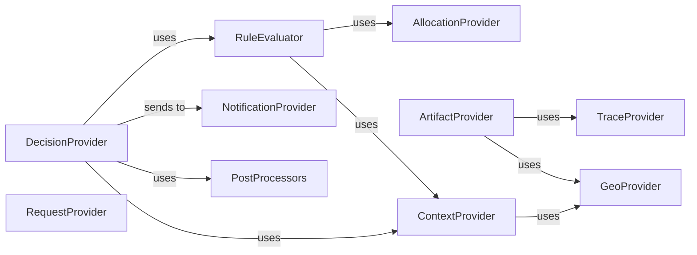

## Component Details

The Local Decisioning Core encapsulates the essential logic for evaluating rules and making personalized content decisions directly within the application. It orchestrates the retrieval and management of decisioning artifacts, constructs various context objects from input data, and handles the tracing and dispatching of notifications and telemetry related to local decisions. This core subsystem ensures efficient and accurate content delivery based on predefined rules and real-time contextual information.

### DecisionProvider
Responsible for executing the core decisioning logic. It takes a delivery request, applies rules, and generates a decisioning response, handling both execute and prefetch requests. It also integrates with tracing and notification mechanisms.

**Related Classes/Methods**:

- `target_python_sdk.target_decisioning_engine.decision_provider.DecisionProvider` (60:313)
- `target_python_sdk.target_decisioning_engine.decision_provider.DecisionProvider:__init__` (full file reference)
- `target_python_sdk.target_decisioning_engine.decision_provider.DecisionProvider:_get_decisions` (full file reference)
- `target_python_sdk.target_decisioning_engine.decision_provider.DecisionProvider:_prepare_notification` (full file reference)
- `target_python_sdk.target_decisioning_engine.decision_provider.DecisionProvider:_get_execute_decisions` (full file reference)
- `target_python_sdk.target_decisioning_engine.decision_provider.DecisionProvider:_get_prefetch_decisions` (full file reference)
- `target_python_sdk.target_decisioning_engine.decision_provider.DecisionProvider:run` (full file reference)

### RuleEvaluator
Evaluates decisioning rules against the provided context. It processes individual rules and determines if they match the current request and context, often involving context creation and allocation computations.

**Related Classes/Methods**:

- `target_python_sdk.target_decisioning_engine.rule_evaluator.RuleEvaluator` (21:68)
- `target_python_sdk.target_decisioning_engine.rule_evaluator.RuleEvaluator:process_rule` (full file reference)

### AllocationProvider
Manages visitor ID generation and allocation computations. It ensures valid TNT IDs, creates UUIDs for new visitors, and calculates allocation based on memoized functions.

**Related Classes/Methods**:

- `target_python_sdk.target_decisioning_engine.allocation_provider` (full file reference)
- `target_python_sdk.target_decisioning_engine.allocation_provider:valid_tnt_id` (full file reference)
- `target_python_sdk.target_decisioning_engine.allocation_provider:get_or_create_visitor_id` (full file reference)
- `target_python_sdk.target_decisioning_engine.allocation_provider:_calculate_allocation` (full file reference)
- `target_python_sdk.target_decisioning_engine.allocation_provider:compute_allocation` (full file reference)

### ArtifactProvider
Manages the decisioning artifact, which contains the rules and other data needed for decisioning. It handles initialization, polling for updates, fetching artifacts, and providing tracing for artifact-related operations.

**Related Classes/Methods**:

- `target_python_sdk.target_decisioning_engine.artifact_provider.ArtifactProvider` (53:231)
- `target_python_sdk.target_decisioning_engine.artifact_provider.ArtifactProvider:__init__` (full file reference)
- `target_python_sdk.target_decisioning_engine.artifact_provider.ArtifactProvider:_get_polling_interval` (full file reference)
- `target_python_sdk.target_decisioning_engine.artifact_provider.ArtifactProvider:initialize` (full file reference)
- `target_python_sdk.target_decisioning_engine.artifact_provider.ArtifactProvider:_fetch_and_schedule` (full file reference)
- `target_python_sdk.target_decisioning_engine.artifact_provider.ArtifactProvider:resume_polling` (full file reference)
- `target_python_sdk.target_decisioning_engine.artifact_provider.ArtifactProvider:_get_initial_artifact` (full file reference)
- `target_python_sdk.target_decisioning_engine.artifact_provider.ArtifactProvider:_artifact_tracer_update` (full file reference)
- `target_python_sdk.target_decisioning_engine.artifact_provider.ArtifactProvider:get_trace` (full file reference)
- `target_python_sdk.target_decisioning_engine.artifact_provider.ArtifactProvider:_fetch_artifact` (full file reference)

### GeoProvider
Provides geographical context information for decisioning.

**Related Classes/Methods**:

- `target_python_sdk.target_decisioning_engine.geo_provider.GeoProvider` (121:200)
- `target_python_sdk.target_decisioning_engine.geo_provider` (full file reference)

### ContextProvider
Responsible for creating various context objects (browser, URL, page, referring, geo, timing, and decisioning context) that are used during the decisioning process to evaluate rules.

**Related Classes/Methods**:

- `target_python_sdk.target_decisioning_engine.context_provider` (full file reference)
- `target_python_sdk.target_decisioning_engine.context_provider:get_lower_case_attributes` (full file reference)
- `target_python_sdk.target_decisioning_engine.context_provider:_create_browser_context` (full file reference)
- `target_python_sdk.target_decisioning_engine.context_provider:_create_url_context` (full file reference)
- `target_python_sdk.target_decisioning_engine.context_provider:create_page_context` (full file reference)
- `target_python_sdk.target_decisioning_engine.context_provider:create_referring_context` (full file reference)
- `target_python_sdk.target_decisioning_engine.context_provider:with_lowercase_string_values` (full file reference)
- `target_python_sdk.target_decisioning_engine.context_provider:create_mbox_context` (full file reference)
- `target_python_sdk.target_decisioning_engine.context_provider:create_geo_context` (full file reference)
- `target_python_sdk.target_decisioning_engine.context_provider:_create_timing_context` (full file reference)
- `target_python_sdk.target_decisioning_engine.context_provider:create_decisioning_context` (full file reference)

### RequestProvider
Validates and processes incoming delivery requests. It checks for valid visitor IDs and ensures the overall delivery request structure is correct before further processing.

**Related Classes/Methods**:

- `target_python_sdk.target_decisioning_engine.request_provider` (full file reference)
- `target_python_sdk.target_decisioning_engine.request_provider:get_customer_id` (full file reference)
- `target_python_sdk.target_decisioning_engine.request_provider:_no_ids` (full file reference)
- `target_python_sdk.target_decisioning_engine.request_provider:valid_visitor_id` (full file reference)
- `target_python_sdk.target_decisioning_engine.request_provider:valid_delivery_request` (full file reference)

### TraceProvider
Provides tracing capabilities for decisioning requests and artifact updates. It records details about request processing and rule evaluations to help in debugging and understanding the decision flow.

**Related Classes/Methods**:

- `target_python_sdk.target_decisioning_engine.trace_provider.TraceProvider` (33:83)
- `target_python_sdk.target_decisioning_engine.trace_provider.RequestTracer` (86:217)
- `target_python_sdk.target_decisioning_engine.trace_provider.ArtifactTracer` (220:261)
- `target_python_sdk.target_decisioning_engine.trace_provider.TraceProvider:__init__` (full file reference)
- `target_python_sdk.target_decisioning_engine.trace_provider.RequestTracer:trace_request` (full file reference)
- `target_python_sdk.target_decisioning_engine.trace_provider.RequestTracer:trace_rule_evaluated` (full file reference)
- `target_python_sdk.target_decisioning_engine.trace_provider.RequestTracer:get_trace_result` (full file reference)
- `target_python_sdk.target_decisioning_engine.trace_provider.ArtifactTracer:__init__` (full file reference)

### NotificationProvider
Handles the creation and sending of notifications and telemetry data. It allows adding individual notifications and telemetry entries, and then sending them as part of a delivery request.

**Related Classes/Methods**:

- `target_python_sdk.target_decisioning_engine.notification_provider.NotificationProvider` (29:114)
- `target_python_sdk.target_decisioning_engine.notification_provider.NotificationProvider:__init__` (full file reference)
- `target_python_sdk.target_decisioning_engine.notification_provider.NotificationProvider:add_notification` (full file reference)
- `target_python_sdk.target_decisioning_engine.notification_provider.NotificationProvider:add_telemetry_entry` (full file reference)
- `target_python_sdk.target_decisioning_engine.notification_provider.NotificationProvider:send_notifications` (full file reference)

### PostProcessors
Applies various post-processing steps to the decisioning responses, such as preparing execute and prefetch responses, adding response tokens, and replacing campaign macros within the content.

**Related Classes/Methods**:

- `target_python_sdk.target_decisioning_engine.post_processors` (full file reference)
- `target_python_sdk.target_decisioning_engine.post_processors:prepare_execute_response` (full file reference)
- `target_python_sdk.target_decisioning_engine.post_processors:prepare_prefetch_response` (full file reference)
- `target_python_sdk.target_decisioning_engine.post_processors:create_response_tokens_post_processor` (full file reference)
- `target_python_sdk.target_decisioning_engine.post_processors:add_campaign_macro_values` (full file reference)
- `target_python_sdk.target_decisioning_engine.post_processors:update_action_campaign_content` (full file reference)
- `target_python_sdk.target_decisioning_engine.post_processors:update_option_campaign_content` (full file reference)
- `target_python_sdk.target_decisioning_engine.post_processors:replace_campaign_macros` (full file reference)

### [FAQ](https://github.com/CodeBoarding/GeneratedOnBoardings/tree/main?tab=readme-ov-file#faq)