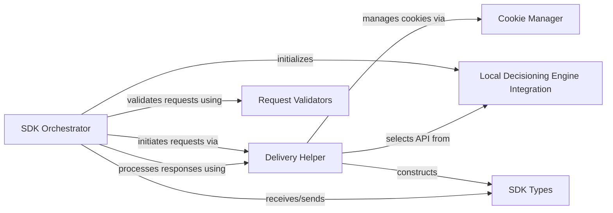

## Component Details

This graph illustrates the structure and interactions within the Adobe Target Python SDK's core components. The SDK Orchestrator acts as the central entry point, managing the lifecycle of requests, from initialization and validation to fetching offers and sending notifications. It leverages the Delivery Helper for constructing and processing requests/responses, which in turn interacts with the Cookie Manager for cookie handling, and can utilize the Local Decisioning Engine Integration for client-side decisioning. All data structures are defined by the SDK Types component, ensuring consistent data flow across the system, and requests are validated by the Request Validators.

### SDK Orchestrator
The primary entry point for interacting with the Adobe Target Python SDK. It orchestrates the entire process of fetching offers, sending notifications, and managing the SDK's lifecycle, including initialization and validation of requests. It can utilize either the local decisioning engine or make remote API calls, and provides helper functionalities for cookie management and request/response processing.

**Related Classes/Methods**:

- `target-python-sdk.target_python_sdk.target.TargetClient` (full file reference)
- `target-python-sdk.target_python_sdk.target.TargetClient:__init__` (full file reference)
- `target-python-sdk.target_python_sdk.target.TargetClient:initialize` (full file reference)
- `target-python-sdk.target_python_sdk.target.TargetClient:create` (full file reference)
- `target-python-sdk.target_python_sdk.target.TargetClient:get_offers` (full file reference)
- `target-python-sdk.target_python_sdk.target.TargetClient:send_notifications` (full file reference)
- `target-python-sdk.target_python_sdk.target.TargetClient:get_attributes` (full file reference)
- <a href="https://github.com/adobe/target-python-sdk/blob/master/target_python_sdk/target.py#L52-L72" target="_blank" rel="noopener noreferrer">`target-python-sdk.target_python_sdk.target:_create_request_context` (52:72)</a>
- <a href="https://github.com/adobe/target-python-sdk/blob/master/target_python_sdk/target.py#L75-L139" target="_blank" rel="noopener noreferrer">`target-python-sdk.target_python_sdk.target:execute_delivery` (75:139)</a>
- <a href="https://github.com/adobe/target-python-sdk/blob/master/target_python_sdk/target.py#L142-L163" target="_blank" rel="noopener noreferrer">`target-python-sdk.target_python_sdk.target:handle_delivery_response` (142:163)</a>

### Delivery Helper
A utility module containing functions responsible for constructing various parts of a Target Delivery API request, such as headers, visitor IDs, context, and experience cloud details. It also handles the processing of delivery responses, extracting analytics, trace information, and response tokens, and manages Target-specific cookies.

**Related Classes/Methods**:

- `target-python-sdk.target_python_sdk.helper` (full file reference)
- <a href="https://github.com/adobe/target-python-sdk/blob/master/target_python_sdk/helper.py#L85-L92" target="_blank" rel="noopener noreferrer">`target-python-sdk.target_python_sdk.helper:create_headers` (85:92)</a>
- <a href="https://github.com/adobe/target-python-sdk/blob/master/target_python_sdk/helper.py#L95-L106" target="_blank" rel="noopener noreferrer">`target-python-sdk.target_python_sdk.helper:get_session_id` (95:106)</a>
- <a href="https://github.com/adobe/target-python-sdk/blob/master/target_python_sdk/helper.py#L109-L119" target="_blank" rel="noopener noreferrer">`target-python-sdk.target_python_sdk.helper:get_target_host` (109:119)</a>
- <a href="https://github.com/adobe/target-python-sdk/blob/master/target_python_sdk/helper.py#L147-L150" target="_blank" rel="noopener noreferrer">`target-python-sdk.target_python_sdk.helper:get_cluster` (147:150)</a>
- <a href="https://github.com/adobe/target-python-sdk/blob/master/target_python_sdk/helper.py#L160-L177" target="_blank" rel="noopener noreferrer">`target-python-sdk.target_python_sdk.helper:create_delivery_api` (160:177)</a>
- <a href="https://github.com/adobe/target-python-sdk/blob/master/target_python_sdk/helper.py#L198-L220" target="_blank" rel="noopener noreferrer">`target-python-sdk.target_python_sdk.helper:customer_ids_accumulator` (198:220)</a>
- <a href="https://github.com/adobe/target-python-sdk/blob/master/target_python_sdk/helper.py#L223-L233" target="_blank" rel="noopener noreferrer">`target-python-sdk.target_python_sdk.helper:get_customer_ids` (223:233)</a>
- <a href="https://github.com/adobe/target-python-sdk/blob/master/target_python_sdk/helper.py#L236-L251" target="_blank" rel="noopener noreferrer">`target-python-sdk.target_python_sdk.helper:create_visitor_id` (236:251)</a>
- <a href="https://github.com/adobe/target-python-sdk/blob/master/target_python_sdk/helper.py#L259-L266" target="_blank" rel="noopener noreferrer">`target-python-sdk.target_python_sdk.helper:create_context` (259:266)</a>
- <a href="https://github.com/adobe/target-python-sdk/blob/master/target_python_sdk/helper.py#L269-L274" target="_blank" rel="noopener noreferrer">`target-python-sdk.target_python_sdk.helper:get_location_hint` (269:274)</a>
- <a href="https://github.com/adobe/target-python-sdk/blob/master/target_python_sdk/helper.py#L277-L292" target="_blank" rel="noopener noreferrer">`target-python-sdk.target_python_sdk.helper:create_audience_manager` (277:292)</a>
- <a href="https://github.com/adobe/target-python-sdk/blob/master/target_python_sdk/helper.py#L295-L301" target="_blank" rel="noopener noreferrer">`target-python-sdk.target_python_sdk.helper:is_current_supplemental_data_id` (295:301)</a>
- <a href="https://github.com/adobe/target-python-sdk/blob/master/target_python_sdk/helper.py#L304-L316" target="_blank" rel="noopener noreferrer">`target-python-sdk.target_python_sdk.helper:create_supplemental_data_id` (304:316)</a>
- <a href="https://github.com/adobe/target-python-sdk/blob/master/target_python_sdk/helper.py#L319-L327" target="_blank" rel="noopener noreferrer">`target-python-sdk.target_python_sdk.helper:create_analytics` (319:327)</a>
- <a href="https://github.com/adobe/target-python-sdk/blob/master/target_python_sdk/helper.py#L330-L342" target="_blank" rel="noopener noreferrer">`target-python-sdk.target_python_sdk.helper:create_experience_cloud` (330:342)</a>
- <a href="https://github.com/adobe/target-python-sdk/blob/master/target_python_sdk/helper.py#L345-L350" target="_blank" rel="noopener noreferrer">`target-python-sdk.target_python_sdk.helper:valid_mbox` (345:350)</a>
- <a href="https://github.com/adobe/target-python-sdk/blob/master/target_python_sdk/helper.py#L353-L358" target="_blank" rel="noopener noreferrer">`target-python-sdk.target_python_sdk.helper:create_mboxes` (353:358)</a>
- <a href="https://github.com/adobe/target-python-sdk/blob/master/target_python_sdk/helper.py#L361-L370" target="_blank" rel="noopener noreferrer">`target-python-sdk.target_python_sdk.helper:valid_notification` (361:370)</a>
- <a href="https://github.com/adobe/target-python-sdk/blob/master/target_python_sdk/helper.py#L373-L379" target="_blank" rel="noopener noreferrer">`target-python-sdk.target_python_sdk.helper:create_notifications` (373:379)</a>
- <a href="https://github.com/adobe/target-python-sdk/blob/master/target_python_sdk/helper.py#L382-L384" target="_blank" rel="noopener noreferrer">`target-python-sdk.target_python_sdk.helper:create_configuration` (382:384)</a>
- <a href="https://github.com/adobe/target-python-sdk/blob/master/target_python_sdk/helper.py#L387-L399" target="_blank" rel="noopener noreferrer">`target-python-sdk.target_python_sdk.helper:create_execute` (387:399)</a>
- <a href="https://github.com/adobe/target-python-sdk/blob/master/target_python_sdk/helper.py#L402-L415" target="_blank" rel="noopener noreferrer">`target-python-sdk.target_python_sdk.helper:create_prefetch` (402:415)</a>
- <a href="https://github.com/adobe/target-python-sdk/blob/master/target_python_sdk/helper.py#L418-L420" target="_blank" rel="noopener noreferrer">`target-python-sdk.target_python_sdk.helper:create_property` (418:420)</a>
- <a href="https://github.com/adobe/target-python-sdk/blob/master/target_python_sdk/helper.py#L423-L440" target="_blank" rel="noopener noreferrer">`target-python-sdk.target_python_sdk.helper:create_request` (423:440)</a>
- <a href="https://github.com/adobe/target-python-sdk/blob/master/target_python_sdk/helper.py#L443-L463" target="_blank" rel="noopener noreferrer">`target-python-sdk.target_python_sdk.helper:get_target_cookie` (443:463)</a>
- <a href="https://github.com/adobe/target-python-sdk/blob/master/target_python_sdk/helper.py#L466-L476" target="_blank" rel="noopener noreferrer">`target-python-sdk.target_python_sdk.helper:extract_cluster_from_edge_host` (466:476)</a>
- <a href="https://github.com/adobe/target-python-sdk/blob/master/target_python_sdk/helper.py#L479-L493" target="_blank" rel="noopener noreferrer">`target-python-sdk.target_python_sdk.helper:request_location_hint_cookie` (479:493)</a>
- <a href="https://github.com/adobe/target-python-sdk/blob/master/target_python_sdk/helper.py#L496-L508" target="_blank" rel="noopener noreferrer">`target-python-sdk.target_python_sdk.helper:get_target_location_hint_cookie` (496:508)</a>
- <a href="https://github.com/adobe/target-python-sdk/blob/master/target_python_sdk/helper.py#L511-L517" target="_blank" rel="noopener noreferrer">`target-python-sdk.target_python_sdk.helper:get_analytics_from_object` (511:517)</a>
- <a href="https://github.com/adobe/target-python-sdk/blob/master/target_python_sdk/helper.py#L520-L524" target="_blank" rel="noopener noreferrer">`target-python-sdk.target_python_sdk.helper:get_analytics_from_list` (520:524)</a>
- <a href="https://github.com/adobe/target-python-sdk/blob/master/target_python_sdk/helper.py#L527-L550" target="_blank" rel="noopener noreferrer">`target-python-sdk.target_python_sdk.helper:get_analytics_details` (527:550)</a>
- <a href="https://github.com/adobe/target-python-sdk/blob/master/target_python_sdk/helper.py#L553-L559" target="_blank" rel="noopener noreferrer">`target-python-sdk.target_python_sdk.helper:get_trace_from_object` (553:559)</a>
- <a href="https://github.com/adobe/target-python-sdk/blob/master/target_python_sdk/helper.py#L562-L566" target="_blank" rel="noopener noreferrer">`target-python-sdk.target_python_sdk.helper:get_trace_from_list` (562:566)</a>
- <a href="https://github.com/adobe/target-python-sdk/blob/master/target_python_sdk/helper.py#L569-L592" target="_blank" rel="noopener noreferrer">`target-python-sdk.target_python_sdk.helper:get_trace_details` (569:592)</a>
- <a href="https://github.com/adobe/target-python-sdk/blob/master/target_python_sdk/helper.py#L595-L601" target="_blank" rel="noopener noreferrer">`target-python-sdk.target_python_sdk.helper:get_response_tokens_from_object` (595:601)</a>
- <a href="https://github.com/adobe/target-python-sdk/blob/master/target_python_sdk/helper.py#L604-L608" target="_blank" rel="noopener noreferrer">`target-python-sdk.target_python_sdk.helper:get_response_tokens_from_list` (604:608)</a>
- <a href="https://github.com/adobe/target-python-sdk/blob/master/target_python_sdk/helper.py#L611-L634" target="_blank" rel="noopener noreferrer">`target-python-sdk.target_python_sdk.helper:get_response_tokens` (611:634)</a>
- <a href="https://github.com/adobe/target-python-sdk/blob/master/target_python_sdk/helper.py#L637-L651" target="_blank" rel="noopener noreferrer">`target-python-sdk.target_python_sdk.helper:get_response_meta` (637:651)</a>
- <a href="https://github.com/adobe/target-python-sdk/blob/master/target_python_sdk/helper.py#L654-L675" target="_blank" rel="noopener noreferrer">`target-python-sdk.target_python_sdk.helper:process_response` (654:675)</a>

### Cookie Manager
This component is responsible for the serialization and deserialization of Target-specific cookies. It handles parsing incoming cookies and creating outgoing cookies, including managing their expiration.

**Related Classes/Methods**:

- `target-python-sdk.target_python_sdk.cookies` (full file reference)
- <a href="https://github.com/adobe/target-python-sdk/blob/master/target_python_sdk/cookies.py#L43-L58" target="_blank" rel="noopener noreferrer">`target-python-sdk.target_python_sdk.cookies:deserialize_cookie` (43:58)</a>
- <a href="https://github.com/adobe/target-python-sdk/blob/master/target_python_sdk/cookies.py#L75-L77" target="_blank" rel="noopener noreferrer">`target-python-sdk.target_python_sdk.cookies:get_max_expires` (75:77)</a>
- <a href="https://github.com/adobe/target-python-sdk/blob/master/target_python_sdk/cookies.py#L80-L90" target="_blank" rel="noopener noreferrer">`target-python-sdk.target_python_sdk.cookies:parse_cookies` (80:90)</a>
- <a href="https://github.com/adobe/target-python-sdk/blob/master/target_python_sdk/cookies.py#L93-L103" target="_blank" rel="noopener noreferrer">`target-python-sdk.target_python_sdk.cookies:create_target_cookie` (93:103)</a>

### Local Decisioning Engine Integration
This component provides the interface for executing Target delivery requests locally, leveraging a decisioning engine for client-side decisioning. It acts as an alternative to the remote Delivery API when local decisioning is enabled.

**Related Classes/Methods**:

- <a href="https://github.com/adobe/target-python-sdk/blob/master/target_python_sdk/local_delivery_api.py#L15-L33" target="_blank" rel="noopener noreferrer">`target-python-sdk.target_python_sdk.local_delivery_api.LocalDeliveryApi` (15:33)</a>
- <a href="https://github.com/adobe/target-python-sdk/blob/master/target_python_sdk/local_delivery_api.py#L24-L33" target="_blank" rel="noopener noreferrer">`target-python-sdk.target_python_sdk.local_delivery_api.LocalDeliveryApi:execute` (24:33)</a>

### SDK Types
This component defines the core data structures and models used throughout the Target Python SDK, ensuring consistent data representation for requests and responses.

**Related Classes/Methods**:

- <a href="https://github.com/adobe/target-python-sdk/blob/master/target_python_sdk/types/target_delivery_response.py#L14-L32" target="_blank" rel="noopener noreferrer">`target-python-sdk.target_python_sdk.types.target_delivery_response.TargetDeliveryResponse` (14:32)</a>
- <a href="https://github.com/adobe/target-python-sdk/blob/master/target_python_sdk/types/target_delivery_response.py#L27-L29" target="_blank" rel="noopener noreferrer">`target-python-sdk.target_python_sdk.types.target_delivery_response.TargetDeliveryResponse:__init__` (27:29)</a>

### Request Validators
This component is responsible for validating incoming requests and configurations to ensure they meet the required specifications before processing.

**Related Classes/Methods**:

- `target-python-sdk.target_python_sdk.validators` (full file reference)

### [FAQ](https://github.com/CodeBoarding/GeneratedOnBoardings/tree/main?tab=readme-ov-file#faq)