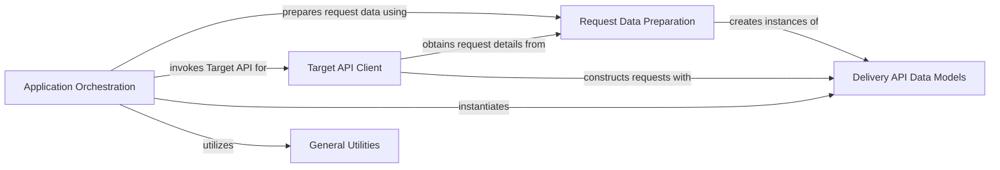

## Component Details

The SDK Samples component provides practical examples demonstrating the usage of the Adobe Target Python SDK. It showcases how to prepare request data, interact with the Target Delivery API for various scenarios like page loads, mbox calls, and prefetching, and handle notifications. The samples are structured to illustrate the typical flow of integrating with Adobe Target, from setting up request parameters to processing API responses.

### Application Orchestration
This component represents the high-level application logic that orchestrates calls to the Target API Client and manages the overall flow of Target interactions, including handling different types of requests (page load, mbox, prefetch views) and notifications.

**Related Classes/Methods**:

- `target_python_sdk.samples.app:execute_page_load` (full file reference)
- `target_python_sdk.samples.app:execute_mbox` (full file reference)
- `target_python_sdk.samples.app:prefetch_mbox` (full file reference)
- `target_python_sdk.samples.app:get_offers_callback` (full file reference)
- `target_python_sdk.samples.app:get_target_delivery_response_async_callback` (full file reference)
- `target_python_sdk.samples.app:get_target_delivery_response_async_await` (full file reference)
- `target_python_sdk.samples.app:get_target_delivery_response` (full file reference)
- `target_python_sdk.samples.app:prefetch_view` (full file reference)
- `target_python_sdk.samples.app:prefetch_view_asyncio` (full file reference)
- `target_python_sdk.samples.app:_get_all_view_notifications` (full file reference)
- `target_python_sdk.samples.app:_get_all_mbox_notifications` (full file reference)
- `target_python_sdk.samples.app:send_notifications` (full file reference)

### Target API Client
This component serves as the primary interface for interacting with the Adobe Target Delivery API. It encapsulates the logic for constructing various types of delivery requests (page load, mbox, prefetch, notifications) and handling their responses.

**Related Classes/Methods**:

- `target_python_sdk.samples.target_client_service.TargetClientService:get_page_load_target_delivery_response` (full file reference)
- `target_python_sdk.samples.target_client_service.TargetClientService:get_mbox_target_delivery_response` (full file reference)
- `target_python_sdk.samples.target_client_service.TargetClientService:prefetch_views_target_delivery_response` (full file reference)
- `target_python_sdk.samples.target_client_service.TargetClientService:prefetch_views_target_delivery_response_asyncio` (full file reference)
- `target_python_sdk.samples.target_client_service.TargetClientService:send_notifications` (full file reference)
- `target_python_sdk.samples.target_client_service:_get_prefetch_views_request` (full file reference)

### Request Data Preparation
This component is responsible for preparing and extracting data related to Target requests, including handling cookies, addresses, context, and visitor IDs. It acts as a utility layer for common request-related operations.

**Related Classes/Methods**:

- `target_python_sdk.samples.target_request_utils:get_target_cookie` (full file reference)
- `target_python_sdk.samples.target_request_utils:get_location_hint_cookie` (full file reference)
- `target_python_sdk.samples.target_request_utils:set_target_cookies` (full file reference)
- `target_python_sdk.samples.target_request_utils:get_address` (full file reference)
- `target_python_sdk.samples.target_request_utils:get_context` (full file reference)
- `target_python_sdk.samples.target_request_utils:get_visitor_id` (full file reference)
- `target_python_sdk.samples.target_request_utils:initialize_options` (full file reference)
- `target_python_sdk.samples.target_request_utils.get_cookie` (full file reference)
- `target_python_sdk.samples.target_request_utils.set_cookie` (full file reference)
- `target_python_sdk.samples.target_request_utils.get_uuid` (full file reference)

### Delivery API Data Models
This component encompasses all the data structures and models defined by the `delivery_api_client` for representing various entities in Target API requests and responses, such as addresses, contexts, visitor IDs, mbox requests, view requests, and notifications.

**Related Classes/Methods**:

- <a href="https://github.com/adobe/target-python-sdk/blob/master/delivery_api_client/Model/address.py#L19-L146" target="_blank" rel="noopener noreferrer">`delivery_api_client.Model.address.Address` (19:146)</a>
- <a href="https://github.com/adobe/target-python-sdk/blob/master/delivery_api_client/Model/context.py#L19-L379" target="_blank" rel="noopener noreferrer">`delivery_api_client.Model.context.Context` (19:379)</a>
- <a href="https://github.com/adobe/target-python-sdk/blob/master/delivery_api_client/Model/visitor_id.py#L19-L204" target="_blank" rel="noopener noreferrer">`delivery_api_client.Model.visitor_id.VisitorId` (19:204)</a>
- <a href="https://github.com/adobe/target-python-sdk/blob/master/delivery_api_client/Model/mbox_request.py#L19-L276" target="_blank" rel="noopener noreferrer">`delivery_api_client.Model.mbox_request.MboxRequest` (19:276)</a>
- <a href="https://github.com/adobe/target-python-sdk/blob/master/delivery_api_client/Model/view_request.py#L19-L280" target="_blank" rel="noopener noreferrer">`delivery_api_client.Model.view_request.ViewRequest` (19:280)</a>
- <a href="https://github.com/adobe/target-python-sdk/blob/master/delivery_api_client/Model/notification.py#L19-L440" target="_blank" rel="noopener noreferrer">`delivery_api_client.Model.notification.Notification` (19:440)</a>
- <a href="https://github.com/adobe/target-python-sdk/blob/master/delivery_api_client/Model/notification_view.py#L19-L174" target="_blank" rel="noopener noreferrer">`delivery_api_client.Model.notification_view.NotificationView` (19:174)</a>
- <a href="https://github.com/adobe/target-python-sdk/blob/master/delivery_api_client/Model/notification_mbox.py#L19-L144" target="_blank" rel="noopener noreferrer">`delivery_api_client.Model.notification_mbox.NotificationMbox` (19:144)</a>
- <a href="https://github.com/adobe/target-python-sdk/blob/master/delivery_api_client/Model/prefetch_request.py#L19-L168" target="_blank" rel="noopener noreferrer">`delivery_api_client.Model.prefetch_request.PrefetchRequest` (19:168)</a>
- <a href="https://github.com/adobe/target-python-sdk/blob/master/delivery_api_client/Model/delivery_request.py#L19-L463" target="_blank" rel="noopener noreferrer">`delivery_api_client.Model.delivery_request.DeliveryRequest` (19:463)</a>
- <a href="https://github.com/adobe/target-python-sdk/blob/master/delivery_api_client/Model/customer_id.py#L19-L173" target="_blank" rel="noopener noreferrer">`delivery_api_client.Model.customer_id.CustomerId` (19:173)</a>
- <a href="https://github.com/adobe/target-python-sdk/blob/master/delivery_api_client/Model/execute_request.py#L19-L140" target="_blank" rel="noopener noreferrer">`delivery_api_client.Model.execute_request.ExecuteRequest` (19:140)</a>
- <a href="https://github.com/adobe/target-python-sdk/blob/master/delivery_api_client/Model/request_details.py#L19-L220" target="_blank" rel="noopener noreferrer">`delivery_api_client.Model.request_details.RequestDetails` (19:220)</a>

### General Utilities
This component provides miscellaneous utility functions that are not specific to Target request processing but are used by other components, such as time-related utilities.

**Related Classes/Methods**:

- <a href="https://github.com/adobe/target-python-sdk/blob/master/target_tools/utils.py#L247-L250" target="_blank" rel="noopener noreferrer">`target_tools.utils.get_epoch_time_milliseconds` (247:250)</a>

### [FAQ](https://github.com/CodeBoarding/GeneratedOnBoardings/tree/main?tab=readme-ov-file#faq)