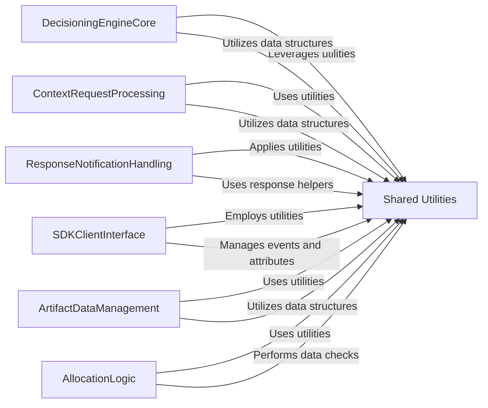

## Component Details

This graph illustrates the central role of the `Shared Utilities` component within the SDK. It acts as a foundational layer, providing essential general-purpose utility functions, performance monitoring tools, event handling mechanisms, attribute management, and core data structures. Various other key components of the SDK, such as the `DecisioningEngineCore`, `ContextRequestProcessing`, `ResponseNotificationHandling`, `SDKClientInterface`, `ArtifactDataManagement`, and `AllocationLogic`, extensively interact with and rely on `Shared Utilities` to perform their respective functions, ensuring consistency, reusability, and efficient operation across the system.

### Shared Utilities
A collection of general-purpose utility functions, performance tools, event handling, attribute management, and data structure helpers used across various modules of the SDK, ensuring consistency and reusability.

**Related Classes/Methods**:

- `target-python-sdk.target_tools.response_helpers` (full file reference)
- `target-python-sdk.target_tools.client_info` (full file reference)
- <a href="https://github.com/adobe/target-python-sdk/blob/master/target_tools/perf_tool.py#L19-L75" target="_blank" rel="noopener noreferrer">`target-python-sdk.target_tools.perf_tool._PerfTool` (19:75)</a>
- <a href="https://github.com/adobe/target-python-sdk/blob/master/target_tools/event_provider.py#L28-L74" target="_blank" rel="noopener noreferrer">`target-python-sdk.target_tools.event_provider.EventProvider` (28:74)</a>
- <a href="https://github.com/adobe/target-python-sdk/blob/master/target_tools/attributes_provider.py#L36-L70" target="_blank" rel="noopener noreferrer">`target-python-sdk.target_tools.attributes_provider.AttributesProvider` (36:70)</a>
- `target-python-sdk.target_tools.hashing` (full file reference)
- `target-python-sdk.target_tools.utils` (full file reference)
- <a href="https://github.com/adobe/target-python-sdk/blob/master/target_tools/types/limited_key_dict.py#L13-L39" target="_blank" rel="noopener noreferrer">`target-python-sdk.target_tools.types.limited_key_dict.LimitedKeyDict` (13:39)</a>
- `target-python-sdk.target_decisioning_engine.post_processors` (full file reference)
- `target-python-sdk.target_decisioning_engine.utils` (full file reference)
- `target-python-sdk.target_decisioning_engine.types.decisioning_artifact` (full file reference)
- `target-python-sdk.target_decisioning_engine.types.decisioning_context` (full file reference)

### [FAQ](https://github.com/CodeBoarding/GeneratedOnBoardings/tree/main?tab=readme-ov-file#faq)