```mermaid
graph LR
    SDK_Orchestrator["SDK Orchestrator"]
    Local_Decisioning_Core["Local Decisioning Core"]
    Delivery_API_Interface["Delivery API Interface"]
    Shared_Utilities["Shared Utilities"]
    SDK_Samples["SDK Samples"]
    SDK_Orchestrator -- "orchestrates" --> Local_Decisioning_Core
    SDK_Orchestrator -- "orchestrates" --> Delivery_API_Interface
    SDK_Orchestrator -- "utilizes" --> Shared_Utilities
    Local_Decisioning_Core -- "utilizes" --> Shared_Utilities
    Local_Decisioning_Core -- "sends data via" --> Delivery_API_Interface
    Delivery_API_Interface -- "utilizes" --> Shared_Utilities
    SDK_Samples -- "interacts with" --> SDK_Orchestrator
    click SDK_Orchestrator href "https://github.com/CodeBoarding/GeneratedOnBoardings/blob/main/target-python-sdk/SDK Orchestrator.md" "Details"
    click Local_Decisioning_Core href "https://github.com/CodeBoarding/GeneratedOnBoardings/blob/main/target-python-sdk/Local Decisioning Core.md" "Details"
    click Delivery_API_Interface href "https://github.com/CodeBoarding/GeneratedOnBoardings/blob/main/target-python-sdk/Delivery API Interface.md" "Details"
    click Shared_Utilities href "https://github.com/CodeBoarding/GeneratedOnBoardings/blob/main/target-python-sdk/Shared Utilities.md" "Details"
    click SDK_Samples href "https://github.com/CodeBoarding/GeneratedOnBoardings/blob/main/target-python-sdk/SDK Samples.md" "Details"
```

## Component Details

This graph illustrates the high-level architecture of the `target-python-sdk`, detailing its core components and their interactions. The main flow involves the `SDK Orchestrator` handling requests, which can be processed either locally by the `Local Decisioning Core` or remotely via the `Delivery API Interface`. Both core functionalities rely on `Shared Utilities` for common operations, and `SDK Samples` demonstrate typical usage patterns.

### SDK Orchestrator
The primary entry point for interacting with the Adobe Target Python SDK. It orchestrates the entire process of fetching offers, sending notifications, and managing the SDK's lifecycle, including initialization and validation of requests. It can utilize either the local decisioning engine or make remote API calls, and provides helper functionalities for cookie management and request/response processing.

**Related Classes/Methods**:

- `target-python-sdk.target_python_sdk.target.TargetClient` (full file reference)
- <a href="https://github.com/adobe/target-python-sdk/blob/master/target_python_sdk/local_delivery_api.py#L15-L33" target="_blank" rel="noopener noreferrer">`target-python-sdk.target_python_sdk.local_delivery_api.LocalDeliveryApi` (15:33)</a>
- `target-python-sdk.target_python_sdk.validators` (full file reference)
- `target-python-sdk.target_python_sdk.helper` (full file reference)
- `target-python-sdk.target_python_sdk.cookies` (full file reference)
- <a href="https://github.com/adobe/target-python-sdk/blob/master/target_python_sdk/types/target_delivery_response.py#L14-L32" target="_blank" rel="noopener noreferrer">`target-python-sdk.target_python_sdk.types.target_delivery_response.TargetDeliveryResponse` (14:32)</a>

### Local Decisioning Core
Encapsulates the core logic for evaluating rules and making personalized content decisions locally. It manages decisioning artifacts, constructs various context objects from input data, and handles tracing and dispatching of notifications and telemetry related to local decisions.

**Related Classes/Methods**:

- <a href="https://github.com/adobe/target-python-sdk/blob/master/target_decisioning_engine/decision_provider.py#L60-L313" target="_blank" rel="noopener noreferrer">`target-python-sdk.target_decisioning_engine.decision_provider.DecisionProvider` (60:313)</a>
- <a href="https://github.com/adobe/target-python-sdk/blob/master/target_decisioning_engine/rule_evaluator.py#L21-L68" target="_blank" rel="noopener noreferrer">`target-python-sdk.target_decisioning_engine.rule_evaluator.RuleEvaluator` (21:68)</a>
- `target-python-sdk.target_decisioning_engine.allocation_provider` (full file reference)
- `target-python-sdk.target_decisioning_engine.filters` (full file reference)
- <a href="https://github.com/adobe/target-python-sdk/blob/master/target_decisioning_engine/artifact_provider.py#L53-L231" target="_blank" rel="noopener noreferrer">`target-python-sdk.target_decisioning_engine.artifact_provider.ArtifactProvider` (53:231)</a>
- <a href="https://github.com/adobe/target-python-sdk/blob/master/target_decisioning_engine/geo_provider.py#L121-L200" target="_blank" rel="noopener noreferrer">`target-python-sdk.target_decisioning_engine.geo_provider.GeoProvider` (121:200)</a>
- `target-python-sdk.target_decisioning_engine.context_provider` (full file reference)
- `target-python-sdk.target_decisioning_engine.request_provider` (full file reference)
- <a href="https://github.com/adobe/target-python-sdk/blob/master/target_decisioning_engine/trace_provider.py#L33-L83" target="_blank" rel="noopener noreferrer">`target-python-sdk.target_decisioning_engine.trace_provider.TraceProvider` (33:83)</a>
- <a href="https://github.com/adobe/target-python-sdk/blob/master/target_decisioning_engine/trace_provider.py#L86-L217" target="_blank" rel="noopener noreferrer">`target-python-sdk.target_decisioning_engine.trace_provider.RequestTracer` (86:217)</a>
- <a href="https://github.com/adobe/target-python-sdk/blob/master/target_decisioning_engine/trace_provider.py#L220-L261" target="_blank" rel="noopener noreferrer">`target-python-sdk.target_decisioning_engine.trace_provider.ArtifactTracer` (220:261)</a>
- <a href="https://github.com/adobe/target-python-sdk/blob/master/target_decisioning_engine/notification_provider.py#L29-L114" target="_blank" rel="noopener noreferrer">`target-python-sdk.target_decisioning_engine.notification_provider.NotificationProvider` (29:114)</a>

### Delivery API Interface
Provides the low-level interface for making HTTP requests to the Adobe Target Delivery API. It handles request serialization, response deserialization, error handling for network communication, and defines the data models for all requests and responses exchanged with the API.

**Related Classes/Methods**:

- <a href="https://github.com/adobe/target-python-sdk/blob/master/delivery_api_client/api/delivery_api.py#L27-L209" target="_blank" rel="noopener noreferrer">`target-python-sdk.delivery_api_client.api.delivery_api.DeliveryApi` (27:209)</a>
- <a href="https://github.com/adobe/target-python-sdk/blob/master/delivery_api_client/api_client.py#L39-L723" target="_blank" rel="noopener noreferrer">`target-python-sdk.delivery_api_client.api_client.ApiClient` (39:723)</a>
- <a href="https://github.com/adobe/target-python-sdk/blob/master/delivery_api_client/rest.py#L50-L296" target="_blank" rel="noopener noreferrer">`target-python-sdk.delivery_api_client.rest.RESTClientObject` (50:296)</a>
- <a href="https://github.com/adobe/target-python-sdk/blob/master/delivery_api_client/configuration.py#L39-L311" target="_blank" rel="noopener noreferrer">`target-python-sdk.delivery_api_client.configuration.Configuration` (39:311)</a>
- `target-python-sdk.delivery_api_client.exceptions` (full file reference)
- <a href="https://github.com/adobe/target-python-sdk/blob/master/delivery_api_client/Model/delivery_request.py#L19-L463" target="_blank" rel="noopener noreferrer">`target-python-sdk.delivery_api_client.Model.delivery_request.DeliveryRequest` (19:463)</a>
- <a href="https://github.com/adobe/target-python-sdk/blob/master/delivery_api_client/Model/delivery_response.py#L19-L300" target="_blank" rel="noopener noreferrer">`target-python-sdk.delivery_api_client.Model.delivery_response.DeliveryResponse` (19:300)</a>
- <a href="https://github.com/adobe/target-python-sdk/blob/master/delivery_api_client/Model/mbox_response.py#L19-L252" target="_blank" rel="noopener noreferrer">`target-python-sdk.delivery_api_client.Model.mbox_response.MboxResponse` (19:252)</a>
- <a href="https://github.com/adobe/target-python-sdk/blob/master/delivery_api_client/Model/notification.py#L19-L440" target="_blank" rel="noopener noreferrer">`target-python-sdk.delivery_api_client.Model.notification.Notification` (19:440)</a>
- <a href="https://github.com/adobe/target-python-sdk/blob/master/delivery_api_client/Model/context.py#L19-L379" target="_blank" rel="noopener noreferrer">`target-python-sdk.delivery_api_client.Model.context.Context` (19:379)</a>
- <a href="https://github.com/adobe/target-python-sdk/blob/master/delivery_api_client/Model/geo.py#L19-L286" target="_blank" rel="noopener noreferrer">`target-python-sdk.delivery_api_client.Model.geo.Geo` (19:286)</a>
- <a href="https://github.com/adobe/target-python-sdk/blob/master/delivery_api_client/Model/visitor_id.py#L19-L204" target="_blank" rel="noopener noreferrer">`target-python-sdk.delivery_api_client.Model.visitor_id.VisitorId` (19:204)</a>

### Shared Utilities
A collection of general-purpose utility functions, performance tools, event handling, attribute management, and data structure helpers used across various modules of the SDK, ensuring consistency and reusability.

**Related Classes/Methods**:

- `target-python-sdk.target_tools.response_helpers` (full file reference)
- `target-python-sdk.target_tools.client_info` (full file reference)
- <a href="https://github.com/adobe/target-python-sdk/blob/master/target_tools/perf_tool.py#L19-L75" target="_blank" rel="noopener noreferrer">`target-python-sdk.target_tools.perf_tool._PerfTool` (19:75)</a>
- <a href="https://github.com/adobe/target-python-sdk/blob/master/target_tools/event_provider.py#L28-L74" target="_blank" rel="noopener noreferrer">`target-python-sdk.target_tools.event_provider.EventProvider` (28:74)</a>
- <a href="https://github.com/adobe/target-python-sdk/blob/master/target_tools/attributes_provider.py#L36-L70" target="_blank" rel="noopener noreferrer">`target-python-sdk.target_tools.attributes_provider.AttributesProvider` (36:70)</a>
- `target-python-sdk.target_tools.hashing` (full file reference)
- `target-python-sdk.target_tools.utils` (full file reference)
- <a href="https://github.com/adobe/target-python-sdk/blob/master/target_tools/types/limited_key_dict.py#L13-L39" target="_blank" rel="noopener noreferrer">`target-python-sdk.target_tools.types.limited_key_dict.LimitedKeyDict` (13:39)</a>
- `target-python-sdk.target_decisioning_engine.post_processors` (full file reference)
- `target-python-sdk.target_decisioning_engine.utils` (full file reference)
- `target-python-sdk.target_decisioning_engine.types.decisioning_artifact` (full file reference)
- `target-python-sdk.target_decisioning_engine.types.decisioning_context` (full file reference)

### SDK Samples
Contains example code demonstrating how to use the Adobe Target Python SDK for various scenarios, serving as a guide for developers.

**Related Classes/Methods**:

- `target-python-sdk.samples.app` (full file reference)
- `target-python-sdk.samples.target_client_service` (full file reference)
- `target-python-sdk.samples.target_request_utils` (full file reference)

### [FAQ](https://github.com/CodeBoarding/GeneratedOnBoardings/tree/main?tab=readme-ov-file#faq)