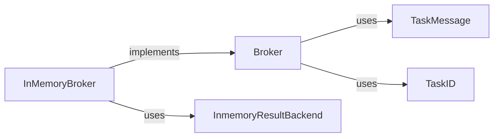

## Details

This subsystem forms the core message queue mechanism for reliable task delivery within `taskiq`. It defines the abstract contract for message brokers and provides a concrete in-memory implementation for development and testing purposes.

### Broker
The foundational abstract class that defines the contract for all message brokers in the `taskiq` ecosystem. It specifies the essential methods for task registration, sending tasks to the message queue, and handling task results. It acts as the pluggable interface for different message queue technologies.

**Related Classes/Methods**:

- <a href="https://github.com/taskiq-python/taskiq/blob/master/taskiq/abc/broker.py" target="_blank" rel="noopener noreferrer">`taskiq.abc.broker.Broker`</a>

### InMemoryBroker
A concrete implementation of the `Broker` interface. It manages task queues and results directly within the application's memory. This implementation is ideal for testing, development, and simple, single-process use cases where a full-fledged external message queue is not required.

**Related Classes/Methods**:

- <a href="https://github.com/taskiq-python/taskiq/blob/master/taskiq/brokers/inmemory_broker.py#L116-L203" target="_blank" rel="noopener noreferrer">`taskiq.brokers.inmemory_broker.InMemoryBroker`:116-203</a>

### TaskMessage
Defines the standardized data structure for messages exchanged between task producers (clients) and brokers. It encapsulates all necessary details about a task, including its name, arguments, and metadata, ensuring consistent communication across the distributed system.

**Related Classes/Methods**:

- <a href="https://github.com/taskiq-python/taskiq/blob/master/taskiq/abc/broker.py" target="_blank" rel="noopener noreferrer">`taskiq.abc.broker.TaskMessage`</a>

### TaskID
Represents a unique identifier assigned to each task. This ID is critical for tracking the lifecycle of a task, from its dispatch to the retrieval of its results.

**Related Classes/Methods**:

- <a href="https://github.com/taskiq-python/taskiq/blob/master/taskiq/abc/broker.py" target="_blank" rel="noopener noreferrer">`taskiq.abc.broker.TaskID`</a>

### InmemoryResultBackend
Manages the storage and retrieval of task execution results specifically for the `InMemoryBroker`. It demonstrates a basic, in-memory result backend capability, storing results directly in application memory.

**Related Classes/Methods**:

- <a href="https://github.com/taskiq-python/taskiq/blob/master/taskiq/brokers/inmemory_broker.py#L18-L113" target="_blank" rel="noopener noreferrer">`taskiq.brokers.inmemory_broker.InmemoryResultBackend`:18-113</a>

### [FAQ](https://github.com/CodeBoarding/GeneratedOnBoardings/tree/main?tab=readme-ov-file#faq)