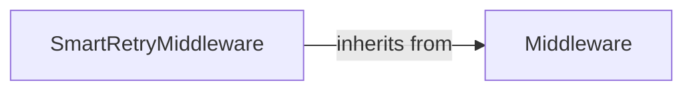

## Details

The Middleware System in taskiq provides a flexible mechanism to intercept and modify the task lifecycle at various stages. It adheres to the "Pluggable Architecture" pattern, allowing developers to inject custom logic before, during, or after task processing.

### Middleware
This is the abstract base class (taskiq.abc.middleware.Middleware) that defines the contract for all middleware components. It specifies a set of asynchronous methods (hooks) such as on_before_send, on_after_send, on_before_process, on_after_process, and on_error. These hooks are strategically placed to allow interception of different phases of a task's lifecycle, enabling custom logic to be executed at specific points.

**Related Classes/Methods**:

- <a href="https://github.com/taskiq-python/taskiq/blob/master/taskiq/abc/middleware.py" target="_blank" rel="noopener noreferrer">`taskiq.abc.middleware.Middleware`</a>
- <a href="https://github.com/taskiq-python/taskiq/blob/master/taskiq/abc/middleware.py" target="_blank" rel="noopener noreferrer">`taskiq.abc.middleware.Middleware:on_before_send`</a>
- <a href="https://github.com/taskiq-python/taskiq/blob/master/taskiq/abc/middleware.py" target="_blank" rel="noopener noreferrer">`taskiq.abc.middleware.Middleware:on_after_send`</a>
- <a href="https://github.com/taskiq-python/taskiq/blob/master/taskiq/abc/middleware.py" target="_blank" rel="noopener noreferrer">`taskiq.abc.middleware.Middleware:on_before_process`</a>
- <a href="https://github.com/taskiq-python/taskiq/blob/master/taskiq/abc/middleware.py" target="_blank" rel="noopener noreferrer">`taskiq.abc.middleware.Middleware:on_after_process`</a>
- <a href="https://github.com/taskiq-python/taskiq/blob/master/taskiq/abc/middleware.py" target="_blank" rel="noopener noreferrer">`taskiq.abc.middleware.Middleware:on_error`</a>

### SmartRetryMiddleware
A concrete implementation of the Middleware abstract base class (taskiq.middlewares.smart_retry_middleware.SmartRetryMiddleware). Its specific responsibility is to provide a "smart retry" mechanism for tasks that fail during execution. This typically involves catching exceptions within its on_error hook, determining if a retry is appropriate based on configured criteria (e.g., number of attempts, specific error types), and re-queuing the task for a subsequent execution attempt. This component directly contributes to the system's robustness and fault tolerance.

**Related Classes/Methods**:

- <a href="https://github.com/taskiq-python/taskiq/blob/master/taskiq/middlewares/smart_retry_middleware.py#L18-L191" target="_blank" rel="noopener noreferrer">`taskiq.middlewares.smart_retry_middleware.SmartRetryMiddleware`:18-191</a>
- <a href="https://github.com/taskiq-python/taskiq/blob/master/taskiq/middlewares/smart_retry_middleware.py" target="_blank" rel="noopener noreferrer">`taskiq.middlewares.smart_retry_middleware.SmartRetryMiddleware:on_error`</a>
- <a href="https://github.com/taskiq-python/taskiq/blob/master/taskiq/abc/middleware.py" target="_blank" rel="noopener noreferrer">`taskiq.abc.middleware.Middleware`</a>

### [FAQ](https://github.com/CodeBoarding/GeneratedOnBoardings/tree/main?tab=readme-ov-file#faq)