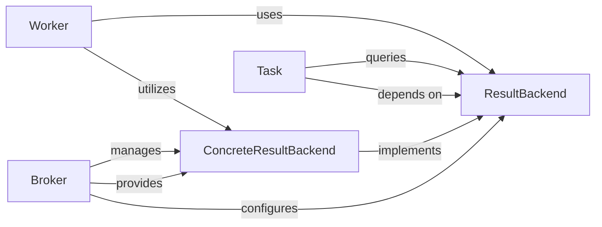

## Details

The `taskiq` system's result handling revolves around a pluggable architecture centered on the `ResultBackend`. The abstract `ResultBackend` defines the contract for result storage, which is concretely implemented by `ConcreteResultBackend` components (e.g., in-memory, Redis). The `Broker` plays a pivotal role by configuring and providing the appropriate `ConcreteResultBackend` instance, making it accessible to other parts of the system. The `Worker` component, after executing a task, uses the configured `ResultBackend` to store the task's outcome. Concurrently, the `Task` component acts as a user-facing proxy, querying the `ResultBackend` to retrieve task results and status, thus enabling asynchronous result retrieval. This design ensures a clear separation of concerns, allowing different result storage mechanisms to be seamlessly integrated and managed.

### ResultBackend
This is the foundational abstract base class that defines the contract for any result storage mechanism. It specifies methods for setting and getting task results, exceptions, and status, ensuring a consistent interface across diverse implementations. It embodies the "Pluggable Architecture" pattern by allowing various storage solutions to be swapped in.

**Related Classes/Methods**:

- <a href="https://github.com/taskiq-python/taskiq/blob/master/taskiq/abc/result_backend.py#L1-L1000" target="_blank" rel="noopener noreferrer">`taskiq.abc.result_backend.ResultBackend`:1-1000</a>

### ConcreteResultBackend
These are the concrete classes that implement the `ResultBackend` interface. They handle the actual persistence and retrieval of task results using specific storage technologies (e.g., in-memory, Redis, NATS). They provide the actual storage capabilities.

**Related Classes/Methods**:

- <a href="https://github.com/taskiq-python/taskiq/blob/master/taskiq/brokers/inmemory_broker.py#L18-L113" target="_blank" rel="noopener noreferrer">`taskiq.brokers.inmemory_broker.InmemoryResultBackend`:18-113</a>

### Task
Represents an individual task within the system. While a broader component, its role in managing `TaskResult` and providing asynchronous methods like `wait_result`, `is_ready`, and `get_result` makes it central to how producers interact with task outcomes. It acts as a user-facing proxy to the actual result stored by a `ResultBackend`.

**Related Classes/Methods**:

- <a href="https://github.com/taskiq-python/taskiq/blob/master/taskiq/task.py" target="_blank" rel="noopener noreferrer">`taskiq.task.Task`</a>

### Broker
The `Broker` component is responsible for instantiating, configuring, and providing the chosen `ResultBackend` implementation to the system. It acts as the integration point, ensuring that workers and tasks have access to the appropriate result storage mechanism. This aligns with the "Message Queue/Broker" pattern where the broker facilitates various aspects of task management, including result handling.

**Related Classes/Methods**:

- <a href="https://github.com/taskiq-python/taskiq/blob/master/taskiq/brokers/inmemory_broker.py#L116-L203" target="_blank" rel="noopener noreferrer">`taskiq.brokers.inmemory_broker.InMemoryBroker`:116-203</a>

### Worker
The `Worker` is responsible for executing tasks. After a task completes, the `Worker` utilizes the configured `ResultBackend` to store the task's outcome (result or exception) and its final status. It is the primary producer of data for the `Result Backend`.

**Related Classes/Methods**:

- <a href="https://github.com/taskiq-python/taskiq/blob/master/taskiq/cli/worker/run.py#L177-L223" target="_blank" rel="noopener noreferrer">`taskiq.cli.worker.run.run_worker`:177-223</a>

### [FAQ](https://github.com/CodeBoarding/GeneratedOnBoardings/tree/main?tab=readme-ov-file#faq)