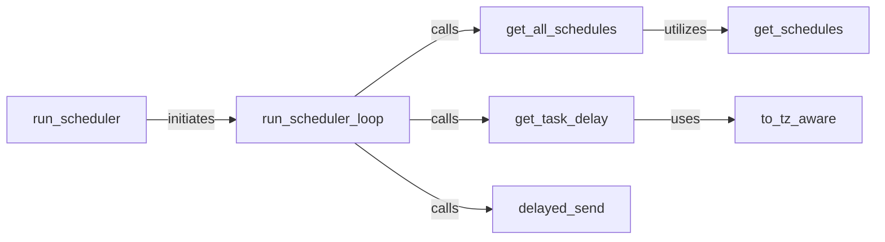

## Details

The `Scheduler Service` subsystem is responsible for dispatching tasks at predefined times or intervals within the `taskiq` project. Its core functionality is encapsulated within the `taskiq.cli.scheduler.run` module, specifically the `run.py` file.

### run_scheduler
Serves as the main entry point for the Scheduler Service. It initializes and orchestrates the continuous scheduling loop.

**Related Classes/Methods**:

- <a href="https://github.com/taskiq-python/taskiq/blob/master/taskiq/cli/scheduler/run.py#L231-L294" target="_blank" rel="noopener noreferrer">`taskiq.cli.scheduler.run.run_scheduler`:231-294</a>

### run_scheduler_loop
The core of the scheduler, continuously executing the scheduling logic. It is responsible for fetching scheduled tasks, calculating their next execution time, and dispatching them to the message broker. This ensures the scheduler is always active and responsive to time-based triggers.

**Related Classes/Methods**:

- <a href="https://github.com/taskiq-python/taskiq/blob/master/taskiq/cli/scheduler/run.py#L146-L228" target="_blank" rel="noopener noreferrer">`taskiq.cli.scheduler.run.run_scheduler_loop`:146-228</a>

### get_all_schedules
Aggregates all defined scheduled tasks from various sources (e.g., configuration, task definitions), providing a consolidated view of tasks configured for periodic execution.

**Related Classes/Methods**:

- <a href="https://github.com/taskiq-python/taskiq/blob/master/taskiq/cli/scheduler/run.py#L56-L74" target="_blank" rel="noopener noreferrer">`taskiq.cli.scheduler.run.get_all_schedules`:56-74</a>

### get_schedules
A helper component that retrieves raw schedule definitions from a specific source. It provides the foundational data for `get_all_schedules`.

**Related Classes/Methods**:

- <a href="https://github.com/taskiq-python/taskiq/blob/master/taskiq/cli/scheduler/run.py#L36-L53" target="_blank" rel="noopener noreferrer">`taskiq.cli.scheduler.run.get_schedules`:36-53</a>

### get_task_delay
Calculates the precise delay until a scheduled task's next execution, taking into account timezones and recurring patterns.

**Related Classes/Methods**:

- <a href="https://github.com/taskiq-python/taskiq/blob/master/taskiq/cli/scheduler/run.py#L77-L105" target="_blank" rel="noopener noreferrer">`taskiq.cli.scheduler.run.get_task_delay`:77-105</a>

### to_tz_aware
Ensures all time-related operations are handled with timezone awareness, preventing common scheduling errors due to time zone discrepancies.

**Related Classes/Methods**:

- <a href="https://github.com/taskiq-python/taskiq/blob/master/taskiq/cli/scheduler/run.py#L20-L33" target="_blank" rel="noopener noreferrer">`taskiq.cli.scheduler.run.to_tz_aware`:20-33</a>

### delayed_send
Dispatches the scheduled task to the message broker or task queue. This component acts as the "Producer" for scheduled tasks, sending them into the distributed system for eventual execution by workers.

**Related Classes/Methods**:

- <a href="https://github.com/taskiq-python/taskiq/blob/master/taskiq/cli/scheduler/run.py#L108-L143" target="_blank" rel="noopener noreferrer">`taskiq.cli.scheduler.run.delayed_send`:108-143</a>

### [FAQ](https://github.com/CodeBoarding/GeneratedOnBoardings/tree/main?tab=readme-ov-file#faq)