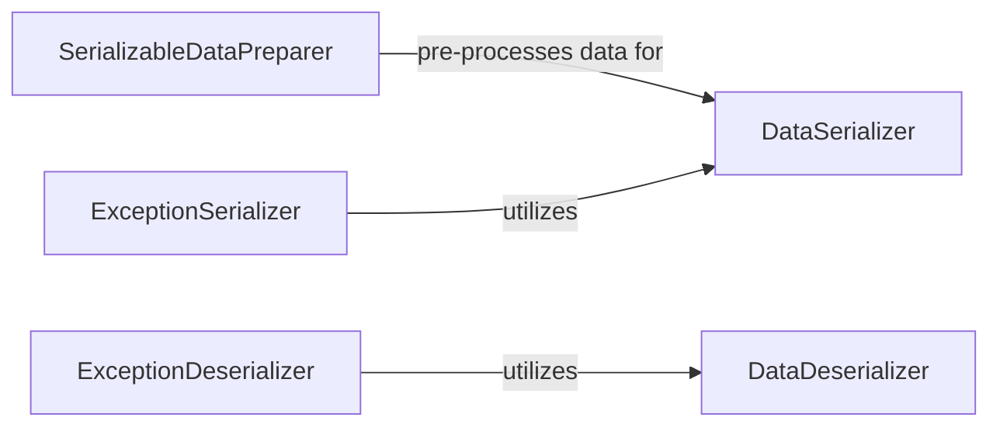

## Details

This subsystem is responsible for converting Python objects into a format suitable for network transmission (serialization) and reconstructing them back into Python objects (deserialization). It is a critical layer in an Asynchronous Distributed Task Queue Library, enabling tasks and their results (including exceptions) to be sent between clients, brokers, and workers.

### DataSerializer
The fundamental component responsible for converting arbitrary Python objects into a byte stream, making them suitable for transmission over a network or storage in a message broker.

**Related Classes/Methods**:

- <a href="https://github.com/taskiq-python/taskiq/blob/master/taskiq/serialization.py#L37-L38" target="_blank" rel="noopener noreferrer">`taskiq.serialization.dumps`:37-38</a>

### DataDeserializer
The counterpart to the `DataSerializer`, this component reconstructs Python objects from their byte stream representation received from the network or broker.

**Related Classes/Methods**:

- <a href="https://github.com/taskiq-python/taskiq/blob/master/taskiq/serialization.py#L34-L35" target="_blank" rel="noopener noreferrer">`taskiq.serialization.loads`:34-35</a>

### SerializableDataPreparer
This component ensures that data is in a compatible and safe format before it undergoes the serialization process. It handles pre-processing to prevent serialization errors.

**Related Classes/Methods**:

- <a href="https://github.com/taskiq-python/taskiq/blob/master/taskiq/serialization.py#L99-L121" target="_blank" rel="noopener noreferrer">`taskiq.serialization.ensure_serializable`:99-121</a>

### ExceptionSerializer
A specialized component dedicated to the serialization of Python exception objects. It extracts necessary information from exceptions and prepares them for transmission, ensuring they can be reconstructed on the receiving end.

**Related Classes/Methods**:

- <a href="https://github.com/taskiq-python/taskiq/blob/master/taskiq/serialization.py#L147-L176" target="_blank" rel="noopener noreferrer">`taskiq.serialization.from_exception`:147-176</a>
- <a href="https://github.com/taskiq-python/taskiq/blob/master/taskiq/serialization.py#L279-L314" target="_blank" rel="noopener noreferrer">`taskiq.serialization._prepare_exception`:279-314</a>
- <a href="https://github.com/taskiq-python/taskiq/blob/master/taskiq/serialization.py#L214-L234" target="_blank" rel="noopener noreferrer">`taskiq.serialization.get_pickleable_exception`:214-234</a>

### ExceptionDeserializer
This component handles the reconstruction of Python exception objects from their serialized form. It includes logic for dynamically creating or retrieving the correct exception class and restoring its state.

**Related Classes/Methods**:

- <a href="https://github.com/taskiq-python/taskiq/blob/master/taskiq/serialization.py#L141-L142" target="_blank" rel="noopener noreferrer">`taskiq.serialization.restore`:141-142</a>
- <a href="https://github.com/taskiq-python/taskiq/blob/master/taskiq/serialization.py#L332-L402" target="_blank" rel="noopener noreferrer">`taskiq.serialization.exception_to_python`:332-402</a>
- <a href="https://github.com/taskiq-python/taskiq/blob/master/taskiq/serialization.py#L81-L96" target="_blank" rel="noopener noreferrer">`taskiq.serialization.create_exception_cls`:81-96</a>
- <a href="https://github.com/taskiq-python/taskiq/blob/master/taskiq/serialization.py#L237-L246" target="_blank" rel="noopener noreferrer">`taskiq.serialization.get_pickled_exception`:237-246</a>

### [FAQ](https://github.com/CodeBoarding/GeneratedOnBoardings/tree/main?tab=readme-ov-file#faq)