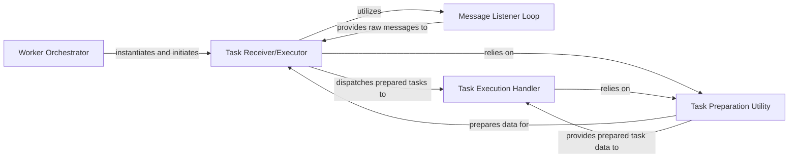

## Details

The `taskiq` worker subsystem is orchestrated by the **Worker Orchestrator**, which serves as the primary entry point, managing the worker's lifecycle and initiating the core **Task Receiver/Executor**. The **Task Receiver/Executor** is central to the worker's operation, responsible for connecting to the message broker, receiving, deserializing, and dispatching tasks. It leverages the **Message Listener Loop** to continuously poll for new task messages, with the loop providing these raw messages back to the **Task Receiver/Executor**. Before execution, the **Task Receiver/Executor** utilizes the **Task Preparation Utility** to deserialize and prepare the incoming task messages. Once prepared, the **Task Receiver/Executor** dispatches these tasks to the **Task Execution Handler**, which is responsible for executing the actual task function. The **Task Execution Handler** may also interact with the **Task Preparation Utility** for any final setup or access to prepared task details before invocation.

### Worker Orchestrator
Serves as the main entry point for the worker, managing its lifecycle from startup to graceful shutdown. It initializes the Task Receiver/Executor and initiates the message listening process.

**Related Classes/Methods**:

- <a href="https://github.com/taskiq-python/taskiq/blob/master/taskiq/cli/worker/run.py#L73-L174" target="_blank" rel="noopener noreferrer">`taskiq.cli.worker.run.start_listen`:73-174</a>

### Task Receiver/Executor
The core component of the worker, responsible for establishing a connection with the message broker, continuously receiving task messages, deserializing them, and dispatching them for execution. It encapsulates the main logic for task processing and error handling.

**Related Classes/Methods**:

- <a href="https://github.com/taskiq-python/taskiq/blob/master/taskiq/receiver/receiver.py#L45-L473" target="_blank" rel="noopener noreferrer">`taskiq.receiver.receiver.Receiver`:45-473</a>

### Message Listener Loop
Implements the continuous asynchronous loop that actively polls or subscribes to the message broker for new task messages, ensuring the worker remains vigilant for incoming work.

**Related Classes/Methods**:

- <a href="https://github.com/taskiq-python/taskiq/blob/master/taskiq/receiver/receiver.py#L321-L341" target="_blank" rel="noopener noreferrer">`taskiq.receiver.receiver.listen`:321-341</a>

### Task Execution Handler
Executes the actual Python function (the "task") associated with a received message. It handles the invocation of the task's business logic after the message has been deserialized and prepared.

**Related Classes/Methods**:

- <a href="https://github.com/taskiq-python/taskiq/blob/master/taskiq/receiver/receiver.py#L186-L319" target="_blank" rel="noopener noreferrer">`taskiq.receiver.receiver.run_task`:186-319</a>

### Task Preparation Utility
Prepares a raw task message for execution. This involves deserialization of the task payload, parsing arguments, resolving dependencies, or other setup required before the task function can be safely invoked.

**Related Classes/Methods**:

- <a href="https://github.com/taskiq-python/taskiq/blob/master/taskiq/receiver/receiver.py#L455-L473" target="_blank" rel="noopener noreferrer">`taskiq.receiver.receiver._prepare_task`:455-473</a>

### [FAQ](https://github.com/CodeBoarding/GeneratedOnBoardings/tree/main?tab=readme-ov-file#faq)