```mermaid
graph LR
    Client_Producer_Application["Client/Producer Application"]
    Task_Serialization_Deserialization_Layer["Task Serialization & Deserialization Layer"]
    Broker_Interface_Implementations["Broker Interface & Implementations"]
    Worker_Service["Worker Service"]
    Scheduler_Service["Scheduler Service"]
    Middleware_System["Middleware System"]
    Result_Backend_Optional_["Result Backend (Optional)"]
    Client_Producer_Application -- "dispatches task" --> Task_Serialization_Deserialization_Layer
    Task_Serialization_Deserialization_Layer -- "sends serialized task" --> Broker_Interface_Implementations
    Broker_Interface_Implementations -- "delivers task" --> Worker_Service
    Worker_Service -- "processes task data" --> Task_Serialization_Deserialization_Layer
    Worker_Service -- "stores result/status" --> Result_Backend_Optional_
    Client_Producer_Application -- "retrieves result/status" --> Result_Backend_Optional_
    Scheduler_Service -- "dispatches scheduled task" --> Task_Serialization_Deserialization_Layer
    Task_Serialization_Deserialization_Layer -- "sends serialized scheduled task" --> Broker_Interface_Implementations
    Middleware_System -- "intercepts dispatch" --> Client_Producer_Application
    Middleware_System -- "intercepts execution" --> Worker_Service
    click Task_Serialization_Deserialization_Layer href "https://github.com/CodeBoarding/GeneratedOnBoardings/blob/main/taskiq/Task_Serialization_Deserialization_Layer.md" "Details"
    click Broker_Interface_Implementations href "https://github.com/CodeBoarding/GeneratedOnBoardings/blob/main/taskiq/Broker_Interface_Implementations.md" "Details"
    click Worker_Service href "https://github.com/CodeBoarding/GeneratedOnBoardings/blob/main/taskiq/Worker_Service.md" "Details"
    click Scheduler_Service href "https://github.com/CodeBoarding/GeneratedOnBoardings/blob/main/taskiq/Scheduler_Service.md" "Details"
    click Middleware_System href "https://github.com/CodeBoarding/GeneratedOnBoardings/blob/main/taskiq/Middleware_System.md" "Details"
    click Result_Backend_Optional_ href "https://github.com/CodeBoarding/GeneratedOnBoardings/blob/main/taskiq/Result_Backend_Optional_.md" "Details"
```

## Details

The `taskiq` project functions as a distributed task queue system, designed for asynchronous task execution and scheduling. Its core relies on the `Broker Interface & Implementations`, which serves as a central message queue to ensure reliable task delivery between various components.

Tasks are initiated either by the `Client/Producer Application` or the `Scheduler Service`. The `Client/Producer Application` is responsible for dispatching immediate tasks, while the `Scheduler Service` handles tasks scheduled for predefined times or intervals. Before being transmitted, all tasks are processed by the `Task Serialization & Deserialization Layer`, which converts Python objects into a network-transmittable format.

The `Worker Service` consumes tasks from the `Broker Interface & Implementations`. Upon receipt, the `Worker Service` processes the task data, often requiring deserialization via the `Task Serialization & Deserialization Layer`. Task results or status can be optionally stored and retrieved using the `Result Backend (Optional)`.

A key architectural feature is the `Middleware System`, which provides extensible hooks to intercept and modify the task lifecycle. This system specifically intercepts task dispatch operations originating from the `Client/Producer Application` and task execution within the `Worker Service`, enabling the injection of custom logic such as retries, logging, or monitoring. This modular design promotes clear separation of concerns and enhances system extensibility.

### Client/Producer Application
Initiates and dispatches tasks.

**Related Classes/Methods**:

- <a href="https://github.com/taskiq-python/taskiq/blob/master/taskiq/kicker.py" target="_blank" rel="noopener noreferrer">`taskiq.kicker`</a>
- <a href="https://github.com/taskiq-python/taskiq/blob/master/taskiq/decor.py" target="_blank" rel="noopener noreferrer">`taskiq.decor`</a>

### Task Serialization & Deserialization Layer [[Expand]](./Task_Serialization_Deserialization_Layer.md)
Converts Python objects to/from network-transmittable formats.

**Related Classes/Methods**:

- <a href="https://github.com/taskiq-python/taskiq/blob/master/taskiq/serialization.py" target="_blank" rel="noopener noreferrer">`taskiq.serialization`</a>

### Broker Interface & Implementations [[Expand]](./Broker_Interface_Implementations.md)
Central message queue for reliable task delivery.

**Related Classes/Methods**:

- <a href="https://github.com/taskiq-python/taskiq/blob/master/taskiq/abc/broker.py" target="_blank" rel="noopener noreferrer">`taskiq.abc.broker`</a>
- <a href="https://github.com/taskiq-python/taskiq/blob/master/taskiq/brokers/inmemory_broker.py" target="_blank" rel="noopener noreferrer">`taskiq.brokers.inmemory_broker`</a>

### Worker Service [[Expand]](./Worker_Service.md)
Receives, executes, and processes tasks from the Broker.

**Related Classes/Methods**:

- <a href="https://github.com/taskiq-python/taskiq/blob/master/taskiq/receiver/receiver.py" target="_blank" rel="noopener noreferrer">`taskiq.receiver.receiver`</a>
- <a href="https://github.com/taskiq-python/taskiq/blob/master/taskiq/cli/worker/run.py" target="_blank" rel="noopener noreferrer">`taskiq.cli.worker.run`</a>

### Scheduler Service [[Expand]](./Scheduler_Service.md)
Dispatches tasks at predefined times or intervals.

**Related Classes/Methods**:

- <a href="https://github.com/taskiq-python/taskiq/blob/master/taskiq/cli/scheduler/run.py" target="_blank" rel="noopener noreferrer">`taskiq.cli.scheduler.run`</a>

### Middleware System [[Expand]](./Middleware_System.md)
Provides hooks to intercept and modify the task lifecycle.

**Related Classes/Methods**:

- <a href="https://github.com/taskiq-python/taskiq/blob/master/taskiq/abc/middleware.py" target="_blank" rel="noopener noreferrer">`taskiq.abc.middleware`</a>
- <a href="https://github.com/taskiq-python/taskiq/blob/master/taskiq/middlewares/smart_retry_middleware.py" target="_blank" rel="noopener noreferrer">`taskiq.middlewares.smart_retry_middleware`</a>

### Result Backend (Optional) [[Expand]](./Result_Backend_Optional_.md)
Stores and retrieves task results or status.

**Related Classes/Methods**:

- <a href="https://github.com/taskiq-python/taskiq/blob/master/taskiq/abc/result_backend.py" target="_blank" rel="noopener noreferrer">`taskiq.abc.result_backend`</a>
- <a href="https://github.com/taskiq-python/taskiq/blob/master/taskiq/task.py" target="_blank" rel="noopener noreferrer">`taskiq.task`</a>

### [FAQ](https://github.com/CodeBoarding/GeneratedOnBoardings/tree/main?tab=readme-ov-file#faq)