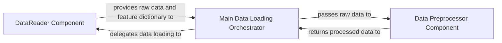

## Details

The `Data Ingestion & Preprocessing` subsystem primarily encompasses functionality defined within `example/DataReader.py` and relevant data loading and preprocessing logic within `example/main.py`. These files contain the core components responsible for preparing raw data for the DeepFM model.

### DataReader Component
This component is responsible for the initial loading of raw data from its source. Its key function is to initialize the data reading process and, crucially, to generate a feature dictionary (`gen_feat_dict`). This dictionary defines the structure, types, and mappings of features, which is essential for the DeepFM model to correctly interpret the input data.

**Related Classes/Methods**:

- <a href="https://github.com/ChenglongChen/tensorflow-DeepFM/blob/master/example/DataReader.py" target="_blank" rel="noopener noreferrer">`example.DataReader`</a>
- <a href="https://github.com/ChenglongChen/tensorflow-DeepFM/blob/master/example/DataReader.py" target="_blank" rel="noopener noreferrer">`example.DataReader:gen_feat_dict`</a>

### Data Preprocessor Component
This component takes the raw data, potentially along with the feature dictionary, and performs necessary transformations to prepare it for model consumption. This includes tasks such as normalization, encoding categorical features, or other forms of feature engineering, ensuring the data is in a clean and structured format suitable for training and inference.

**Related Classes/Methods**:

- <a href="https://github.com/ChenglongChen/tensorflow-DeepFM/blob/master/example/main.py" target="_blank" rel="noopener noreferrer">`example.main:preprocess`</a>

### Main Data Loading Orchestrator
This component acts as the high-level controller for the entire data ingestion and preprocessing workflow. It coordinates the sequence of operations, ensuring that data is first loaded by the `DataReader` and then passed through the `Data Preprocessor`. It manages the flow of data through the pipeline, ensuring data readiness for both training and inference.

**Related Classes/Methods**:

- <a href="https://github.com/ChenglongChen/tensorflow-DeepFM/blob/master/example/main.py" target="_blank" rel="noopener noreferrer">`example.main:_load_data`</a>

### [FAQ](https://github.com/CodeBoarding/GeneratedOnBoardings/tree/main?tab=readme-ov-file#faq)