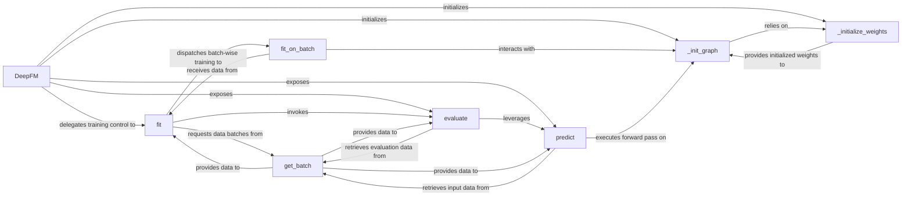

## Details

The DeepFM Model Core subsystem is primarily defined by the DeepFM class and its associated methods within the DeepFM.py file. This subsystem encapsulates the entire lifecycle of the DeepFM model, from its architectural definition and weight initialization to training, prediction, and evaluation.

### DeepFM
Acts as the primary interface for the DeepFM model, orchestrating its entire lifecycle from initialization to training, prediction, and evaluation. It manages the overall flow and coordination of the model's operations.

**Related Classes/Methods**:

- <a href="https://github.com/ChenglongChen/tensorflow-DeepFM/blob/master/DeepFM.py#L18-L384" target="_blank" rel="noopener noreferrer">`DeepFM`:18-384</a>

### _init_graph
Defines and constructs the TensorFlow computational graph for the DeepFM model, integrating its Factorization Machine (FM) and Deep Neural Network (DNN) components.

**Related Classes/Methods**:

- <a href="https://github.com/ChenglongChen/tensorflow-DeepFM/blob/master/DeepFM.py#L64-L170" target="_blank" rel="noopener noreferrer">`_init_graph`:64-170</a>

### _initialize_weights
Sets up and initializes all trainable parameters (weights and biases) required by the DeepFM model's computational graph.

**Related Classes/Methods**:

- <a href="https://github.com/ChenglongChen/tensorflow-DeepFM/blob/master/DeepFM.py#L179-L219" target="_blank" rel="noopener noreferrer">`_initialize_weights`:179-219</a>

### fit
Oversees the entire training process, including iterating over epochs, managing data batches, and coordinating batch-wise training and periodic evaluation.

**Related Classes/Methods**:

- <a href="https://github.com/ChenglongChen/tensorflow-DeepFM/blob/master/DeepFM.py#L259-L324" target="_blank" rel="noopener noreferrer">`fit`:259-324</a>

### fit_on_batch
Executes a single forward and backward pass on a given data batch, updating model weights based on the computed loss.

**Related Classes/Methods**:

- <a href="https://github.com/ChenglongChen/tensorflow-DeepFM/blob/master/DeepFM.py#L248-L256" target="_blank" rel="noopener noreferrer">`fit_on_batch`:248-256</a>

### predict
Generates output predictions for new input data using the trained model.

**Related Classes/Methods**:

- <a href="https://github.com/ChenglongChen/tensorflow-DeepFM/blob/master/DeepFM.py#L344-L373" target="_blank" rel="noopener noreferrer">`predict`:344-373</a>

### evaluate
Calculates and reports performance metrics of the model on a given dataset, often by leveraging the `predict` functionality.

**Related Classes/Methods**:

- <a href="https://github.com/ChenglongChen/tensorflow-DeepFM/blob/master/DeepFM.py#L376-L384" target="_blank" rel="noopener noreferrer">`evaluate`:376-384</a>

### get_batch
Handles the preparation and delivery of data in mini-batches for training, prediction, or evaluation.

**Related Classes/Methods**:

- <a href="https://github.com/ChenglongChen/tensorflow-DeepFM/blob/master/DeepFM.py#L231-L235" target="_blank" rel="noopener noreferrer">`get_batch`:231-235</a>

### [FAQ](https://github.com/CodeBoarding/GeneratedOnBoardings/tree/main?tab=readme-ov-file#faq)