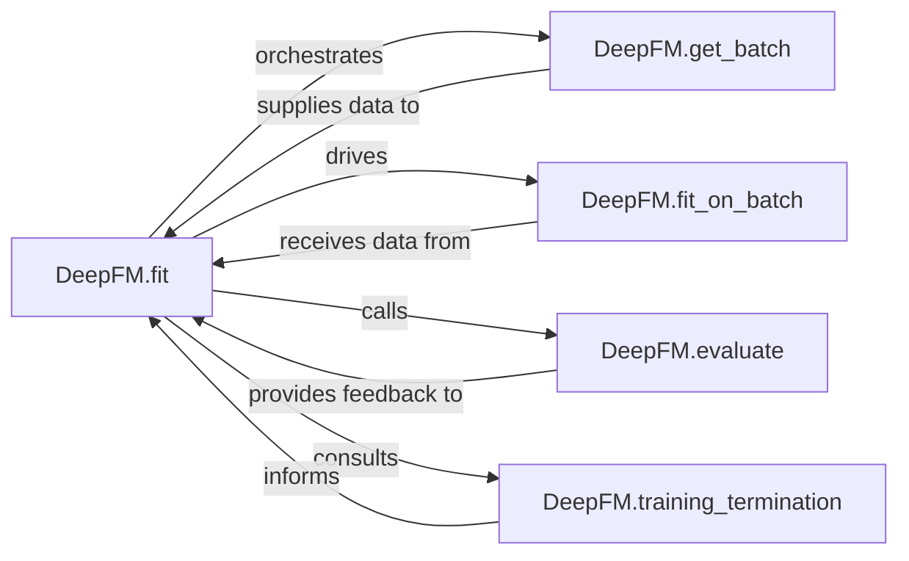

## Details

The `Model Training & Optimization` subsystem is central to the project's machine learning lifecycle, focusing on the iterative process of training the DeepFM model.

### DeepFM.fit
The primary orchestrator of the entire model training lifecycle. It manages epochs, data shuffling, batch processing, periodic evaluation, and applies termination criteria.

**Related Classes/Methods**:

- <a href="https://github.com/ChenglongChen/tensorflow-DeepFM/blob/master/DeepFM.py#L259-L324" target="_blank" rel="noopener noreferrer">`DeepFM.fit`:259-324</a>

### DeepFM.fit_on_batch
Executes a single forward and backward pass on a given batch of data. It calculates the loss and updates the model's parameters using TensorFlow's optimization algorithms.

**Related Classes/Methods**:

- <a href="https://github.com/ChenglongChen/tensorflow-DeepFM/blob/master/DeepFM.py#L248-L256" target="_blank" rel="noopener noreferrer">`DeepFM.fit_on_batch`:248-256</a>

### DeepFM.evaluate
Assesses the model's performance on a given dataset (typically a validation set) during or after training. It computes relevant metrics to monitor training progress and inform termination decisions.

**Related Classes/Methods**:

- <a href="https://github.com/ChenglongChen/tensorflow-DeepFM/blob/master/DeepFM.py#L376-L384" target="_blank" rel="noopener noreferrer">`DeepFM.evaluate`:376-384</a>

### DeepFM.training_termination
Implements the logic to determine when to stop the training process. This could be based on convergence, maximum epochs, or other early stopping criteria.

**Related Classes/Methods**:

- <a href="https://github.com/ChenglongChen/tensorflow-DeepFM/blob/master/DeepFM.py#L327-L341" target="_blank" rel="noopener noreferrer">`DeepFM.training_termination`:327-341</a>

### DeepFM.get_batch
Provides mini-batches of input features and labels from the dataset. This component is crucial for feeding data to both the training (`fit_on_batch`) and evaluation (`predict`) processes.

**Related Classes/Methods**:

- <a href="https://github.com/ChenglongChen/tensorflow-DeepFM/blob/master/DeepFM.py#L231-L235" target="_blank" rel="noopener noreferrer">`DeepFM.get_batch`:231-235</a>

### [FAQ](https://github.com/CodeBoarding/GeneratedOnBoardings/tree/main?tab=readme-ov-file#faq)