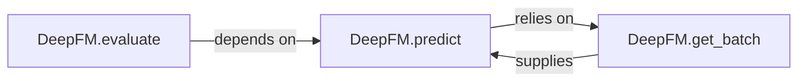

## Details

The Prediction & Inference Engine subsystem is primarily encapsulated within the DeepFM.py file. Its core responsibility is to facilitate the forward pass of the trained DeepFM model for generating predictions on new data and subsequently evaluating these predictions.

### DeepFM.predict
This is the core component of the `Prediction & Inference Engine`. It performs the forward pass through the trained DeepFM model, taking new input data and producing output scores or probabilities. It embodies the "Prediction Module" pattern.

**Related Classes/Methods**:

- <a href="https://github.com/ChenglongChen/tensorflow-DeepFM/blob/master/DeepFM.py#L344-L373" target="_blank" rel="noopener noreferrer">`DeepFM.predict`:344-373</a>

### DeepFM.evaluate
This component orchestrates the model assessment process. It leverages `DeepFM.predict` to obtain predictions and then computes and reports various performance metrics (e.g., accuracy, AUC, RMSE). It aligns with the "Evaluation Module" pattern.

**Related Classes/Methods**:

- <a href="https://github.com/ChenglongChen/tensorflow-DeepFM/blob/master/DeepFM.py#L376-L384" target="_blank" rel="noopener noreferrer">`DeepFM.evaluate`:376-384</a>

### DeepFM.get_batch
This component acts as a data utility, specifically responsible for preparing and retrieving input data in manageable batches. It ensures that the `DeepFM.predict` method receives data in the correct format and quantity for efficient processing. It represents a specialized aspect of the "Data Reader/Preprocessor" pattern, focused on inference data preparation.

**Related Classes/Methods**:

- <a href="https://github.com/ChenglongChen/tensorflow-DeepFM/blob/master/DeepFM.py#L231-L235" target="_blank" rel="noopener noreferrer">`DeepFM.get_batch`:231-235</a>

### [FAQ](https://github.com/CodeBoarding/GeneratedOnBoardings/tree/main?tab=readme-ov-file#faq)