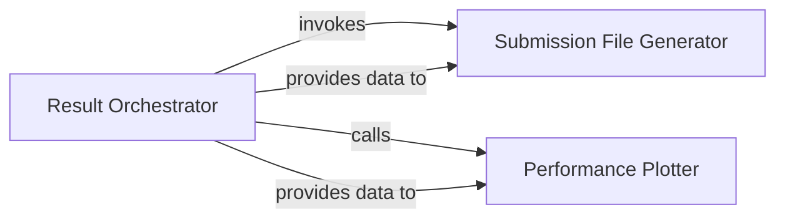

## Details

The `Result Visualization & Output` subsystem is responsible for the final processing and presentation of model outputs. This includes generating structured submission files for competitions or further analysis, and creating visual representations (plots) of performance metrics to monitor training progress or evaluate results. It acts as the terminal stage in the model's lifecycle, ensuring results are consumable and insightful.

### Result Orchestrator
Serves as the central coordinator for the `Result Visualization & Output` subsystem. Its primary responsibility is to orchestrate the generation of submission files and the visualization of performance metrics, ensuring that all final outputs are produced. It acts as the entry point for triggering result processing.

**Related Classes/Methods**:

- <a href="https://github.com/ChenglongChen/tensorflow-DeepFM/blob/master/example/main.py#L47-L93" target="_blank" rel="noopener noreferrer">`example.main._run_base_model_dfm`:47-93</a>

### Submission File Generator
Dedicated to producing structured output files, typically in a format suitable for competition submissions or subsequent programmatic analysis. It encapsulates the specific logic for data formatting and file writing, ensuring compliance with required output specifications.

**Related Classes/Methods**:

- <a href="https://github.com/ChenglongChen/tensorflow-DeepFM/blob/master/example/main.py#L96-L98" target="_blank" rel="noopener noreferrer">`example.main._make_submission`:96-98</a>

### Performance Plotter
Responsible for creating visual representations of the model's performance, such as training curves, loss plots, or evaluation metrics (e.g., AUC, accuracy over epochs). It handles the plotting logic and figure generation, providing insights into model behavior and training dynamics.

**Related Classes/Methods**:

- <a href="https://github.com/ChenglongChen/tensorflow-DeepFM/blob/master/example/main.py#L101-L116" target="_blank" rel="noopener noreferrer">`example.main._plot_fig`:101-116</a>

### [FAQ](https://github.com/CodeBoarding/GeneratedOnBoardings/tree/main?tab=readme-ov-file#faq)