```mermaid
graph LR
    Configuration_Management["Configuration Management"]
    Data_Ingestion_Preprocessing["Data Ingestion & Preprocessing"]
    DeepFM_Model_Core["DeepFM Model Core"]
    Model_Training_Optimization["Model Training & Optimization"]
    Prediction_Inference_Engine["Prediction & Inference Engine"]
    Model_Evaluation["Model Evaluation"]
    Result_Visualization_Output["Result Visualization & Output"]
    Configuration_Management -- "Provides configuration parameters" --> Data_Ingestion_Preprocessing
    Configuration_Management -- "Supplies model hyperparameters" --> DeepFM_Model_Core
    Configuration_Management -- "Configures training settings" --> Model_Training_Optimization
    Data_Ingestion_Preprocessing -- "Provides processed data schema" --> DeepFM_Model_Core
    Data_Ingestion_Preprocessing -- "Supplies training data batches" --> Model_Training_Optimization
    Data_Ingestion_Preprocessing -- "Supplies inference data batches" --> Prediction_Inference_Engine
    DeepFM_Model_Core -- "Defines model architecture" --> Model_Training_Optimization
    Model_Training_Optimization -- "Outputs trained model" --> Prediction_Inference_Engine
    Model_Training_Optimization -- "Triggers evaluation" --> Model_Evaluation
    Prediction_Inference_Engine -- "Provides predictions for assessment" --> Model_Evaluation
    Prediction_Inference_Engine -- "Delivers raw predictions" --> Result_Visualization_Output
    Model_Evaluation -- "Forwards evaluation metrics" --> Result_Visualization_Output
    click Data_Ingestion_Preprocessing href "https://github.com/CodeBoarding/GeneratedOnBoardings/blob/main/tensorflow-DeepFM/Data_Ingestion_Preprocessing.md" "Details"
    click DeepFM_Model_Core href "https://github.com/CodeBoarding/GeneratedOnBoardings/blob/main/tensorflow-DeepFM/DeepFM_Model_Core.md" "Details"
    click Model_Training_Optimization href "https://github.com/CodeBoarding/GeneratedOnBoardings/blob/main/tensorflow-DeepFM/Model_Training_Optimization.md" "Details"
    click Prediction_Inference_Engine href "https://github.com/CodeBoarding/GeneratedOnBoardings/blob/main/tensorflow-DeepFM/Prediction_Inference_Engine.md" "Details"
    click Result_Visualization_Output href "https://github.com/CodeBoarding/GeneratedOnBoardings/blob/main/tensorflow-DeepFM/Result_Visualization_Output.md" "Details"
```

## Details

The `tensorflow-DeepFM` architecture is designed around a clear machine learning workflow, starting with `Configuration Management` (example/config.py) that feeds parameters to all stages. Data flows from `Data Ingestion & Preprocessing` (example/DataReader.py, example/main.py) to define the `DeepFM Model Core` (DeepFM.py) and supply data for `Model Training & Optimization` (DeepFM.py). The trained model then moves to the `Prediction & Inference Engine` (DeepFM.py), whose outputs are consumed by `Model Evaluation` (DeepFM.py, example/metrics.py) and ultimately presented by `Result Visualization & Output` (example/main.py). This structure emphasizes a linear data progression with distinct, reusable components, ideal for a flow graph representation where arrows clearly depict data and control transfers.

### Configuration Management
Manages all configurable parameters for the DeepFM system, including model hyperparameters, training settings, and data paths. It acts as a centralized source for system configuration.

**Related Classes/Methods**:

- <a href="https://github.com/ChenglongChen/tensorflow-DeepFM/blob/master/example/config.py" target="_blank" rel="noopener noreferrer">`example/config.py`</a>

### Data Ingestion & Preprocessing [[Expand]](./Data_Ingestion_Preprocessing.md)
Responsible for loading raw data, generating feature mappings, and transforming data into a format suitable for model consumption. This component ensures data readiness for both training and inference.

**Related Classes/Methods**:

- <a href="https://github.com/ChenglongChen/tensorflow-DeepFM/blob/master/example/DataReader.py" target="_blank" rel="noopener noreferrer">`example/DataReader.py`</a>
- <a href="https://github.com/ChenglongChen/tensorflow-DeepFM/blob/master/example/main.py" target="_blank" rel="noopener noreferrer">`example/main.py`</a>

### DeepFM Model Core [[Expand]](./DeepFM_Model_Core.md)
Encapsulates the DeepFM model's architecture, including its Factorization Machine (FM) and Deep Neural Network (DNN) components. It manages the construction of the TensorFlow computational graph and the initialization of model weights.

**Related Classes/Methods**:

- <a href="https://github.com/ChenglongChen/tensorflow-DeepFM/blob/master/DeepFM.py" target="_blank" rel="noopener noreferrer">`DeepFM.py`</a>

### Model Training & Optimization [[Expand]](./Model_Training_Optimization.md)
Oversees the entire training lifecycle of the DeepFM model. This includes iterating through epochs, managing data batches, performing forward and backward passes, and optimizing model parameters using TensorFlow's optimization algorithms.

**Related Classes/Methods**:

- <a href="https://github.com/ChenglongChen/tensorflow-DeepFM/blob/master/DeepFM.py" target="_blank" rel="noopener noreferrer">`DeepFM.py`</a>

### Prediction & Inference Engine [[Expand]](./Prediction_Inference_Engine.md)
Provides the functionality to generate predictions from the trained DeepFM model on new, unseen input data. It performs the forward pass through the model to produce output scores or probabilities.

**Related Classes/Methods**:

- <a href="https://github.com/ChenglongChen/tensorflow-DeepFM/blob/master/DeepFM.py" target="_blank" rel="noopener noreferrer">`DeepFM.py`</a>

### Model Evaluation
Assesses the performance of the trained model by calculating and normalizing relevant metrics, such as the Gini coefficient. This component provides insights into the model's effectiveness.

**Related Classes/Methods**:

- <a href="https://github.com/ChenglongChen/tensorflow-DeepFM/blob/master/DeepFM.py" target="_blank" rel="noopener noreferrer">`DeepFM.py`</a>
- <a href="https://github.com/ChenglongChen/tensorflow-DeepFM/blob/master/example/metrics.py" target="_blank" rel="noopener noreferrer">`example/metrics.py`</a>

### Result Visualization & Output [[Expand]](./Result_Visualization_Output.md)
Processes and presents the final outputs of the model. This includes generating submission files for competitions and plotting performance figures to visualize training progress or evaluation results.

**Related Classes/Methods**:

- <a href="https://github.com/ChenglongChen/tensorflow-DeepFM/blob/master/example/main.py" target="_blank" rel="noopener noreferrer">`example/main.py`</a>

### [FAQ](https://github.com/CodeBoarding/GeneratedOnBoardings/tree/main?tab=readme-ov-file#faq)