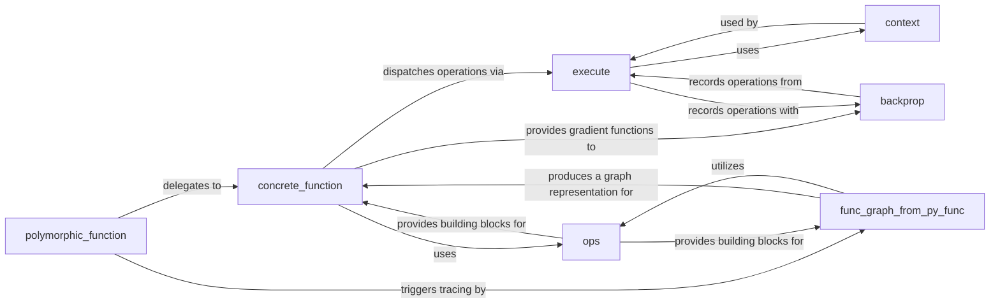

## Details

The `Core Execution Engine` is the heart of TensorFlow's dataflow programming model, responsible for transforming user-defined computations into efficient, executable TensorFlow graphs. It orchestrates eager execution, manages automatic differentiation, and dispatches operations to the underlying hardware. The subsystem encompasses the mechanisms for tracing Python functions into TensorFlow graphs, managing the execution context and device placement, executing low-level TensorFlow operations, performing automatic differentiation, and representing and optimizing compiled functions.

### polymorphic_function
Serves as the primary entry point for user-defined Python functions, enabling them to be automatically traced and converted into TensorFlow graphs. It manages the caching of `ConcreteFunction` instances based on input signatures, facilitating polymorphic behavior (e.g., `tf.function`).

**Related Classes/Methods**:

- <a href="https://github.com/tensorflow/tensorflow/blob/master/tensorflow/python/eager/polymorphic_function/polymorphic_function.py" target="_blank" rel="noopener noreferrer">`tensorflow.python.eager.polymorphic_function.polymorphic_function`</a>

### func_graph_from_py_func
Crucial for the transition from Python eager execution to graph mode. It converts a Python function into a `FuncGraph` (a TensorFlow graph representation), handling variable capturing, control flow, and graph construction.

**Related Classes/Methods**:

- <a href="https://github.com/tensorflow/tensorflow/blob/master/tensorflow/python/framework/func_graph.py" target="_blank" rel="noopener noreferrer">`tensorflow.python.framework.func_graph`</a>

### concrete_function
Represents a specific, traced, and optimized version of a Python function for a particular input signature. It encapsulates the compiled graph and manages its execution, including dispatching operations and handling gradient functions.

**Related Classes/Methods**:

- <a href="https://github.com/tensorflow/tensorflow/blob/master/tensorflow/python/eager/polymorphic_function/concrete_function.py" target="_blank" rel="noopener noreferrer">`tensorflow.python.eager.polymorphic_function.concrete_function`</a>

### context
Manages the global state and configuration of the TensorFlow runtime. This includes controlling eager execution mode, device placement (CPU/GPU/TPU), JIT compilation settings, and other runtime behaviors.

**Related Classes/Methods**:

- <a href="https://github.com/tensorflow/tensorflow/blob/master/tensorflow/python/eager/context.py" target="_blank" rel="noopener noreferrer">`tensorflow.python.eager.context`</a>

### execute
Provides the low-level mechanisms for directly executing TensorFlow operations in eager mode. It interfaces with the underlying C++ runtime to dispatch operations to the appropriate hardware.

**Related Classes/Methods**:

- <a href="https://github.com/tensorflow/tensorflow/blob/master/tensorflow/python/eager/execute.py" target="_blank" rel="noopener noreferrer">`tensorflow.python.eager.execute`</a>

### backprop
Implements the automatic differentiation (autodiff) system, primarily through the gradient tape mechanism. It records operations performed during the forward pass to enable the computation of gradients during the backward pass.

**Related Classes/Methods**:

- <a href="https://github.com/tensorflow/tensorflow/blob/master/tensorflow/python/eager/backprop.py" target="_blank" rel="noopener noreferrer">`tensorflow.python.eager.backprop`</a>

### ops
Provides the fundamental building blocks for defining and manipulating TensorFlow operations and graphs. This includes creating operations, managing collections, and handling name scopes, essential for constructing the computational graph.

**Related Classes/Methods**:

- <a href="https://github.com/tensorflow/tensorflow/blob/master/tensorflow/python/framework/ops.py" target="_blank" rel="noopener noreferrer">`tensorflow.python.framework.ops`</a>

### [FAQ](https://github.com/CodeBoarding/GeneratedOnBoardings/tree/main?tab=readme-ov-file#faq)