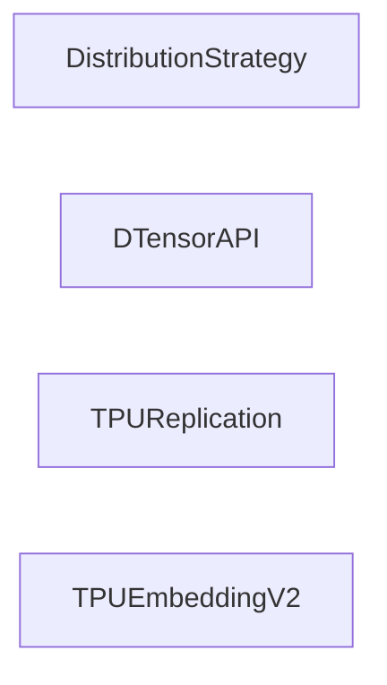

## Details

One paragraph explaining the functionality which is represented by this graph. What the main flow is and what is its purpose.

### DistributionStrategy
The core component for distributing training across multiple devices.

**Related Classes/Methods**:

- <a href="https://github.com/tensorflow/tensorflow/blob/master/tensorflow/python/distribute/distribute_lib.py" target="_blank" rel="noopener noreferrer">`tensorflow.python.distribute.distribute_lib.DistributionStrategy`</a>

### DTensorAPI
API for distributed tensor operations.

**Related Classes/Methods**:

- <a href="https://github.com/tensorflow/tensorflow/blob/master/tensorflow/dtensor/python/api.py" target="_blank" rel="noopener noreferrer">`tensorflow.dtensor.DTensorAPI`</a>

### TPUReplication
Handles replication for TPU devices.

**Related Classes/Methods**:

- <a href="https://github.com/tensorflow/tensorflow/blob/master/tensorflow/python/tpu/tpu_replication.py" target="_blank" rel="noopener noreferrer">`tensorflow.tpu.TPUReplication`</a>

### TPUEmbeddingV2
Version 2 of TPU embedding.

**Related Classes/Methods**:

- <a href="https://github.com/tensorflow/tensorflow/blob/master/tensorflow/python/tpu/tpu_embedding_v2.py" target="_blank" rel="noopener noreferrer">`tensorflow.tpu.TPUEmbeddingV2`</a>

### [FAQ](https://github.com/CodeBoarding/GeneratedOnBoardings/tree/main?tab=readme-ov-file#faq)